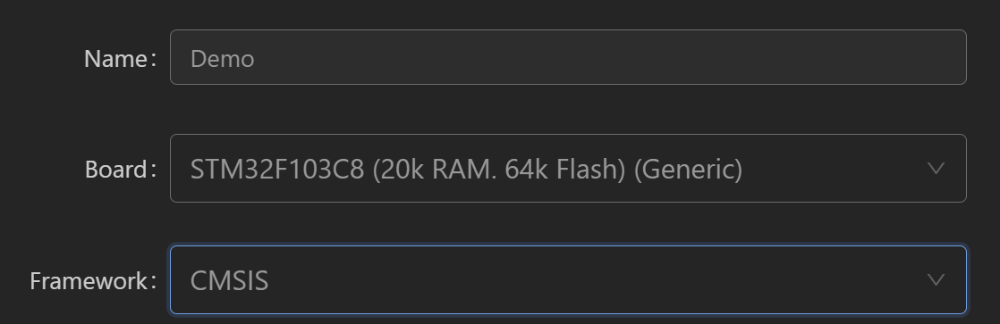

# 从0开始——在PlatformIO下开展STM32单片机的库函数编程指南

## 前言

​	终于准备开STM32F1系列的文档教程了！笔者在2025年3月29日成功的独立移植了标准库到了PlatformIO上，换而言之，从现在开始，我们可以轻量级的接触库函数编程了（至少，彻底摆脱MDK5那个不是人的开发环境）

​	这个文档的作用，就是教授各位如何最小的配置，从而在PlatformIO下展开库函数编程。

## 下载CMSIS针对目标单片机的库函数

​	这里笔者是直接使用的是江科大部分的资料的标准库代码，然后注意，笔者发现默认的CMSIS的PlatformIO框架并不好，所以需要我们自己更加细致的特化芯片库，这里笔者将文件列出来，这部分代码可以到ST官方下载，也可以直接抄板i江科大的源代码，如果上述事情懒得配置，到我的[BetterATK/103c8t6/standard/0_RawTemplate at STM32F1 · Charliechen114514/BetterATK](https://github.com/Charliechen114514/BetterATK/tree/STM32F1/103c8t6/standard/0_RawTemplate)文件夹下直接抄lib/cmsis_library就好了。

| 文件名             | 文件用途说明                                                |
| :----------------- | :---------------------------------------------------------- |
| misc.c             | 杂项功能实现文件，包含一些通用的辅助函数                    |
| misc.h             | misc.c的头文件，声明相关函数和宏                            |
| stm32f10x_adc.c    | STM32 ADC(模数转换器)驱动源文件                             |
| stm32f10x_adc.h    | ADC驱动的头文件                                             |
| stm32f10x_bkp.c    | 备份寄存器(BKP)驱动源文件                                   |
| stm32f10x_bkp.h    | 备份寄存器(BKP)驱动头文件                                   |
| stm32f10x_can.c    | CAN控制器驱动源文件                                         |
| stm32f10x_can.h    | CAN控制器驱动头文件                                         |
| stm32f10x_cec.c    | 消费电子控制(CEC)驱动源文件                                 |
| stm32f10x_cec.h    | 消费电子控制(CEC)驱动头文件                                 |
| stm32f10x_conf.h   | 库配置文件，用于启用或禁用特定的外设驱动                    |
| stm32f10x_crc.c    | CRC(循环冗余校验)计算单元驱动源文件                         |
| stm32f10x_crc.h    | CRC计算单元驱动头文件                                       |
| stm32f10x_dac.c    | DAC(数模转换器)驱动源文件                                   |
| stm32f10x_dac.h    | DAC驱动头文件                                               |
| stm32f10x_dbgmcu.c | 调试MCU单元驱动源文件                                       |
| stm32f10x_dbgmcu.h | 调试MCU单元驱动头文件                                       |
| stm32f10x_dma.c    | DMA(直接内存访问)控制器驱动源文件                           |
| stm32f10x_dma.h    | DMA控制器驱动头文件                                         |
| stm32f10x_exti.c   | 外部中断/事件控制器(EXTI)驱动源文件                         |
| stm32f10x_exti.h   | 外部中断/事件控制器(EXTI)驱动头文件                         |
| stm32f10x_flash.c  | 闪存控制器驱动源文件                                        |
| stm32f10x_flash.h  | 闪存控制器驱动头文件                                        |
| stm32f10x_fsmc.c   | 灵活的静态存储控制器(FSMC)驱动源文件                        |
| stm32f10x_fsmc.h   | 灵活的静态存储控制器(FSMC)驱动头文件                        |
| stm32f10x_gpio.c   | GPIO(通用输入输出)驱动源文件                                |
| stm32f10x_gpio.h   | GPIO驱动头文件                                              |
| stm32f10x_i2c.c    | I2C(Inter-Integrated Circuit)驱动源文件                     |
| stm32f10x_i2c.h    | I2C驱动头文件                                               |
| stm32f10x_it.c     | 中断服务程序源文件，包含中断处理函数                        |
| stm32f10x_it.h     | 中断服务程序头文件                                          |
| stm32f10x_iwdg.c   | 独立看门狗(IWDG)驱动源文件                                  |
| stm32f10x_iwdg.h   | 独立看门狗(IWDG)驱动头文件                                  |
| stm32f10x_pwr.c    | 电源控制(PWR)驱动源文件                                     |
| stm32f10x_pwr.h    | 电源控制(PWR)驱动头文件                                     |
| stm32f10x_rcc.c    | 复位和时钟控制(RCC)驱动源文件                               |
| stm32f10x_rcc.h    | 复位和时钟控制(RCC)驱动头文件                               |
| stm32f10x_rtc.c    | 实时时钟(RTC)驱动源文件                                     |
| stm32f10x_rtc.h    | 实时时钟(RTC)驱动头文件                                     |
| stm32f10x_sdio.c   | SDIO(SD输入输出接口)驱动源文件                              |
| stm32f10x_sdio.h   | SDIO驱动头文件                                              |
| stm32f10x_spi.c    | SPI(串行外设接口)驱动源文件                                 |
| stm32f10x_spi.h    | SPI驱动头文件                                               |
| stm32f10x_tim.c    | 定时器(TIM)驱动源文件                                       |
| stm32f10x_tim.h    | 定时器(TIM)驱动头文件                                       |
| stm32f10x_usart.c  | USART(通用同步异步收发器)驱动源文件                         |
| stm32f10x_usart.h  | USART驱动头文件                                             |
| stm32f10x_wwdg.c   | 窗口看门狗(WWDG)驱动源文件                                  |
| stm32f10x_wwdg.h   | 窗口看门狗(WWDG)驱动头文件                                  |
| stm32f10x.h        | STM32F10x系列微控制器的主头文件，包含所有寄存器和外设的定义 |
| system_stm32f10x.c | 系统初始化源文件，包含系统时钟配置等                        |
| system_stm32f10x.h | 系统初始化头文件                                            |

此外的部分，就是我们用户自己裁定的一些文件：

| 文件名               | 文件用途说明                                                 | 特殊说明                                                     |
| :------------------- | :----------------------------------------------------------- | :----------------------------------------------------------- |
| **stm32f10x_conf.h** | **库配置文件**，用于启用或禁用特定的外设驱动（通过`#define`或注释来管理） | 用户需手动配置，决定编译时包含哪些外设驱动（如`USE_STDPERIPH_DRIVER`） |
| **stm32f10x_it.c**   | **中断服务程序源文件**，包含用户自定义的中断处理函数（如定时器、串口中断等） | 用户需根据实际需求编写或修改中断服务例程（如`TIM2_IRQHandler`） |
| **stm32f10x_it.h**   | **中断服务程序头文件**，声明中断相关函数和宏                 | 通常与`.c`文件配套使用，声明中断函数原型                     |

这些文件是我们的用户层驱动的代码，实际上做的是一些底层的特别于用户设定的Hook文件。

还有一部分是一些启动层代码：

| 文件名                 | 文件用途说明                                                 | 重要特性/依赖关系                                            |
| :--------------------- | :----------------------------------------------------------- | :----------------------------------------------------------- |
| **core_cm3.c**         | **Cortex-M3 核心功能实现**（如内核寄存器访问、NVIC 操作等）  | 提供 CMSIS（Cortex Microcontroller Software Interface Standard）底层支持 |
| **core_cm3.h**         | **Cortex-M3 核心头文件**，定义内核寄存器、中断控制器(NVIC)等 | 包含 ARM 官方定义的寄存器映射和内核宏（如`__NVIC_EnableIRQ`） |
| **stm32f10x.h**        | **STM32F10x 全系列主头文件**，定义外设寄存器、内存映射、时钟配置等 | 依赖 `core_cm3.h`，是外设库的基础（如 `GPIOA->ODR` 寄存器操作） |
| **system_stm32f10x.c** | **系统初始化源文件**，包含时钟树配置（如 HSE/PLL 设置）、系统时钟更新函数等 | 需根据硬件修改 `SystemInit()`（如外部晶振频率）              |
| **system_stm32f10x.h** | **系统初始化头文件**，声明系统时钟频率常量（如 `SystemCoreClock`） | 通常通过 `stm32f10x.h` 间接引用                              |

（特别写给江科大的朋友：如果是手头有江科大的代码，只需要将Library下的所有文件，Start文件夹下的core_cm3头文件源文件，system_stm32f10x头文件源文件和stm32f10x.h文件拷贝出来即可）

上面的这些文件放到一个叫做cmsis_library的文件夹中，当然啥名字无所谓，PIO检索不是依靠名称判定的。

## 修正自带的PIO的CMSIS固件包的代码

​	这部分是无奈之举，PIO的STM32F1的CMSIS使用的是通用STM32F1系列的代码，完全没办法进一步给我们的F103C8T6使用，这是要我们自己做裁剪的（这也能理解，现在标准库已经不维护了，放弃也是自然的）

​	打开PIO中存储我们的F1系列的CMSIS库文件文件夹位置（按照默认的路径，是`.platformio\packages\framework-cmsis-stm32f1\Source\Templates`），这个部分，有一个文件叫做`system_stm32f1xx.c`文件，打开，**然后全部注释掉！注意，是全部注释掉！**，使用CMSIS作为我们的工程模板的时候，一定会将这部分代码参与编译，这里就提供了最基本的SystemInit和SystemClockUpdate函数，这两个函数在单片机的初始化和系统时钟寄存器Systicks更新的时候会调用，不加以注释，会对单片机的系统时钟造成完全错误的初始化，一个现象就是Delay的时间不正确，这是系统的时钟配置错误导致的（默认采用的SystemCLK是160MHZ，但是我们的时钟才极限72MHZ，几次回卷导致误差放大了原先的六倍甚至是更多，这是完全不可以接受的！）

​	更加适配于我们的时钟和系统初始化的代码在system_stm32f10x.c中，这里对SystemInit和SystemClockUpdate的定义才是正确的。这就是为什么笔者将会把这个文件放置到cmsis_library下。

## 生成CMSIS模板的工程



​	我们的模板选择选成如此，名称随意，地址看你心情。这些都无所谓！

## 客制化PlatformIO.ini工程配置文件

```
; PlatformIO Project Configuration File
;
;   Build options: build flags, source filter
;   Upload options: custom upload port, speed and extra flags
;   Library options: dependencies, extra library storages
;   Advanced options: extra scripting
;
; Please visit documentation for the other options and examples
; https://docs.platformio.org/page/projectconf.html

[env:genericSTM32F103C8]
platform = ststm32
board = genericSTM32F103C8
framework = cmsis

build_flags = 
    -DSTM32F10X_MD
    -DUSE_STDPERIPH_DRIVER

upload_protocol = stlink 
debug_tool = stlink 
```

​	这是笔者的最小配置，笔者补充一下：-DSTM32F10X_MD定义了宏STM32F10X_MD，这说明我们的STM库需要熟知环境是中级密度存储的，这样我们才会正确的使能我们单片机的存储。 -DUSE_STDPERIPH_DRIVER则是表达我们使用的是标准的外设，这意味着大部分常见的外设都会被包括进来进行编译。**注意，你还需要把我们刚刚存储CMSIS库文件的cmsis_library文件夹放置到lib文件夹下**，当然，这里笔者偷个懒，直接使用江科大对Systicks编程实现的延时，笔者在后面会好好说这个的原理

> Delay.h

```c
#ifndef __DELAY_H
#define __DELAY_H
#include <stdint.h>

void Delay_us(uint32_t us);
void Delay_ms(uint32_t ms);
void Delay_s(uint32_t s);

#endif

```

> Delay.c

```c
#include "stm32f1xx.h"

/**
  * @brief  微秒级延时
  * @param  xus 延时时长，范围：0~233015
  * @retval 无
  */
void Delay_us(uint32_t xus)
{
	SysTick->LOAD = 72 * xus;				//设置定时器重装值
	SysTick->VAL = 0x00;					//清空当前计数值
	SysTick->CTRL = 0x00000005;				//设置时钟源为HCLK，启动定时器
	while(!(SysTick->CTRL & 0x00010000));	//等待计数到0
	SysTick->CTRL = 0x00000004;				//关闭定时器
}

/**
  * @brief  毫秒级延时
  * @param  xms 延时时长，范围：0~4294967295
  * @retval 无
  */
void Delay_ms(uint32_t xms)
{
	while(xms--)
	{
		Delay_us(1000);
	}
}
 
/**
  * @brief  秒级延时
  * @param  xs 延时时长，范围：0~4294967295
  * @retval 无
  */
void Delay_s(uint32_t xs)
{
	while(xs--)
	{
		Delay_ms(1000);
	}
} 
```

## 编写测试代码

​	下面的这个部分是写一个测试代码：

```c
#include "stm32f10x.h"
#include "Delay.h"

int main(void)
{
	RCC_APB2PeriphClockCmd(RCC_APB2Periph_GPIOA, ENABLE);
	
	GPIO_InitTypeDef GPIO_InitStructure;
	GPIO_InitStructure.GPIO_Mode = GPIO_Mode_Out_PP;
	GPIO_InitStructure.GPIO_Pin = GPIO_Pin_0;
	GPIO_InitStructure.GPIO_Speed = GPIO_Speed_50MHz;
	GPIO_Init(GPIOA, &GPIO_InitStructure);
	
	while (1)
	{
		GPIO_ResetBits(GPIOA, GPIO_Pin_0);
		Delay_ms(500);
		GPIO_SetBits(GPIOA, GPIO_Pin_0);
		Delay_ms(500);
		
		GPIO_WriteBit(GPIOA, GPIO_Pin_0, Bit_RESET);
		Delay_ms(500);
		GPIO_WriteBit(GPIOA, GPIO_Pin_0, Bit_SET);
		Delay_ms(500);
		
		GPIO_WriteBit(GPIOA, GPIO_Pin_0, (BitAction)0);
		Delay_ms(500);
		GPIO_WriteBit(GPIOA, GPIO_Pin_0, (BitAction)1);
		Delay_ms(500);
	}
}
```

​	我们把一个LED接到PA0上，就能看到LED的闪烁了！

​	笔者构建的模板在：[BetterATK/103c8t6/standard/0_RawTemplate at STM32F1 · Charliechen114514/BetterATK](https://github.com/Charliechen114514/BetterATK/tree/STM32F1/103c8t6/standard/0_RawTemplate)！
