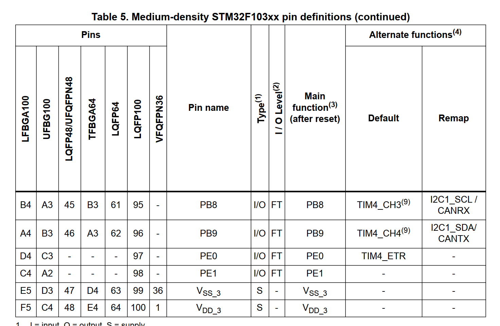
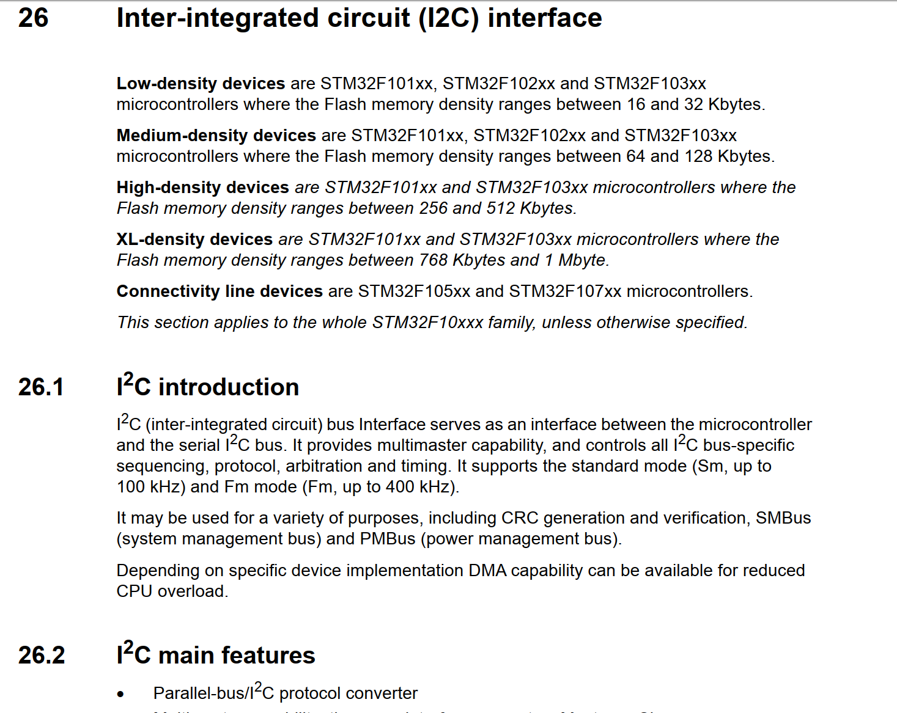

# 以STM32F103C8T6为例子的单片机资源分析

## 第一点：为什么叫STM32F103C8T6

​	先不着急，我们先把命名规矩说一下：

| 部分              | 说明                                                         |
| ----------------- | ------------------------------------------------------------ |
| **1. 产品系列**   | 固定为“STM32”，表示基于ARM Cortex-M内核的32位微控制器。      |
| **2. 产品类型**   | 用一个字母表示产品类型： **F**：通用型 **L**：低功耗型 **W**：无线型 |
| **3. 产品子系列** | 用三位数字表示产品子系列，指示特定的功能和性能： **101**：基本型 **102**：USB基本型（USB 2.0全速设备） **103**：增强型 **105/107**：互联型 |
| **4. 引脚数**     | 用一个字母表示封装的引脚数量： **T**：36引脚 **C**：48引脚 **R**：64引脚 **V**：100引脚 **Z**：144引脚 **I**：176引脚 |
| **5. 闪存容量**   | 用一个字母或数字表示内置的Flash容量： **6**：32KB **8**：64KB **B**：128KB **C**：256KB **D**：384KB **E**：512KB **G**：1MB |
| **6. 封装类型**   | 用一个字母表示封装类型： **H**：BGA封装 **T**：LQFP封装 **U**：VFQFPN封装 |
| **7. 温度范围**   | 用一个数字表示工作温度范围： **6**：-40°C 至 85°C **7**：-40°C 至 105°C |

​	以STM32F103C8T6作为例子：

1. **STM32**：代表基于ARM Cortex-M内核的32位微控制器。  
2. **产品类型**：以字母表示，例如“F”代表通用型（General-purpose）。  
3. **子系列**：以数字表示，例如“103”代表增强型系列（Performance Line）。  
4. **引脚数**：以字母表示，常见选项如C（48脚）、R（64脚）、V（100脚）等。  
5. **闪存容量**：以字母或数字表示，这里的数字“8”代表64KB
6. **封装类型**：以字母表示，例如“T”代表LQFP封装。  
7. **温度范围**：以数字表示，“6”代表工业级温度（-40℃至85℃）。 

## 从资源手册拿到我们的对STM32F103C8T6的资源描述

​	笔者在之前的博客中说到了我们的手册可以从哪里来，所以这里我们就不去再重复说下面的资源是从哪里考证的——就是从资源手册的第一页中摘取的。

| 分类                   | 资源描述                                                     |
| ---------------------- | ------------------------------------------------------------ |
| **核心**               | ARM 32位 Cortex-M3，主频72 MHz，性能90 DMIPS（1.25 DMIPS/MHz），单周期乘法与硬件除法，嵌套中断控制器，43个可屏蔽中断通道，6周期中断响应，支持尾链优化 |
| **存储器**             | 32～128 KB Flash，6～20 KB SRAM                              |
| **时钟/复位/电源管理** | 工作电压2.0～3.6 V，带POR/PDR和可编程电压检测器（PVD），4～16 MHz晶振，内部8 MHz RC振荡器，内部32 kHz RC，支持PLL，独立32 kHz RTC晶振（可校准） |
| **低功耗模式**         | 睡眠、停止、待机模式，支持VBAT电源供电的RTC和备份寄存器      |
| **ADC**                | 2个12位ADC，16通道，转换时间1 µs，支持双采样保持，可与高级定时器同步，内置温度传感器，输入范围0～3.6 V |
| **DMA**                | 7通道DMA控制器，支持的外设包括定时器、ADC、SPI、I2C、USART   |
| **调试接口**           | 支持Serial Wire Debug（SWD）与JTAG                           |
| **通用I/O口**          | 最多80个高速I/O，32/49/80个支持5V容限，全部可映射至16个外部中断线，支持原子读/改/写操作 |
| **定时器**             | 最多7个定时器，包括3个16位通用定时器（最多4个IC/OC/PWM/计数通道），1个16位6通道高级定时器（带PWM/死区/紧急停机），2个看门狗定时器（独立和窗口），1个SysTick 24位递减计数器 |
| **通信接口**           | 最多9个：2个I2C（支持SMBus/PMBus），3个USART（支持ISO7816、LIN、IrDA、调制解调器控制），2个SPI（最高18 Mbit/s），1个CAN（2.0B），1个USB 2.0全速接口 |

​	可以看到，我们的STM32F103C8T6的资源还是非常的丰富的。

## 第二件事情，关心我们的GPIO引脚输出

​	我们的单片机最后是依靠GPIO引脚跟外界进行沟通，我们查询了上面的资源之，确定了这个板子是我们的一个可以选择的方案后，下一步，就是看看结合我们的需求，简单的调研一下我们的GPIO引脚的复用情况。

​	关于GPIO是什么，这个不是我们这篇博客的重点，笔者记得我前前后后说过两次。所以可以翻翻笔者之前的博客，看我的碎碎念。

​	简单的说，就是我们的GPIO引脚不可能单独的表达含义，我们可以采取复用策略（也就是说把XXXGPIO现在作为一个）

​	关于GPIO的复用，我们还是要去看资源手册。这一部分的内容一般是Pinouts and pin description那一部分的内容，注意，我们在学习其他的单片机的时候，可能板块不会叫这个名字。

​	笔者截取了一下我手头的手册的一个截图：

​	我们一般关心的是Pin name和右侧的一些说明。第一件事情是。

​	以PB8为例子，我们的PB8可以做普通的IO口，可以用来承受5V的电压（FT标识的部分就是可承受5V的意思），同时，我们的PB8可以做TIM4定时器的第三个通道和硬件IIC的SCL，或者是CAN通信下的接受端（CANRX）

​	笔者整理了一份STM32F103C8T6的引脚复用图，这个就是我们实际上编程关心的一个图。

| 引脚号 | 引脚名称 | 类型 | 默认功能 | 复用功能                     | 说明                           |
| ------ | -------- | ---- | -------- | ---------------------------- | ------------------------------ |
| 1      | VBAT     | 电源 | 备用电源 | -                            | 供电给RTC和备用寄存器          |
| 2      | PC13     | I/O  | GPIO     | TAMPER-RTC                   | 低功耗I/O，或作为RTC的篡改引脚 |
| 3      | PC14     | I/O  | GPIO     | OSC32_IN                     | 32.768 kHz外部晶振输入         |
| 4      | PC15     | I/O  | GPIO     | OSC32_OUT                    | 32.768 kHz外部晶振输出         |
| 5      | PD0      | I/O  | GPIO     | OSC_IN                       | 外部高速晶振输入               |
| 6      | PD1      | I/O  | GPIO     | OSC_OUT                      | 外部高速晶振输出               |
| 7      | NRST     | 复位 | 复位     | -                            | 外部复位引脚                   |
| 8      | VSSA     | 电源 | 模拟地   | -                            | 模拟电源地                     |
| 9      | VDDA     | 电源 | 模拟电源 | -                            | 模拟电源正极                   |
| 10     | PA0      | I/O  | GPIO     | WKUP1, ADC_IN0, TIM2_CH1_ETR |                                |
| 11     | PA1      | I/O  | GPIO     | ADC_IN1, TIM2_CH2            |                                |
| 12     | PA2      | I/O  | GPIO     | ADC_IN2, TIM2_CH3, USART2_TX |                                |
| 13     | PA3      | I/O  | GPIO     | ADC_IN3, TIM2_CH4, USART2_RX |                                |
| 14     | PA4      | I/O  | GPIO     | ADC_IN4, SPI1_NSS            |                                |
| 15     | PA5      | I/O  | GPIO     | ADC_IN5, SPI1_SCK            |                                |
| 16     | PA6      | I/O  | GPIO     | ADC_IN6, SPI1_MISO, TIM3_CH1 |                                |
| 17     | PA7      | I/O  | GPIO     | ADC_IN7, SPI1_MOSI, TIM3_CH2 |                                |
| 18     | PB0      | I/O  | GPIO     | ADC_IN8, TIM3_CH3            |                                |
| 19     | PB1      | I/O  | GPIO     | ADC_IN9, TIM3_CH4            |                                |
| 20     | PB2      | I/O  | GPIO     | BOOT1                        |                                |
| 21     | PB10     | I/O  | GPIO     | I2C2_SCL, USART3_TX          |                                |
| 22     | PB11     | I/O  | GPIO     | I2C2_SDA, USART3_RX          |                                |
| 23     | PB12     | I/O  | GPIO     | SPI2_NSS, I2C2_SMBA          |                                |
| 24     | PB13     | I/O  | GPIO     | SPI2_SCK                     |                                |
| 25     | PB14     | I/O  | GPIO     | SPI2_MISO                    |                                |
| 26     | PB15     | I/O  | GPIO     | SPI2_MOSI                    |                                |
| 27     | PC10     | I/O  | GPIO     | USART3_TX                    |                                |
| 28     | PC11     | I/O  | GPIO     | USART3_RX                    |                                |
| 29     | PC12     | I/O  | GPIO     | USART3_CK                    |                                |
| 30     | PD2      | I/O  | GPIO     | -                            |                                |
| 31     | PC0      | I/O  | GPIO     | ADC_IN10                     |                                |
| 32     | PC1      | I/O  | GPIO     | ADC_IN11                     |                                |
| 33     | PC2      | I/O  | GPIO     | ADC_IN12                     |                                |
| 34     | PC3      | I/O  | GPIO     | ADC_IN13                     |                                |
| 35     | PC4      | I/O  | GPIO     | ADC_IN14                     |                                |
| 36     | PC5      | I/O  | GPIO     | ADC_IN15                     |                                |
| 37     | PB8      | I/O  | GPIO     | I2C1_SCL, TIM4_CH3           |                                |
| 38     | PB9      | I/O  | GPIO     | I2C1_SDA, TIM4_CH4           |                                |
| 39     | AVSS     | 电源 | 模拟地   | -                            | 模拟电源地                     |
| 40     | AVDD     | 电源 | 模拟电源 | -                            | 模拟电源正极                   |
| 41     | PA8      | I/O  | GPIO     | MCO, TIM1_CH1                |                                |
| 42     | PA9      | I/O  | GPIO     | USART1_TX, TIM1_CH2          |                                |
| 43     | PA10     | I/O  | GPIO     | USART1_RX, TIM1_CH3          |                                |
| 44     | PA11     | I/O  | GPIO     | USART1_CTS, CAN_RX           |                                |
| 45     | PA12     | I/O  | GPIO     | USART1_RTS, CAN_TX           |                                |
| 46     | PA13     | I/O  | GPIO     | JTMS-SWDIO                   |                                |
| 47     | PA14     | I/O  | GPIO     | JTCK-SWCLK                   |                                |
| 48     | PA15     | I/O  | GPIO     | JTDI                         |                                |

## 第三件事情：去找对应外设的说明部分

​	这个事情在我们的编程手册中才会涉及到，比如说，我们想要驱动IIC。

​	就要准备去对应的手册上慢慢翻。ST官方的手册比较全面，会仔细的介绍细节。这里给出的是英文手册的截图。

​	笔者接触到的流程大致就是如此。

