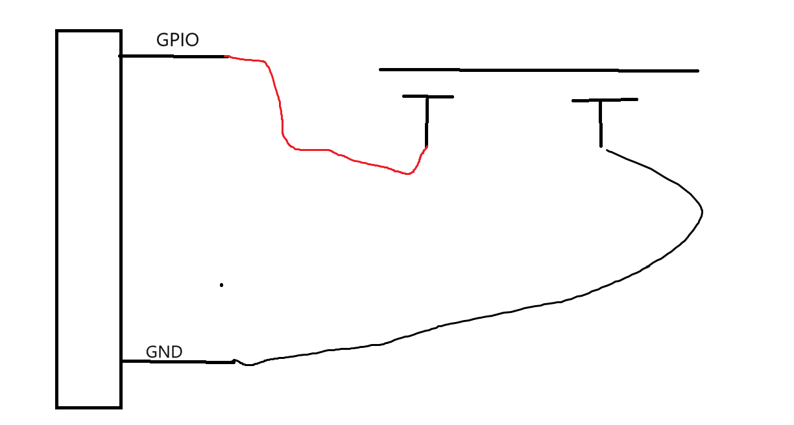

# STM32F103C8T6单片机开发：使用GPIO输入模式完成按键的检测

## 前言

​	上一节博客中，我们使用了GPIO的推完输出模式，完成了LED的驱动，我们基本上见识道了GPIO中的“输出”功能，但是这个还没有完事，我们还有一个输入没有说明呢！因此，我们这个文档，实际上就是在说明输入模式的使用。

## GPIO的输入模式

​	我们下面就来完成GPIO的输入模式的样例编程。还是一样，为了理解，我们需要好好设计一下实验完成我们的工作。笔者需要再强调一次——对任何外设器件编程，你首先需要关心它的编程模型是什么，换而言之，你需要理解它的引脚的特性。对于按钮，我们知道，按钮在默认的情况下是断开的，由按钮，引脚，单片机的VCC或GND构成了一个断开的通路，你看：



​	当我们的弹片摁下去之后，很显然，回路导通，这个时候，我们亲爱的GPIO就会收到一个低电平。这个毫无疑问，所以，我们得到了一个重要的结论，在上面这个图示的情况下，我们的按钮按下，等价于GPIO接受到了一个低电平，当我们的程序逻辑判断得到了——**GPIO读取道了一个低电平的时候，我们就认为按钮摁下，我们的程序也就跟现实的物理电路联系了起来！**

​	那问题来了，我们如何设置GPIO为输入模式呢？答案也是简单的，只需要更改我们的GPIO_Mode就好了，对于按钮，我们选择上一个博客中谈到的：GPIO_Mode_IPU就好了，还是一样，为什么是这个，我们会在后面进行说明。

​	从头捋一次：我们操作GPIO，实际上就是按照如下的步骤：

- 打开GPIO对应的时钟
- 对于标准库，使用GPIO_InitTypeDef来配置GPIO，之后使用GPIO_Init提交我们的修改
- 使用GPIO来驱动简单的外设或者是**接受我们外部电路的变化电平信号**

​	下面我们就会来尝试一下我们的功能。笔者列写我们的电路连接清单。

| 器件的引脚                       | 连接到的端口 |
| -------------------------------- | ------------ |
| LED的长引脚（正极）              | PA1          |
| LED的短引脚（负极）              | GND          |
| 按钮的一个引脚（无所谓正负极）   | PB1          |
| 按钮的另一个引脚（无所谓正负极） | GND          |

​	笔者修改了一下连接的端口，就是想考察你对端口和引脚的关系有没有正确理解。好，我们下面就开始编程吧。

## 编程启动！

```c
void init_bsp_key()
{
    GPIO_InitTypeDef gpio_init_struct;
    __HAL_RCC_GPIOB_CLK_ENABLE();                                 

    gpio_init_struct.Pin = GPIO_PIN_1;                   
    gpio_init_struct.Mode = GPIO_MODE_INPUT;            
    gpio_init_struct.Pull = GPIO_PULLUP;                    
    gpio_init_struct.Speed = GPIO_SPEED_FREQ_HIGH;          
    HAL_GPIO_Init(GPIOB, &gpio_init_struct);
}
```

​	这里需要注意两个重要的点：

- 第一个点：模式需要选择GPIO_Mode_IPU，这里的I是Input, PU是什么？PullUp，我可以先告诉你，当然这里的上拉（一个相似的词是下拉）是什么意思，如果你电路学的好估计已经搞懂了，不懂不着急，GPIO的原理部分我会好好讲述的。

- 我们的按钮是GPIOB的Pin1引脚，请注意，千万不要写错地方了

## 检测按钮触发

​	按钮触发检测是一个很大的话题，实际上，甚至直到我们完成了GPIO原理说明后的GPIO中断，我们还会回来讨论这个话题，**按钮的按下状态检测更是一个设计到状态机编程的话题，这个就属于笔者比较擅长的领域了，我会在其他文件中好好分析这个事情，但不是现在，我怕把萌新吓跑了就没意思了。**

​	在这里，我们思考，如何检测，何时检测按钮按下呢？先不要想着那么复杂。假设你是一个保安，你的工作就是轮询着站在岗位上，观察周边的情况。如果你还记得微机原理，**这就是轮循的检测手法**

```c
while(1)
{
	uint8_t isdone = detect_done();	// 你做了吗
	if(isdone) 	do_done_issue();		// 触发了，处理逻辑
    else		do_undone_issue();		// 没有触发，做其他逻辑
}
```

​	当然代价是显然的——没有办法做任何其他更加分神的事情，哦，也许躺一下是可以的，但是睡着那是不行的。因为`do_undone_issue`或者是`detect_done`拖的过长，你没法检测频繁的按钮输入，在一些场景下又是不被接受的。这个事情我们还会有其他的解决方案，这里我们只是一个点灯小子，没必要在这里絮絮叨叨。

> 我猜测会有单片机大蛇来这里炸鱼，笔者说说我的看法：
>
> - 轮循是最糟糕的编程方案，它简直把CPU分身了
> - 使用GPIO中断是一个尚可的方案，因为我们的按钮是突发事件，而不是一个每时每刻发生的事情，就像没有人喜欢一个神经病絮絮叨叨问你“你吃没吃饭啊，我这里有一个面包”，你说没有后立马又问“你吃没吃饭啊，我这里有一个面包”。。。GPIO中断通知引脚的电平变化，向单片机传递了一个事件后，我们只需要处理事件发生后需要作什么即可
> - 定时器中断是一个更好的方案，因为，GPIO中断是存在相同Pin引脚无法区分，总会存在这样的场景，我们把按钮接入到了PB0和PA0上，我们无法依靠GPIO中断本身来薄记到底是哪一个Pin引脚整活了，但是定时器中断却没有这个问题，只需要在触发溢出/更新中断的时候直接执行定时器的Callback（回调函数）就好了
> - 如果存在RTOS对单片机时间片的分时机制，那我们采用轮循也许更是一个好办法，这也算是大道轮回了，我们只需要分出时间片来检测我们的按钮是否活跃（被按下）即可。

​	萌新可能看不大懂我在说什么，不需要着急，所有的内容很快就会讲授，GPIO中断在GPIO原理分析的下一个章节，定时器在GPIO中断之后，RTOS是额外的篇章部分。

​	下一步，我们按照轮循的编程模型，进一步完成对单片机的逻辑书写

```c
    while(1)
    {
        if(isKeyPressed()){
            led_flippings();
        }
    }
```

​	你看，我们的编程模型就是被化简成这样的——如果我们的按钮按下了，那就执行翻转GPIO的逻辑，反之，不做任何事情，立马回来检测按钮是否被嗯下了。思考这样的逻辑的时候，想象你就是单片机，你一行一行的看C代码，观察你要执行什么，你要做什么，这样就会对程序发生了什么存在掌控力了。

​	基于上述事情，我们的工作流被分成两个部分——一个是我们早就写好的翻转PA1的GPIO，这个熟悉C语言的大伙只需要做如下的事情就完事了

```c
static void led_flippings()
{
    HAL_GPIO_TogglePin(GPIOA, GPIO_PIN_1);
    HAL_Delay(500);
}
```

​	但是按键检测呢，我们上面说过，我们的编程模型是——检测到低电平就说明了按键被按下了。因此，使用一个函数来读取GPIO电平的高低，我们的事情就解决了。

​	在库函数中，使用HAL_GPIO_ReadPin来完成对一个引脚高低电平的读取，

```
static uint8_t isKeyPressed()
{
    return HAL_GPIO_ReadPin(GPIOB, GPIO_PIN_1) == GPIO_PIN_RESET;
}
```

​	HAL_GPIO_ReadPin将我们的引脚电平读入进来，低电平，我们在上一篇博客就说过了，就是0，所以判断的最好办法就是判断它是不是为0.笔者这里却没有写0，而是GPIO_PIN_RESET，这个是从哪里看出来的呢？

> 如何保证自己写的程序一定不会出现语义缺失？那就是使用库编程约束的规范——使用人家的东西就用到底，不要想当然！
>
> ```c
> typedef enum
> {
>   GPIO_PIN_RESET = 0u,
>   GPIO_PIN_SET
> } GPIO_PinState;
> ```
>
> GPIO_PinState是HAL库对GPIO电平的抽象，显然，GPIO_PIN_RESET态就是低电平，反之，GPIO_PIN_SET就是高电平，这个没啥好说的。

​	整个程序的全貌变得非常的显然

```c
#include "stm32f1xx_hal.h"
#include "system_clock.h"

void init_led()
{
    GPIO_InitTypeDef gpio_init_struct;
    __HAL_RCC_GPIOA_CLK_ENABLE();                                 

    gpio_init_struct.Pin = GPIO_PIN_1;                   /* LED0引脚 */
    gpio_init_struct.Mode = GPIO_MODE_OUTPUT_PP;            /* 推挽输出 */
    gpio_init_struct.Pull = GPIO_PULLUP;                    /* 上拉 */
    gpio_init_struct.Speed = GPIO_SPEED_FREQ_HIGH;          /* 高速 */
    HAL_GPIO_Init(GPIOA, &gpio_init_struct);       /* 初始化LED0引脚 */
}

void init_bsp_key()
{
    GPIO_InitTypeDef gpio_init_struct;
    __HAL_RCC_GPIOB_CLK_ENABLE();                                 

    gpio_init_struct.Pin = GPIO_PIN_1;                   
    gpio_init_struct.Mode = GPIO_MODE_INPUT;            
    gpio_init_struct.Pull = GPIO_PULLUP;                    
    gpio_init_struct.Speed = GPIO_SPEED_FREQ_HIGH;          
    HAL_GPIO_Init(GPIOB, &gpio_init_struct);
}

static uint8_t isKeyPressed()
{
    return HAL_GPIO_ReadPin(GPIOB, GPIO_PIN_1) == GPIO_PIN_RESET;
}

static void led_flippings()
{
    HAL_GPIO_TogglePin(GPIOA, GPIO_PIN_1);
    HAL_Delay(500);
}


int main()
{
    HAL_Init();
    sys_stm32_clock_init(RCC_PLL_MUL9);
    init_led();
    init_bsp_key();
    while(1)
    {
        if(isKeyPressed()){
            led_flippings();
        }
    }
}
```

- 下载程序，默认的行为上，灯并不会亮，直到你按下按钮，你会发现LED开始闪烁，按一下，闪一次。（没有放置图像是因为不太好拍）
- 在1s内的按钮按下，你会发现程序并不会理睬，因为我们使用的是轮循，当CPU跑去做别的事情的时候，他并不会检测按钮的事件，直到它回来了。

​	到这里，我们的GPIO的输入和输出算是做完了。我们下一个篇章，就是对GPIO的介绍了。

