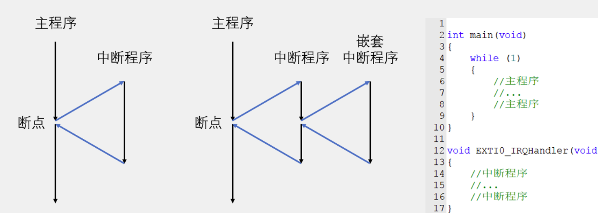
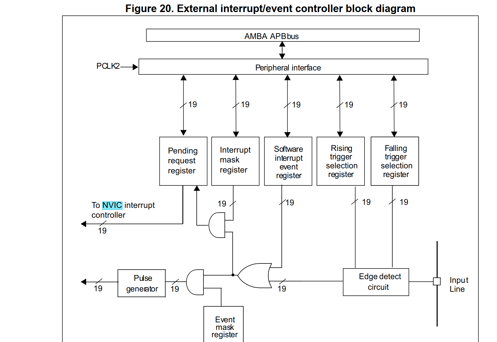
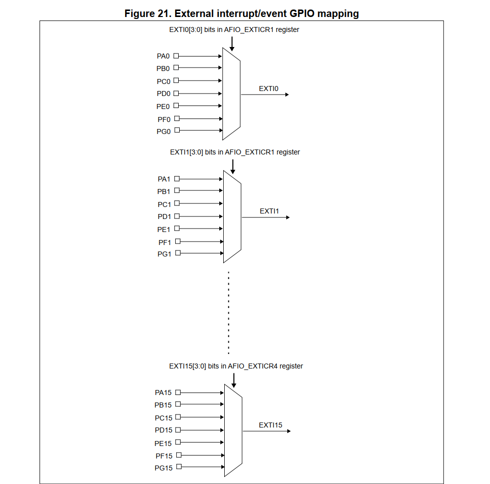
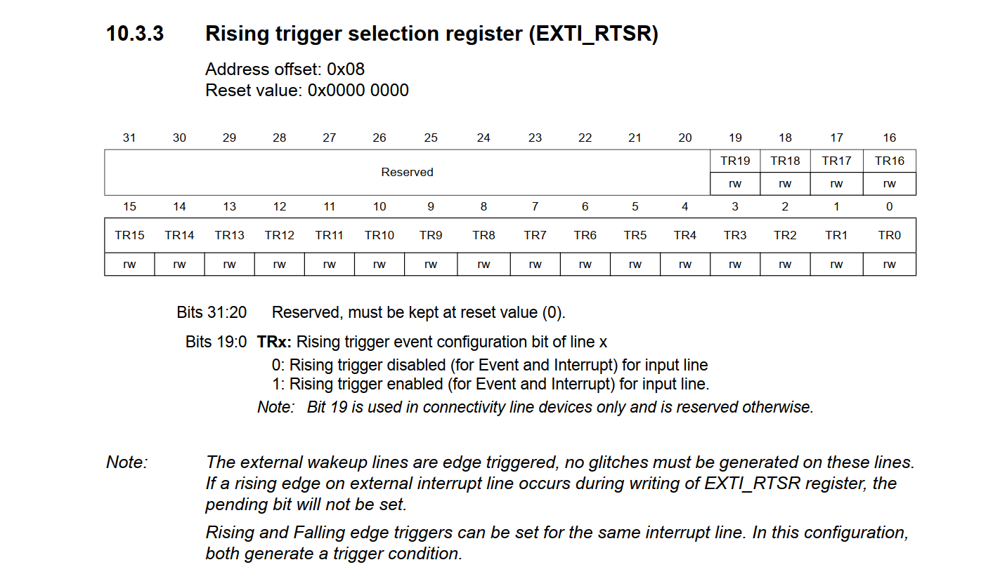
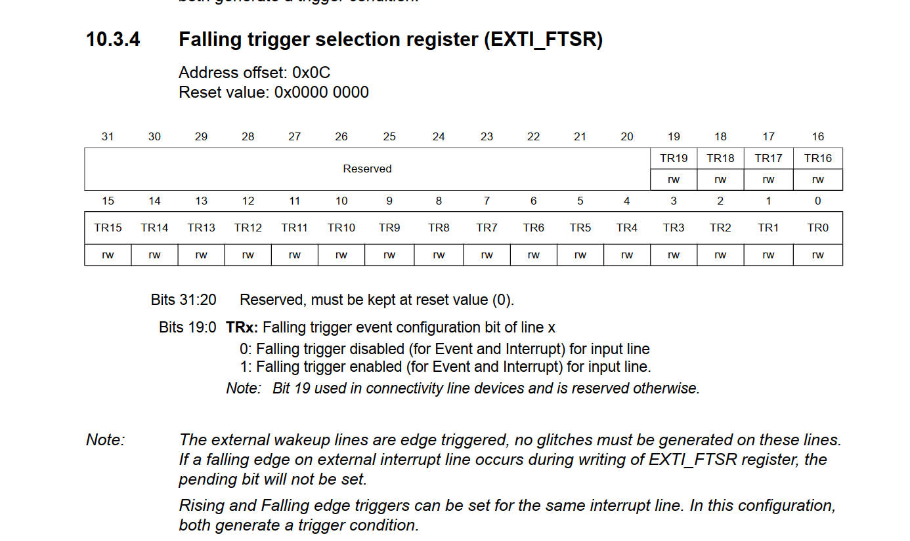

# 硬核原理篇：解析单片机中断和GPIO中断的几个重要原理

​	下面，我们就打算好好说说中断和GPIO中断了。这个知识实际上还设计到一点Cortex-M3架构的知识（对于STM32F1系列是这样的），因此，理解中断，还需要懂一点Cortex-M3，笔者尽可能把事情说的简短跟明晰。

## 先说中断

​	我先说结论，中断的汉语含义是——在原先正在执行的流程中突然被打断，这就是中断。但是仅靠这样的理解还是不够全面，我要说的是，我们关心的中断在它没有说明的后半部分内容中。那就是：打断后，处理器专心的处理中断的事务，包括受理中断的标志后，调用对应处理的子例程。比如说我们上一个小节中，就是使用中断来受理光强变化的。



​	笔者认为江科大的图说的很清晰很直白了，你可以看到我们的程序流在事件尺度上的变化。

​	所以，在STM32中，到底发生了什么呢？中断的处理流程到底是什么呢，我们下面就来分析。

## 所以，在STM32中如何抽象和受理中断的

​	参考手册的第十章，说的就是STM32的中断处理机制。让我们看看手册如何介绍STM32的

> 特性
>
> - 68 个（不包括 16 条 Cortex®-M3 中断线）
> - **16** 个可编程优先级（使用 4 位中断优先级）
> - 低延迟异常和中断处理
> - 电源管理控制
> - 系统控制寄存器的实现
>
> NVIC 和处理器核心接口紧密耦合，可实现低延迟中断处理和高效处理迟到中断。
> 所有中断（包括核心异常）均由 NVIC 管理。

​	也就是说，我们的所有的中断，都交给了一个叫做NVIC的东西管理了，NVIC是啥呢？上一节我们也说过了：NVIC的全称是Nested vectored interrupt controller，即嵌套向量中断控制器。NVIC，你可以认为是STM32的核心部件之一了，它**负责管理和控制整个中断系统**。

​	那问题来了，中断有千千万，我们怎么在最开始就知道这个中断说的是什么事件导致的中断呢？答案是，我们使用了一个叫做中断向量表的东西。为什么是向量呢？嗯，你看向量就像一个指**向**东西的一个量，对于STM32使用的arm架构而言，我们是使用NVIC发过来的通知向量号N（这是第几个中断，至于到底是啥，查表，这个表就是中断向量表），STM32内部简单的将程序流设置成了第N个中断向量所在的位置，那里存放的内容就是我们的中断处理回调函数，这样，我们实际上就完成了如下的简单的工作：

```
NVIC -----> 你需要处理的是第N个中断 ------> STM32
STM32	--> 首先快速保留执行现场，然后设置PC的值为第N个中断向量所在的位置 -----> 执行IRQHandler
```

​	问题来了，这个表放哪里呢？在启动文件的汇编里。

| 编号 | 向量名称       | 说明                        |
| ---- | -------------- | --------------------------- |
| 0    | 初始堆栈指针   | 主堆栈指针初始值（MSP）     |
| 1    | Reset          | 复位中断处理函数            |
| 2    | NMI            | 非屏蔽中断                  |
| 3    | HardFault      | 硬错误异常                  |
| 4    | MemManage      | 内存管理错误（未启用）      |
| 5    | BusFault       | 总线错误（未启用）          |
| 6    | UsageFault     | 使用错误（未启用）          |
| 7    | Reserved       | 保留                        |
| 8    | Reserved       | 保留                        |
| 9    | Reserved       | 保留                        |
| 10   | Reserved       | 保留                        |
| 11   | SVCall         | 系统服务调用                |
| 12   | DebugMonitor   | 调试监控                    |
| 13   | Reserved       | 保留                        |
| 14   | PendSV         | 可挂起服务调用              |
| 15   | SysTick        | 系统节拍定时器              |
| 16   | WWDG           | 窗口看门狗                  |
| 17   | PVD            | 电压检测器                  |
| 18   | TAMPER         | 篡改检测                    |
| 19   | RTC            | 实时时钟                    |
| 20   | FLASH          | Flash 操作中断              |
| 21   | RCC            | 时钟控制器中断              |
| 22   | EXTI0          | 外部中断线0                 |
| 23   | EXTI1          | 外部中断线1                 |
| 24   | EXTI2          | 外部中断线2                 |
| 25   | EXTI3          | 外部中断线3                 |
| 26   | EXTI4          | 外部中断线4                 |
| 27   | DMA1_Channel1  | DMA1 通道1 中断             |
| 28   | DMA1_Channel2  | DMA1 通道2 中断             |
| 29   | DMA1_Channel3  | DMA1 通道3 中断             |
| 30   | DMA1_Channel4  | DMA1 通道4 中断             |
| 31   | DMA1_Channel5  | DMA1 通道5 中断             |
| 32   | DMA1_Channel6  | DMA1 通道6 中断             |
| 33   | DMA1_Channel7  | DMA1 通道7 中断             |
| 34   | ADC1_2         | ADC1 和 ADC2 中断           |
| 35   | USB_HP_CAN_TX  | USB 高优先级或 CAN TX 中断  |
| 36   | USB_LP_CAN_RX0 | USB 低优先级或 CAN RX0 中断 |
| 37   | CAN_RX1        | CAN RX1 接收中断            |
| 38   | CAN_SCE        | CAN 状态变化和错误中断      |
| 39   | EXTI9_5        | 外部中断线[9:5]             |
| 40   | TIM1_BRK       | 定时器1 断路中断            |
| 41   | TIM1_UP        | 定时器1 更新中断            |
| 42   | TIM1_TRG_COM   | 定时器1 触发和通信中断      |
| 43   | TIM1_CC        | 定时器1 捕获比较中断        |
| 44   | TIM2           | 定时器2 全局中断            |
| 45   | TIM3           | 定时器3 全局中断            |
| 46   | TIM4           | 定时器4 全局中断            |
| 47   | I2C1_EV        | I2C1 事件中断               |
| 48   | I2C1_ER        | I2C1 错误中断               |
| 49   | I2C2_EV        | I2C2 事件中断               |
| 50   | I2C2_ER        | I2C2 错误中断               |
| 51   | SPI1           | SPI1 全局中断               |
| 52   | SPI2           | SPI2 全局中断               |
| 53   | USART1         | USART1 全局中断             |
| 54   | USART2         | USART2 全局中断             |
| 55   | USART3         | USART3 全局中断             |
| 56   | EXTI15_10      | 外部中断线[15:10]           |
| 57   | RTCAlarm       | 实时时钟报警中断            |
| 58   | USBWakeup      | USB 唤醒中断                |

​	很长一串，对吧。

> 笔者认为值得一提的是——为什么第0号回调看起来这么不中断呢？答案是这是ARM-V7M架构决定的特性，PC指针在复位的时候自动指向中断向量表的第0个中断，这个时候，我们的C语言运行需要初始化堆栈，就是在这里初始化的

​	还有一件事情是值得一说的，那就是中断分组的事情。中断分组在上一个博客已经说过了，这里不再重复。

​	到这里笔者就不打算往下说了，在下面其实跟我们的STM32没啥关系了，跟我们的ARMv7M架构扯上关系了，这个分支不打算处理架构相关的学习，感兴趣的朋友去看看《CortexM3权威指南》等手册深入学习。

​	


## EXTI中断

​	对于现在，我们真正关心的中断其实就是1个，那就是GPIO外部中断。这个是我们现在学习的

> The external interrupt/event controller consists of up to 20 edge detectors in connectivity line devices, or 19 edge detectors in other devices for generating event/interrupt requests. Each input line can be independently configured to select the type (event or interrupt) and the corresponding trigger event (rising or falling or both). Each line can also masked independently. A pending register maintains the status line of the interrupt requests 
>
> 外部中断/事件控制器由连接线设备中最多 20 个边沿检测器组成，或由其他设备中的 19 个边沿检测器组成，用于生成事件/中断请求。每条输入线都可以独立配置，以选择类型（事件或中断）和相应的触发事件（上升或下降或两者）。每条线也可以独立屏蔽。待处理寄存器维护中断请求的状态线



​	可以看到我们的逻辑是多么的复杂，笔者慢慢说这个图你要怎么读。

​	读这类框图，要先看输入和输出，对于这个图你仔细看下，输入是一个Input Line，也就是外部的输入线，这个线，就是我们GPIO外部引脚的线。举个例子，当我们给PB0配置成上个博客所说的模式的时候，我们实际上就是将输入线给到了Input Line这个端口。我们下一步就是送到边沿触发电路（Edge Detect Circuit），这个电路负责通知上升沿和下降沿道来的事件脉冲。如果存在脉冲变化，进一步将信号传递给左侧的或门后，一般而言，就会进入左侧的中断受理部分了。

​	我们向上看，之后的下面的部分属于事件触发，这一部分CPU不参与，只是让外面的电路跟我们的片上外设部分的电路进行交互，跟我们的程序逻辑没有直接的关系。上面的部分存在两个寄存器，分别是中断屏蔽寄存器和中断挂起寄存器：

- **Interrupt mask register（中断屏蔽寄存器）**：用于屏蔽/允许中断信号。如果该寄存器相应位被屏蔽，即使发生中断也不会通知 NVIC。
- **Pending request register（中断挂起寄存器）**：用于记录哪个中断正在等待处理。中断发生后相应位会被置位，等待 NVIC 响应。
- 如果请求有效并未被屏蔽，则输出中断请求信号 **送往 NVIC（Nested Vectored Interrupt Controller）**。

​	说白了，中断屏蔽寄存器用于允许这个中断是否可以被理睬，另一方面，中断挂起寄存器又是在准备薄记哪一些中断发生了，NVIC准备好处理外部电路带来的中断信息。随后，这部分信息就被送到我们的STM32中，触发一个中断。STM32快速保存好现场之后，跳转道中断处理的历程，这个事情就结束了。



​	对于编程目的而言，我们要牢记这个图，这个图就是我们的GPIO引脚送来的电平触发随后跟我们的复用的GPIO外部电路触发上的关系是如何的。举个例子，任何一个PIN_0的引脚，可能是PA0，可能是PB0等等，都会统一被送到EXTI0这个中断线上，触发的就是EXTI0的中断。你可能会问我，万一PA0和PB0都准备触发呢？答案是未定义行为，STM32没办法在硬件上直接区分，你需要自己写程序决定到底是哪一个引脚。

​	到这里，基本的原理就结束了。

### EXTI外设寄存器：初始化的RTSR和FTSR

​	Rising Triggure和Falling Triggure的选择寄存器，说白了就是使能这的寄存器的对应的比特位功能后，我们就可以检查对应Pin的引脚功能了。



​	这里置1表达的就是使能上升沿，0失能，对于下降沿也是“同理可得”的




# 标准库源码分析

## 初始化我们的EXTI_Init函数

​	实际上就是按照中断线正确的配置我们的RTSR和FTSR

```c
void EXTI_Init(EXTI_InitTypeDef* EXTI_InitStruct)
{
  uint32_t tmp = 0;

  /* Check the parameters */
  assert_param(IS_EXTI_MODE(EXTI_InitStruct->EXTI_Mode));
  assert_param(IS_EXTI_TRIGGER(EXTI_InitStruct->EXTI_Trigger));
  assert_param(IS_EXTI_LINE(EXTI_InitStruct->EXTI_Line));  
  assert_param(IS_FUNCTIONAL_STATE(EXTI_InitStruct->EXTI_LineCmd));

  tmp = (uint32_t)EXTI_BASE;
     
  if (EXTI_InitStruct->EXTI_LineCmd != DISABLE)
  {
    /* Clear EXTI line configuration */
    EXTI->IMR &= ~EXTI_InitStruct->EXTI_Line;
    EXTI->EMR &= ~EXTI_InitStruct->EXTI_Line;
    
    tmp += EXTI_InitStruct->EXTI_Mode;

    *(__IO uint32_t *) tmp |= EXTI_InitStruct->EXTI_Line;

    /* Clear Rising Falling edge configuration */
    EXTI->RTSR &= ~EXTI_InitStruct->EXTI_Line;
    EXTI->FTSR &= ~EXTI_InitStruct->EXTI_Line;
    
    /* Select the trigger for the selected external interrupts */
    if (EXTI_InitStruct->EXTI_Trigger == EXTI_Trigger_Rising_Falling)
    {
      /* Rising Falling edge */
      EXTI->RTSR |= EXTI_InitStruct->EXTI_Line;
      EXTI->FTSR |= EXTI_InitStruct->EXTI_Line;
    }
    else
    {
      tmp = (uint32_t)EXTI_BASE;
      tmp += EXTI_InitStruct->EXTI_Trigger;

      *(__IO uint32_t *) tmp |= EXTI_InitStruct->EXTI_Line;
    }
  }
  else
  {
    tmp += EXTI_InitStruct->EXTI_Mode;

    /* Disable the selected external lines */
    *(__IO uint32_t *) tmp &= ~EXTI_InitStruct->EXTI_Line;
  }
}
```

​	这个事情很有意思，我们实际上是按照如下步骤进行初始化的

```
tmp = (uint32_t)EXTI_BASE;
```

​	这里我们拿到了EXTI的处理基地址。

> STM32对外设的操控映射到了内存地址上，我们的内存访问检查器看到了这个地址就会把对应的访问接口在硬件上转发成对外设的读写

​	之后的部分就是直接按照我们给定的配置进行配置了：

1. **使能EXTI线的情况(EXTI_LineCmd != DISABLE)**：

   - 清除IMR(中断屏蔽寄存器)和EMR(事件屏蔽寄存器)中对应线的配置

   - 根据模式(中断或事件)设置相应寄存器：

     ```
     tmp += EXTI_InitStruct->EXTI_Mode;
     *(__IO uint32_t *) tmp |= EXTI_InitStruct->EXTI_Line;
     ```

   - 清除上升沿和下降沿触发配置

   - 设置触发方式：

     - 如果是上升沿和下降沿都触发：

       ```
       EXTI->RTSR |= EXTI_InitStruct->EXTI_Line;
       EXTI->FTSR |= EXTI_InitStruct->EXTI_Line;
       ```

     - 否则(仅上升沿或仅下降沿)：

       ```
       tmp = (uint32_t)EXTI_BASE;
       tmp += EXTI_InitStruct->EXTI_Trigger;
       *(__IO uint32_t *) tmp |= EXTI_InitStruct->EXTI_Line;
       ```

2. **禁用EXTI线的情况(EXTI_LineCmd == DISABLE)**：

   - 根据模式(中断或事件)清除相应寄存器中的对应线配置：

     ```
     tmp += EXTI_InitStruct->EXTI_Mode;
     *(__IO uint32_t *) tmp &= ~EXTI_InitStruct->EXTI_Line;
     ```

## 配置我们的中断线时钟

```
void GPIO_EXTILineConfig(uint8_t GPIO_PortSource, uint8_t GPIO_PinSource)
{
  uint32_t tmp = 0x00;
  /* Check the parameters */
  assert_param(IS_GPIO_EXTI_PORT_SOURCE(GPIO_PortSource));
  assert_param(IS_GPIO_PIN_SOURCE(GPIO_PinSource));
  
  tmp = ((uint32_t)0x0F) << (0x04 * (GPIO_PinSource & (uint8_t)0x03));
  AFIO->EXTICR[GPIO_PinSource >> 0x02] &= ~tmp;
  AFIO->EXTICR[GPIO_PinSource >> 0x02] |= (((uint32_t)GPIO_PortSource) << (0x04 * (GPIO_PinSource & (uint8_t)0x03)));
}
```

1. **计算掩码**：

   ```
   tmp = ((uint32_t)0x0F) << (0x04 * (GPIO_PinSource & (uint8_t)0x03));
   ```

   - 创建一个4位的掩码(0x0F)
   - 根据引脚号计算偏移量：(GPIO_PinSource & 0x03)确定引脚在寄存器中的位置(0-3)
   - 左移相应位数(每引脚占4位)

2. **清除原有配置**：

   ```
   AFIO->EXTICR[GPIO_PinSource >> 0x02] &= ~tmp;
   ```

   - `GPIO_PinSource >> 0x02`确定使用哪个EXTICR寄存器(每寄存器控制4个引脚)
   - 使用掩码的反码(& ~tmp)清除对应引脚的位置

3. **设置新配置**：

   ```
   AFIO->EXTICR[GPIO_PinSource >> 0x02] |= (((uint32_t)GPIO_PortSource) << (0x04 * (GPIO_PinSource & (uint8_t)0x03)));
   ```

   - 将端口源值左移到正确的位置
   - 使用或操作(|=)设置新的端口映射

# HAL库源码分析

对于HAL，外部中断的配置实际上被合并到了GPIO_Init当中去了，我们同样的是使能复用时钟后，直接设置我们的RTSR和FTSR寄存器

```c
      /*--------------------- EXTI Mode Configuration ------------------------*/
      /* Configure the External Interrupt or event for the current IO */
      if ((GPIO_Init->Mode & EXTI_MODE) == EXTI_MODE)
      {
        /* Enable AFIO Clock */
        __HAL_RCC_AFIO_CLK_ENABLE();
        temp = AFIO->EXTICR[position >> 2u];
        CLEAR_BIT(temp, (0x0Fu) << (4u * (position & 0x03u)));
        SET_BIT(temp, (GPIO_GET_INDEX(GPIOx)) << (4u * (position & 0x03u)));
        AFIO->EXTICR[position >> 2u] = temp;


        /* Configure the interrupt mask */
        if ((GPIO_Init->Mode & GPIO_MODE_IT) == GPIO_MODE_IT)
        {
          SET_BIT(EXTI->IMR, iocurrent);
        }
        else
        {
          CLEAR_BIT(EXTI->IMR, iocurrent);
        }

        /* Configure the event mask */
        if ((GPIO_Init->Mode & GPIO_MODE_EVT) == GPIO_MODE_EVT)
        {
          SET_BIT(EXTI->EMR, iocurrent);
        }
        else
        {
          CLEAR_BIT(EXTI->EMR, iocurrent);
        }

        /* Enable or disable the rising trigger */
        if ((GPIO_Init->Mode & RISING_EDGE) == RISING_EDGE)
        {
          SET_BIT(EXTI->RTSR, iocurrent);
        }
        else
        {
          CLEAR_BIT(EXTI->RTSR, iocurrent);
        }

        /* Enable or disable the falling trigger */
        if ((GPIO_Init->Mode & FALLING_EDGE) == FALLING_EDGE)
        {
          SET_BIT(EXTI->FTSR, iocurrent);
        }
        else
        {
          CLEAR_BIT(EXTI->FTSR, iocurrent);
        }
      }
    }
```

到此为止，就差不多了。当然还有NVIC的分组设置等，这个我们就不细究了，知道如何使用即可。

