# 硬核原理篇：讨论GPIO的基本原理篇章1——只讨论我们的GPIO简单输入和输出

## 前言

​	你玩够了前面的实验，现在就要准备竖起耳朵听听原理了。GPIO是单片机中很重要的基础外设，是单片机跟外界沟通的桥梁。

​	查看原理，一个非常好的习惯就是学会阅读我们的单片机手册。

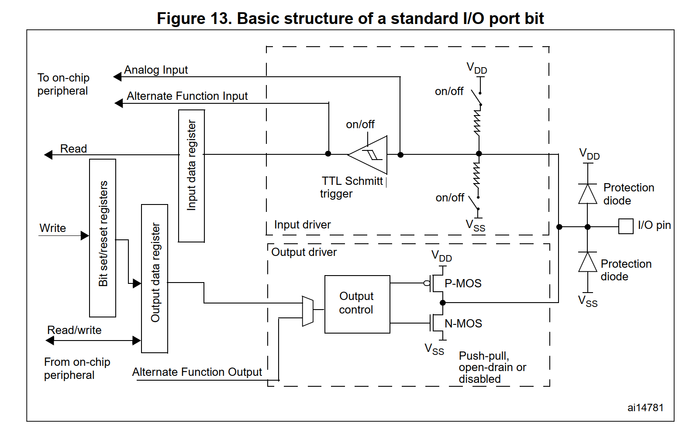

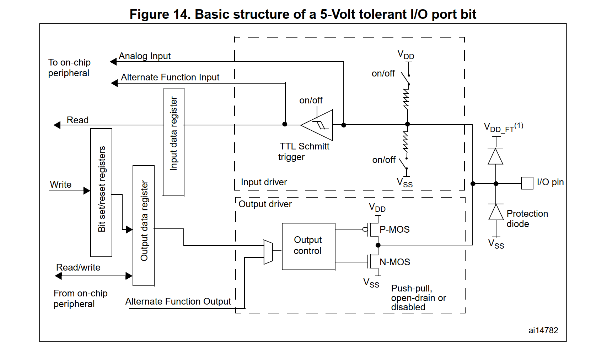

​	上面的两张图像是我们亲爱的单片机GPIO机制全家福，是我们分析源代码和原理的一个重要的辅助手段，哦，我想你应该再说——这我分析鸡毛啊，对，这个图是8种GPIO模式混合在了一起的图像，而且你发现，实际上，第一张图和第二章图在物理上只有一个区别，那就是最右侧的上拉部分的二极管从VDD换成了VDD_FT，还得的笔者的分析资源手册的部分吗？你会看到一些引脚被标记上了FT，这个意思，是说明我们的单片机是耐压为5V的引脚，凡是没有标记FT的，你需要小心，他们是耐压3.3V的，一旦给大了电压，您的开发板可能就要报废了（芯片引脚烧坏）。

​	我们上面谈到了——“8种GPIO模式”这个组合，一个很自然的想法在你的脑袋里Rise up了，哪八种啊？不是我回答，我没那个权力，是手册回答的——

| Mode                          | 模式           | 说明                                                         |
| ----------------------------- | -------------- | ------------------------------------------------------------ |
| Input floating                | 浮空输入       | 输入模式的一个子集：浮空的，换而言之，当没有明确的电平输入的时候，**你的GPIO引脚的电平输入猜猜乐状态，如果没有非常明确的理由，不要使用这个模式！！！** |
| Input pull-up                 | 输入上拉       | 输入模式的一个子集：上拉的一个输入，换而言之，没有输入的时候，我们的电平就是出于高电平，你读取这个GPIO的电平就是高电平 |
| Input-pull-down               | 输入下拉       | 输入模式的一个子集：下拉的一个输入，换而言之，没有输入的时候，我们的电平就是出于低电平，你读取这个GPIO的电平就是低电平 |
| Analog                        | 模拟输入       | 输入模式的一个子集：电路层上的模拟，换而言之，我们直接读取了电平的模拟量，也就是能通过一定手段拿到这个GPIO引脚上的电压！（笔者到ADC会好好说明这个事情） |
| Output open-drain             | 开漏输出       | 输出模式的一个子集：开漏是MOS管模电的术语，不太懂的朋友我打一个比方：就像是门缝里漏进来了高电平，这个高电平必须是外部别人给的，不是自己给的，这个时候的输出更像是**输出一个控制**，它本身不提供高电压，他对提供者（比如说你自己接的电池）进行控制,让他输出高电压。 |
| Output push-pull              | 推挽输出       | 输出模式的一个子集：还记得笔者说的——强势的输出能力吗，这里，我们的GPIO自己就在使劲的驱动外设，这就是单片机自己强势的控制外部外设而不是依赖于给定的电源，这种就适合驱动小外设，比如说LED，常见的最简单传感器等等 |
| Alternate function push-pull  | 复用的推挽输出 | 输出模式的一个子集：推挽输出上面刚说过，在这个事情上没有半毛钱变化.问题在于修饰词AF上,AF就是Alternate Function,也就是复用功能.这个事情对于大部分萌新而言会一脸懵逼,复用?什么复用?答案是，单片机之所以不菜，**就是因为他有强大的复用能力**，很快你就知道，**片上的IIC芯片，SPI芯片等等如何对外沟通的？利用引脚跟外面打交道的，这个时候，GPIO就被征用，用来完成更加详细特定的外部功能了！** |
| Alternate function open-drain | 复用的开漏输出 | 输出模式的一个子集：开漏输出还是一样的，复用笔者上一个也说过了，不再重复。 |

​	现在的学习阶段上，我们不去特别深究电路原理，等到我们真正涉及到电路设计的时候再去了解。目前为之，我们只是接触了最简单的输入和输出，为此，我们来看看手册对这些地方的描述。

## 输出时的GPIO控制部分

​	很多文档说的太过于失去把控，将电路实现细节和编程细节全部混合在一起，笔者初学的时候也是非常的头大，这里笔者尝试说明白。

​	注意，在输出的时候，只有一个地方我们是真正关心的。

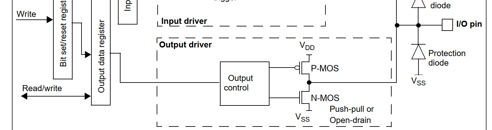

​	笔者告诉你的是。当我们调用GPIO_WriteBits的时候，写入的是Output data寄存器，Outputdata寄存器将我们的行为传递给Output driver输出驱动器子系统，输出驱动器，最关心的就是两个MOS管，也就是P-MOS管和N-MOS管。作为初学，不要立马钻到P-MOS和N-MOS的实现细节里去了，你需要知道的是，当我们处于强势的推挽输出的时候，两个MOS管都工作，共同根据我们的设置切换对应的工作状态，顺着线给出我们的高低电平，从而从I/O Pin上给出单片机自己的高低电平原则。

​	那开漏呢？答案是PMOS管就不工作了！只有NMOS管干活，也就是他只能输出低电平，高电平呢？不是单片机管的！我上面就说过了，实际上是控制外部电源输出他自己的大电压。电路部分点到位置。

​	我们作为软件开发，可以不用如此的关心这些细节（让那些硬件佬们操心吧，我每一次看到硬件✌都会开磕），我们关心的是，对于软件编程，库寄存器到底在做什么。

## 标准库是如何操作寄存器完成GPIO驱动的初始化的？

​	按照逻辑顺序，我们假设我们已经开启了GPIO时钟，现在，GPIO已经就绪，我们需要安排它的工作任务，我们这里的部分就是在探讨——我们委派GPIO任务的全部编程细节。

​	回到我们如何使用标准库完成这个事情的：

```
// 初始化GPIO PA0 完成设置PA0为八大模式下的推挽输出状态
	gpio_init.GPIO_Mode = GPIO_Mode_Out_PP;
	gpio_init.GPIO_Speed = GPIO_Speed_50MHz;
	gpio_init.GPIO_Pin = GPIO_Pin_0;
	GPIO_Init(GPIOA, &gpio_init);
```

​	

### 问题1：如何掌握GPIO的编程细节——跟寄存器如何打交道

​	江科大的笔者听过，大佬是如何分析寄存器的，说真的把我吓跑了，因为真的不太理解。我们知道，单片机的核心实际上就是操作寄存器，甚至广义的说——你的电脑现在的工作，就是我们无时不刻疯狂的操作寄存器设置处理器的状态，接受和传递处理器的结果。所以，**我们在硬件和软件上的衔接，就是寄存器，理解了寄存器要如何操作，我们实际上就可以完成对我们手头器件的编程了，看过笔者手搓操作系统系列的朋友应该会深有体会。**

### 问题2：哪些寄存器，去哪里找呢？

​	数据手册的第一个重要含义，就是告诉你，当你面对一个外设的时候，他有哪些基本我们需要关心的寄存器，哪些我们需要关心的概念。比如说八大寄存器的模式啊，需要操作的寄存器啊，等等内容

​	约定俗称的讲，我们的单片机往往分为控制寄存器和数据寄存器，控制寄存器控制我们的片上外设/片外外设的行为，数据寄存器那就是真往里写东西的。换而言之，数据寄存器是货，控制寄存器是人，你指挥人，让他们正确的处理货物。所以，我们实际上就是看——如何编程这些寄存器呢？

​	我们的手册上给出了我们想要的东西，所以任何问题，先找手册，不是没有道理的，请看STM32F1xx系列的手册，在我们的第159页上的9.1，也就是第一大点，存在这样的一段话，笔者认为非常的关键，需要放到这里

> Each of the general-purpose I/O ports has two 32-bit configuration registers (GPIOx_CRL, GPIOx_CRH), two 32-bit data registers (GPIOx_IDR, GPIOx_ODR), a 32-bit set/reset register (GPIOx_BSRR), a 16-bit reset register (GPIOx_BRR) and a 32-bit locking register (GPIOx_LCKR).
>
> 每个通用 I/O 端口都有两个 32 位配置寄存器（GPIOx_CRL、GPIOx_CRH）、两个 32 位数据寄存器（GPIOx_IDR、GPIOx_ODR）、一个 32 位置位/复位寄存器（GPIOx_BSRR）、一个 16 位复位寄存器（GPIOx_BRR）和一个 32 位锁定寄存器（GPIOx_LCKR）。

​	啊哈，这个没啥好说的，首先就是我们需要说的，关心的寄存器上，就是控制寄存器GPIOx_CRL和GPIOx_CRH，这就是GPIO为什么分组了，我们对每一个组的GPIO都配备了专门的控制寄存器和输入输出的缓存寄存器。我们对GPIO的编程，实际上就是围绕着这七个寄存器来说话的。

### 问题三，寄存器的含义，写入的值的含义是如何的？我们想要完成功能需要写什么东西才能达到我们的目的

​	这个问题就是数据手册存在的第二个重要的含义，举个例子，我们进一步阅读手册

> Each I/O port bit is freely programmable, however the I/O port registers have to be accessed as 32-bit words (half-word or byte accesses are not allowed). The purpose of the GPIOx_BSRR and GPIOx_BRR registers is to allow atomic read/modify accesses to any of the GPIO registers. This way, there is no risk that an IRQ occurs between the read and the modify access.
>
> 每个 I/O 端口位均可自由编程，但 I/O 端口寄存器必须以 32 位字的形式进行访问（不允许半字或字节访问）。**GPIOx_BSRR 和 GPIOx_BRR 寄存器的目的是允许对任何 GPIO 寄存器进行原子读取/修改访问。这样，就不会有在读取和修改访问之间发生 IRQ 的风险。**

​	因此，我们知道，实际上我们不需要太关心ODR寄存器，他的作用实际上是作为BRR和BSRR寄存器的实际执行官，或者说，充当一个输出的影子。毕竟中断的存在的确会带来打断前后状态不一致的风险，我们自己操作寄存器的时候，也要操作的是GPIOx_BSRR 寄存器和GPIOx_BRR！不要更改ODR寄存器！

​	先关心的是控制，控制寄存器分为两个：低32位的GPIOx_CRL和高32位的GPIOx_CRH寄存器。我们在配置模式的时候，实际上也是针对我们的控制寄存器进行编程，请看171页的手册：

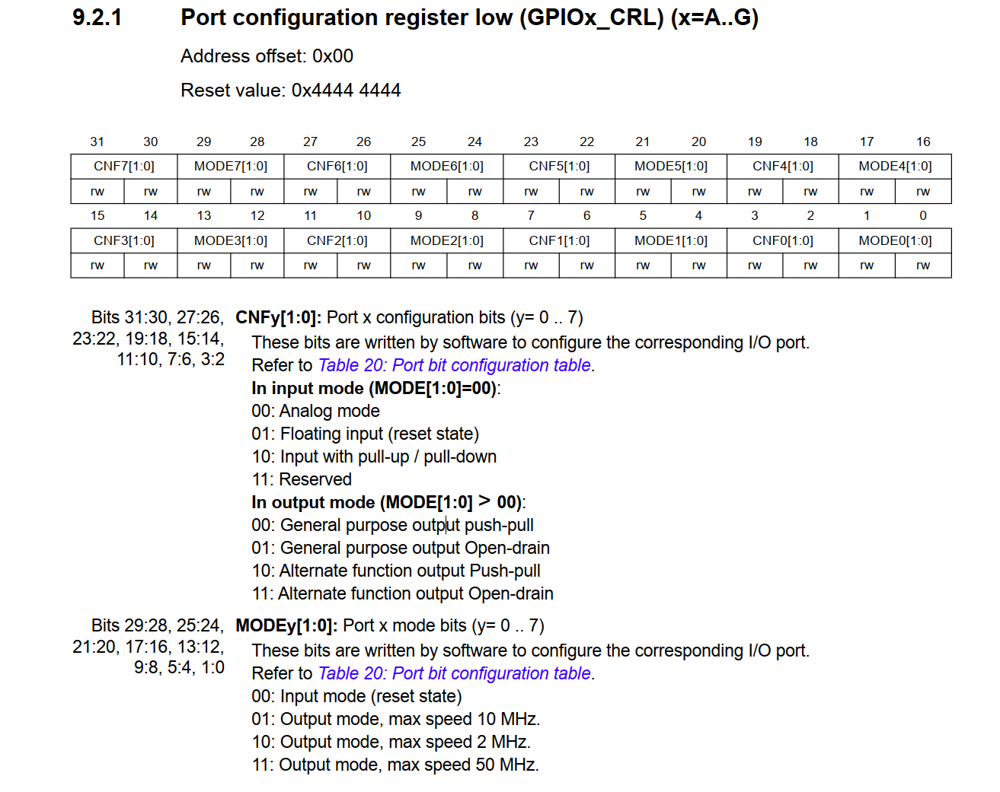

​	笔者下面教授我们如何思考和阅读这样的手册，第一个问题，想清楚我们要干啥。“我们现在要点LED”，”我们现在要让GPIO读取外部的电平...”，想明白这些事情，我们才能以正确的姿势阅读手册。

​	我们看，对于低32位的寄存器，我们实际上每一个Pin的信息占据4位。举个例子，CNF0和MODE0位就是针对我们的PIN_0说的，因此，当我们想要配置PA0的时候，我们实际上就只需要操作GPIOA的最低四位，这样就完事了。


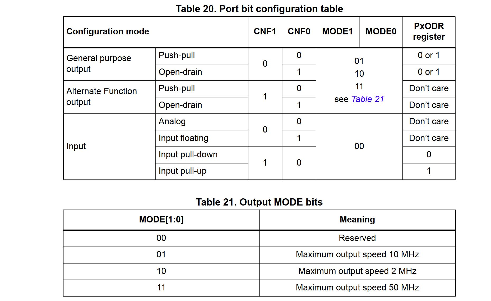

​	那我们应该如何正确的写入值呢？看到上面的表格，上面的表格中，我们就完成了寄存器的模式设置。举个例子，在点灯部分的时候，我们就说过需要设置GPIO为推挽输出，因此，我们就需要设置我们的比特位是：CNF00，然后Mode呢，我们选择的是50MHZ的速度，因此就是0011.你可以使用自己写的点亮小灯的例程中进入调试模式来确认额这个事情

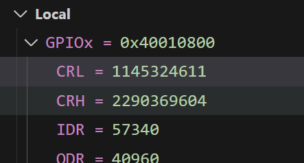


​	非常好！你已经迈出了学习看手册和验证的第一步了。下一步，请你试一试求证一下按钮输入输出的控制寄存器的值如何查找！

> 提示：我们学习按钮的时候，GPIO是按照输入上拉进行配置的。此外，你需要考证下我们的ODR寄存器的值，这个算额外的挑战

​	下一个问题就是，我们编程的时候，GPIO的输入和输出寄存器又是怎么一回事呢？请看手册

#### 输入的IDR寄存器

​	IDR寄存器负责处理我们的输入，我们实际上ReadPin的时候，也是读取的IDR寄存器，他会存储我们的读取的电平的状态。

> The Input Data register (GPIOx_IDR) captures the data present on the I/O pin at every APB2 clock cycle. 
>
> 输入数据寄存器（GPIOx_IDR）在每个 APB2 时钟周期捕获 I/O 引脚上的数据。

​	关于何为APB2,这个事情笔者放到时钟树的介绍的时候,我们好好聊聊.

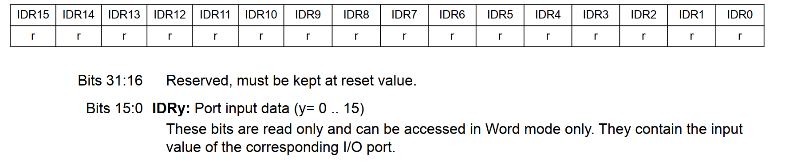

​	所以,我们想要得到GPIO外部引脚的电平的状态,只需要读取我们的IDR寄存器即可.我们后面分析标准库的ReadGPIOPinBits和HAL_GPIO_ReadPin函数的时候,还会回来好好看人家如何使用C语言代码完成这个工作的

#### 最直接的输出寄存器 ODR寄存器

> When configured as output, the value written to the Output Data register (GPIOx_ODR) is output on the I/O pin. It is possible to use the output driver in Push-Pull mode or Open-Drain mode (only the N-MOS is activated when outputting 0).
>
> 当配置为输出时，写入输出数据寄存器 (GPIOx_ODR) 的值将在 I/O 引脚上输出。输出驱动器可以在推挽模式或开漏模式下使用（输出 0 时仅激活 N-MOS）。

​	需要注意的是,我们的写入是非常直接的,最需要操作的安全办法是使用位操作来办事情.

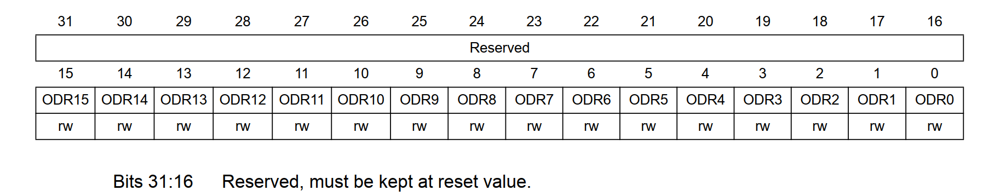

> These bits can be read and written by software and can be accessed in Word mode only. 
> Note: For atomic bit set/reset, the ODR bits can be individually set and cleared by writing to the GPIOx_BSRR register (x = A .. G).
>
> 这些位可以由软件读取和写入，并且只能在字模式下访问。
> 注意：对于原子位设置/重置，可以通过写入 GPIOx_BSRR 寄存器（x = A .. G）单独设置和清除 ODR 位。

​	一般而言,我们也只会操作一个pin一个pin的操作,而且往往不希望中断打断我们的设置导致非常不安全的写入,因此,让我们进一步学习BSRR寄存器的写和BRR寄存器的写.

#### BRR和BSRR寄存器

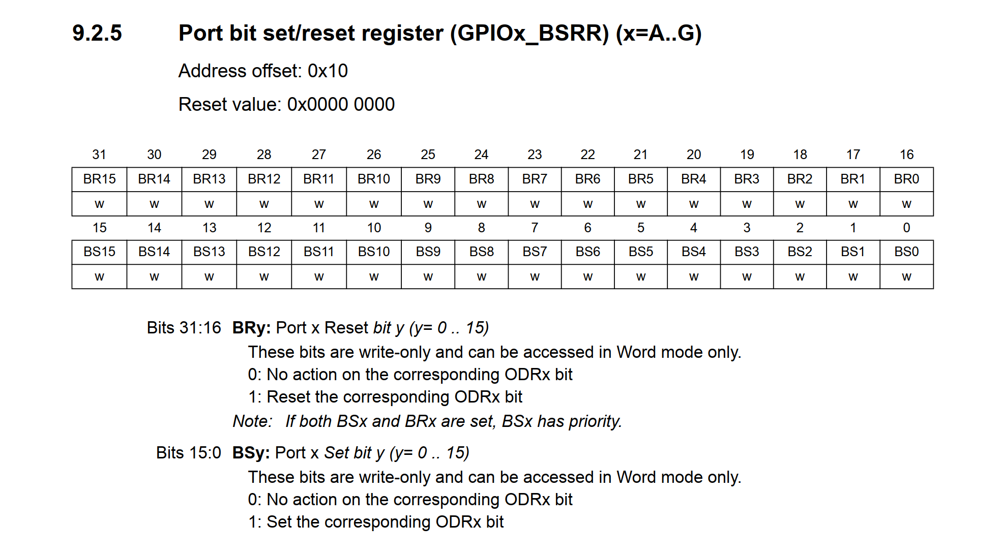

​	BSRR寄存器是只能写入的,如手册所说!这里我们看到,这个32位的寄存器分成了上下两部分,高16位是Port Reset Bit,也就是说,往这里写东西的时候,对应的Pin上的ODR的位就会被复位为1,反之,则是0.

​	BRR寄存器的功能是对我们的指定的位进行清零.嗯,好像跟BSRR重复了?是这样的!

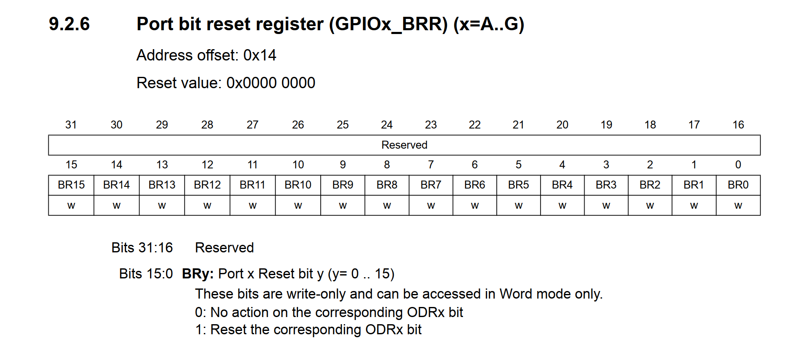

> 哦对了,新一点的STM32系列是没有BRR寄存器了,下面是笔者的STM32F407ZGT6对GPIO操作的手册,所以,ST半导体也认为这个寄存器实在是没有存在的必要,也就被精简掉了.
>
> 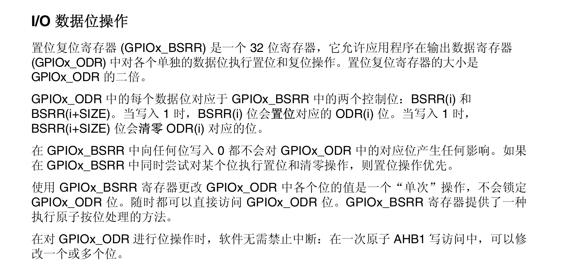

​	基本上我们的寄存器也就说完了.

## 标准库/HAL库是如何操作寄存器初始化GPIO的？

### 标准库`GPIO_Init`初始化函数

我们看看GPIO_Init函数针对设置GPIO为一个推挽输出的时候的程序流。

- 模式设置
- 如果我们的Pin是低8个,则设置设置Control Register的低位寄存器. 反之,设置Control Register的高位寄存器

#### 标准库的习惯——检查我们的参数合法性

​	我们编程的时候，也最好检查一下参数合法性质的问题，不然程序出现了异常，就会导致整个系统崩溃重启，这可就不好了。

```c
/**
  * @brief  Initializes the GPIOx peripheral according to the specified
  *         parameters in the GPIO_InitStruct.
  * @param  GPIOx: where x can be (A..G) to select the GPIO peripheral.
  * @param  GPIO_InitStruct: pointer to a GPIO_InitTypeDef structure that
  *         contains the configuration information for the specified GPIO peripheral.
  * @retval None
  */
void GPIO_Init(GPIO_TypeDef* GPIOx, GPIO_InitTypeDef* GPIO_InitStruct)
{
  uint32_t currentmode = 0x00, currentpin = 0x00, pinpos = 0x00, pos = 0x00;
  uint32_t tmpreg = 0x00, pinmask = 0x00;
  /* Check the parameters */
  assert_param(IS_GPIO_ALL_PERIPH(GPIOx));
  assert_param(IS_GPIO_MODE(GPIO_InitStruct->GPIO_Mode));
  assert_param(IS_GPIO_PIN(GPIO_InitStruct->GPIO_Pin));  
```

​	之后的合法性检查的代码笔者将不会进行任何的说明，除非特殊！

#### 设置我们的GPIO的Mode

```c

/*---------------------------- GPIO Mode Configuration -----------------------*/
  currentmode = ((uint32_t)GPIO_InitStruct->GPIO_Mode) & ((uint32_t)0x0F);
  if ((((uint32_t)GPIO_InitStruct->GPIO_Mode) & ((uint32_t)0x10)) != 0x00)
  { 
    /* Check the parameters */
    assert_param(IS_GPIO_SPEED(GPIO_InitStruct->GPIO_Speed));
    /* Output mode */
    currentmode |= (uint32_t)GPIO_InitStruct->GPIO_Speed;
  }
```

​	这是干啥呢？答案是，设置我们的GPIO速度！嗯，你想想看，设置速度的信息，必须是输出，对吧。我们的`(((uint32_t)GPIO_InitStruct->GPIO_Mode) & ((uint32_t)0x10)) != 0x00`实际上就是在检查我们的第5位。嗯，整个需要请出来我们的GPIO库对标准库的抽象

```c
typedef enum
{ GPIO_Mode_AIN = 0x0,
  GPIO_Mode_IN_FLOATING = 0x04,
  GPIO_Mode_IPD = 0x28,
  GPIO_Mode_IPU = 0x48,
  GPIO_Mode_Out_OD = 0x14,
  GPIO_Mode_Out_PP = 0x10,
  GPIO_Mode_AF_OD = 0x1C,
  GPIO_Mode_AF_PP = 0x18
}GPIOMode_TypeDef;
```

#### **GPIO Mode Binary Encoding Table**

| Enum Name                 | Hex Value | Binary (8-bit) | CNF[1:0] | MODE[1:0] | Description                      |
| :------------------------ | :-------- | :------------- | :------- | :-------- | :------------------------------- |
| **GPIO_Mode_AIN**         | `0x0`     | `0000 0000`    | `00`     | `00`      | Analog Input (ADC/DAC)           |
| **GPIO_Mode_IN_FLOATING** | `0x04`    | `0000 0100`    | `01`     | `00`      | Floating Input (no pull-up/down) |
| **GPIO_Mode_IPD**         | `0x28`    | `0010 1000`    | `10`     | `00`      | Input with Pull-Down             |
| **GPIO_Mode_IPU**         | `0x48`    | `0100 1000`    | `10`     | `00`      | Input with Pull-Up               |
| **GPIO_Mode_Out_OD**      | `0x14`    | `0001 0100`    | `01`     | `11`      | Output Open-Drain (max 50MHz)    |
| **GPIO_Mode_Out_PP**      | `0x10`    | `0001 0000`    | `00`     | `11`      | Output Push-Pull (max 50MHz)     |
| **GPIO_Mode_AF_OD**       | `0x1C`    | `0001 1100`    | `01`     | `11`      | Alternate Function Open-Drain    |
| **GPIO_Mode_AF_PP**       | `0x18`    | `0001 1000`    | `00`     | `11`      | Alternate Function Push-Pull     |

#### 区分和判断到底是设置哪一个CR寄存器

​	我们的标准库的设置方法比较的，嗯，天才

```
#define GPIO_Pin_0                 ((uint16_t)0x0001)  /*!< Pin 0 selected */
#define GPIO_Pin_1                 ((uint16_t)0x0002)  /*!< Pin 1 selected */
#define GPIO_Pin_2                 ((uint16_t)0x0004)  /*!< Pin 2 selected */
#define GPIO_Pin_3                 ((uint16_t)0x0008)  /*!< Pin 3 selected */
#define GPIO_Pin_4                 ((uint16_t)0x0010)  /*!< Pin 4 selected */
#define GPIO_Pin_5                 ((uint16_t)0x0020)  /*!< Pin 5 selected */
#define GPIO_Pin_6                 ((uint16_t)0x0040)  /*!< Pin 6 selected */
#define GPIO_Pin_7                 ((uint16_t)0x0080)  /*!< Pin 7 selected */
#define GPIO_Pin_8                 ((uint16_t)0x0100)  /*!< Pin 8 selected */
#define GPIO_Pin_9                 ((uint16_t)0x0200)  /*!< Pin 9 selected */
#define GPIO_Pin_10                ((uint16_t)0x0400)  /*!< Pin 10 selected */
#define GPIO_Pin_11                ((uint16_t)0x0800)  /*!< Pin 11 selected */
#define GPIO_Pin_12                ((uint16_t)0x1000)  /*!< Pin 12 selected */
#define GPIO_Pin_13                ((uint16_t)0x2000)  /*!< Pin 13 selected */
#define GPIO_Pin_14                ((uint16_t)0x4000)  /*!< Pin 14 selected */
#define GPIO_Pin_15                ((uint16_t)0x8000)  /*!< Pin 15 selected */
#define GPIO_Pin_All               ((uint16_t)0xFFFF)  /*!< All pins selected */
```

​	发现规律了把，实际上就是GPIO_Pin_X就是左移了一个X位，所以你看：我们下面对位检测的处理是这样做的：

```c

/*---------------------------- GPIO CRL Configuration ------------------------*/
  /* Configure the eight low port pins */
	// 如果是低8pin，那么。。。
  if (((uint32_t)GPIO_InitStruct->GPIO_Pin & ((uint32_t)0x00FF)) != 0x00)
  {
      // 我们需要处理的寄存器就是CRL寄存器
    tmpreg = GPIOx->CRL;
    for (pinpos = 0x00; pinpos < 0x08; pinpos++)
    {
        // 我们遍历一下，看看对应GPIO_PIN的位是不是被置1了
      pos = ((uint32_t)0x01) << pinpos;
      /* Get the port pins position */
      currentpin = (GPIO_InitStruct->GPIO_Pin) & pos;
      if (currentpin == pos)
      {
          // 是的，我们放上了1，这个时候，我们需要做的就是萃取控制的4个位。
          // 对于Pin0，则是0~3位，对于Pin1，则是4~7位。。。一次类推，所以我们才需要左移2，相当于x4了
        pos = pinpos << 2;
        /* Clear the corresponding low control register bits */
        pinmask = ((uint32_t)0x0F) << pos;
        // 本来是1111，这一下翻转了成了0000
        tmpreg &= ~pinmask;
        /* Write the mode configuration in the corresponding bits */
          // current mode是只取了低4位的value
        tmpreg |= (currentmode << pos);
        /* Reset the corresponding ODR bit */
          // 如果是下拉的输入，那么我们对对应的BRR寄存器置1，等价于清0了
        if (GPIO_InitStruct->GPIO_Mode == GPIO_Mode_IPD)
        {
          GPIOx->BRR = (((uint32_t)0x01) << pinpos);
        }
        else
        {
          /* Set the corresponding ODR bit */
          if (GPIO_InitStruct->GPIO_Mode == GPIO_Mode_IPU)
          {
              // 反之，那就是置高电平
            GPIOx->BSRR = (((uint32_t)0x01) << pinpos);
          }
        }
      }
    }
      // 写回去值
    GPIOx->CRL = tmpreg;
  }
```

​	剩下的CRH寄存器的逻辑完全一致，请看官自行分析，笔者的代码放到下面了

```c
/*---------------------------- GPIO CRH Configuration ------------------------*/
  /* Configure the eight high port pins */
  if (GPIO_InitStruct->GPIO_Pin > 0x00FF)
  {
    tmpreg = GPIOx->CRH;
    for (pinpos = 0x00; pinpos < 0x08; pinpos++)
    {
      pos = (((uint32_t)0x01) << (pinpos + 0x08));
      /* Get the port pins position */
      currentpin = ((GPIO_InitStruct->GPIO_Pin) & pos);
      if (currentpin == pos)
      {
        pos = pinpos << 2;
        /* Clear the corresponding high control register bits */
        pinmask = ((uint32_t)0x0F) << pos;
        tmpreg &= ~pinmask;
        /* Write the mode configuration in the corresponding bits */
        tmpreg |= (currentmode << pos);
        /* Reset the corresponding ODR bit */
        if (GPIO_InitStruct->GPIO_Mode == GPIO_Mode_IPD)
        {
          GPIOx->BRR = (((uint32_t)0x01) << (pinpos + 0x08));
        }
        /* Set the corresponding ODR bit */
        if (GPIO_InitStruct->GPIO_Mode == GPIO_Mode_IPU)
        {
          GPIOx->BSRR = (((uint32_t)0x01) << (pinpos + 0x08));
        }
      }
    }
    GPIOx->CRH = tmpreg;
  }
}
```

## HAL库如何初始化引脚的

```c
void HAL_GPIO_Init(GPIO_TypeDef  *GPIOx, GPIO_InitTypeDef *GPIO_Init)
{
  // 一些无关的事情，笔者略去了

  /* 配置端口引脚 - 遍历所有需要配置的引脚 */
  while (((GPIO_Init->Pin) >> position) != 0x00u)
  {
    /* 获取当前引脚位置掩码 */
    ioposition = (0x01uL << position);

    /* 获取当前需要配置的引脚 */
    iocurrent = (uint32_t)(GPIO_Init->Pin) & ioposition;

    /* 如果当前引脚需要配置 */
    if (iocurrent == ioposition)
    {
		// 这里是我们终点分析的逻辑 // < --------
    }

    position++;  // 检查下一个引脚
  }
}
```

​	我们先看看大致的框架，这里我们的代码写的更加明白一些，那就是当我们当然的与结果为1，说明我们的确需要配置GPIO的引脚，这个时候，我们就会开始进行配置。跟标准库的流程是完全一致的是，我们首先会设置好4位GPIO的configurations

```c
      /* 检查复用功能参数 */
      assert_param(IS_GPIO_AF_INSTANCE(GPIOx));

      /* 根据所需模式，填充config变量中的MODE[1:0]和CNF[1:0]位 */
      // 在这里，我们实际上是做自己的config向寄存器位的映射
      switch (GPIO_Init->Mode)
      {
        /* 配置为推挽输出模式 */
        case GPIO_MODE_OUTPUT_PP:
          /* 检查速度参数 */
          assert_param(IS_GPIO_SPEED(GPIO_Init->Speed));
          config = GPIO_Init->Speed + GPIO_CR_CNF_GP_OUTPUT_PP;  // 速度模式 + 推挽输出配置
          break;

        /* 配置为开漏输出模式 */
        case GPIO_MODE_OUTPUT_OD:
          assert_param(IS_GPIO_SPEED(GPIO_Init->Speed));
          config = GPIO_Init->Speed + GPIO_CR_CNF_GP_OUTPUT_OD;  // 速度模式 + 开漏输出配置
          break;

        /* 配置为复用功能推挽模式 */
        case GPIO_MODE_AF_PP:
          assert_param(IS_GPIO_SPEED(GPIO_Init->Speed));
          config = GPIO_Init->Speed + GPIO_CR_CNF_AF_OUTPUT_PP;  // 速度模式 + 复用推挽配置
          break;

        /* 配置为复用功能开漏模式 */
        case GPIO_MODE_AF_OD:
          assert_param(IS_GPIO_SPEED(GPIO_Init->Speed));
          config = GPIO_Init->Speed + GPIO_CR_CNF_AF_OUTPUT_OD;  // 速度模式 + 复用开漏配置
          break;

        /* 配置为输入模式（也适用于事件和中断模式） */
        case GPIO_MODE_INPUT:
        case GPIO_MODE_IT_RISING:
        case GPIO_MODE_IT_FALLING:
        case GPIO_MODE_IT_RISING_FALLING:
        case GPIO_MODE_EVT_RISING:
        case GPIO_MODE_EVT_FALLING:
        case GPIO_MODE_EVT_RISING_FALLING:
          /* 检查上拉/下拉参数 */
          assert_param(IS_GPIO_PULL(GPIO_Init->Pull));
          if (GPIO_Init->Pull == GPIO_NOPULL)
          {
            config = GPIO_CR_MODE_INPUT + GPIO_CR_CNF_INPUT_FLOATING;  // 浮空输入
          }
          else if (GPIO_Init->Pull == GPIO_PULLUP)
          {
            config = GPIO_CR_MODE_INPUT + GPIO_CR_CNF_INPUT_PU_PD;     // 上拉输入
            /* 设置对应的ODR位（上拉） */
            GPIOx->BSRR = ioposition;
          }
          else /* GPIO_PULLDOWN */
          {
            config = GPIO_CR_MODE_INPUT + GPIO_CR_CNF_INPUT_PU_PD;     // 下拉输入
            /* 清除对应的ODR位（下拉） */
            GPIOx->BRR = ioposition;
          }
          break;

        /* 配置为模拟输入模式 */
        case GPIO_MODE_ANALOG:
          config = GPIO_CR_MODE_INPUT + GPIO_CR_CNF_ANALOG;  // 模拟输入
          break;

        /* 默认情况（参数已通过assert_param检查） */
        default:
          break;
      }
```

​	组合好了4个位之后，就是做实际上的寄存器修改了

```c
      /* 判断当前引脚属于低8位(CRL)还是高8位(CRH) */
      configregister = (iocurrent < GPIO_PIN_8) ? &GPIOx->CRL     : &GPIOx->CRH;
      registeroffset = (iocurrent < GPIO_PIN_8) ? (position << 2u) : ((position - 8u) << 2u);

      /* 将新的引脚配置应用到寄存器 */
      MODIFY_REG((*configregister), 
                ((GPIO_CRL_MODE0 | GPIO_CRL_CNF0) << registeroffset), 
                (config << registeroffset));
	// 后面，我们略去了对中断部分的设置
```

​	MODIFY_REG实际上是HAL库封装的一个通用的宏，这个宏的原型如下：

```c
#define SET_BIT(REG, BIT)     ((REG) |= (BIT))

#define CLEAR_BIT(REG, BIT)   ((REG) &= ~(BIT))

#define READ_BIT(REG, BIT)    ((REG) & (BIT))

#define CLEAR_REG(REG)        ((REG) = (0x0))

#define WRITE_REG(REG, VAL)   ((REG) = (VAL))

#define READ_REG(REG)         ((REG))

#define MODIFY_REG(REG, CLEARMASK, SETMASK)  WRITE_REG((REG), (((READ_REG(REG)) & (~(CLEARMASK))) | (SETMASK)))
```

​	嗯，实际上就是合并了之前的操作，从语句直接编程了宏，编译速度的确会得到一定的提升。

## 对GPIO触发写操作，设置GPIO的电平

### 标准库的GPIO_WriteBit函数

```c
void GPIO_WriteBit(GPIO_TypeDef* GPIOx, uint16_t GPIO_Pin, BitAction BitVal)
{
  /* Check the parameters */
  assert_param(IS_GPIO_ALL_PERIPH(GPIOx));
  assert_param(IS_GET_GPIO_PIN(GPIO_Pin));
  assert_param(IS_GPIO_BIT_ACTION(BitVal)); 
  
  if (BitVal != Bit_RESET)
  {
    GPIOx->BSRR = GPIO_Pin;
  }
  else
  {
    GPIOx->BRR = GPIO_Pin;
  }
}
```

​	很容易想到吧！注意了，因为BSRR和BRR寄存器可以做到直接原子化的设置我们的GPIO状态，因此使用BSRR和BRR寄存器显然更加的安全

### HAL库的HAL_GPIO_WritePin函数

```c
void HAL_GPIO_WritePin(GPIO_TypeDef *GPIOx, uint16_t GPIO_Pin, GPIO_PinState PinState)
{
  /* Check the parameters */
  assert_param(IS_GPIO_PIN(GPIO_Pin));
  assert_param(IS_GPIO_PIN_ACTION(PinState));

  if (PinState != GPIO_PIN_RESET)
  {
    GPIOx->BSRR = GPIO_Pin;
  }
  else
  {
    GPIOx->BSRR = (uint32_t)GPIO_Pin << 16u;
  }
}
```

​	看到HAL库为什么新了吧，我们前面说过，BRR寄存器已经淘汰了，这就是一个体现，即使是旧单片机，我们也不去操作过时的外设，保证尽可能少的修改代码。

## 对GPIO触发读操作

### GPIO_ReadInputDataBit

​	我认为无需多言，读取IDR寄存器即可

```c
uint8_t GPIO_ReadInputDataBit(GPIO_TypeDef* GPIOx, uint16_t GPIO_Pin)
{
  uint8_t bitstatus = 0x00;
  
  /* Check the parameters */
  assert_param(IS_GPIO_ALL_PERIPH(GPIOx));
  assert_param(IS_GET_GPIO_PIN(GPIO_Pin)); 
  
  if ((GPIOx->IDR & GPIO_Pin) != (uint32_t)Bit_RESET)
  {
    bitstatus = (uint8_t)Bit_SET;
  }
  else
  {
    bitstatus = (uint8_t)Bit_RESET;
  }
  return bitstatus;
}
```

### HAL_GPIO_ReadPin

```
/**
  * @brief  Reads the specified input port pin.
  * @param  GPIOx: where x can be (A..G depending on device used) to select the GPIO peripheral
  * @param  GPIO_Pin: specifies the port bit to read.
  *         This parameter can be GPIO_PIN_x where x can be (0..15).
  * @retval The input port pin value.
  */
GPIO_PinState HAL_GPIO_ReadPin(GPIO_TypeDef *GPIOx, uint16_t GPIO_Pin)
{
  GPIO_PinState bitstatus;

  /* Check the parameters */
  assert_param(IS_GPIO_PIN(GPIO_Pin));

  if ((GPIOx->IDR & GPIO_Pin) != (uint32_t)GPIO_PIN_RESET)
  {
    bitstatus = GPIO_PIN_SET;
  }
  else
  {
    bitstatus = GPIO_PIN_RESET;
  }
  return bitstatus;
}
```

​	如你所见，一样是直接读取了我们的GPIO的IDR寄存器作为一个返回值


