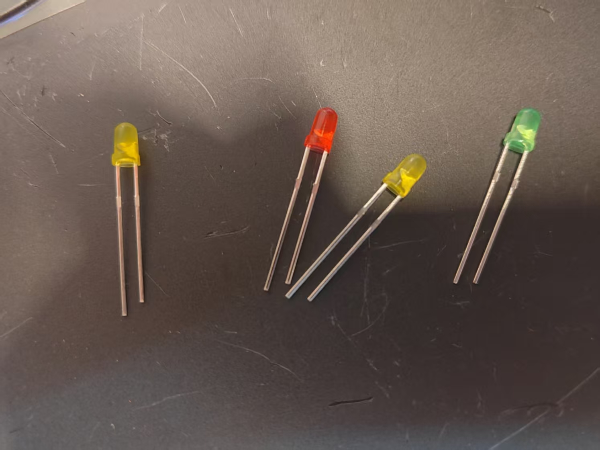
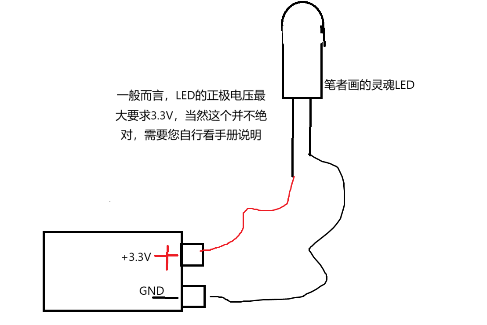
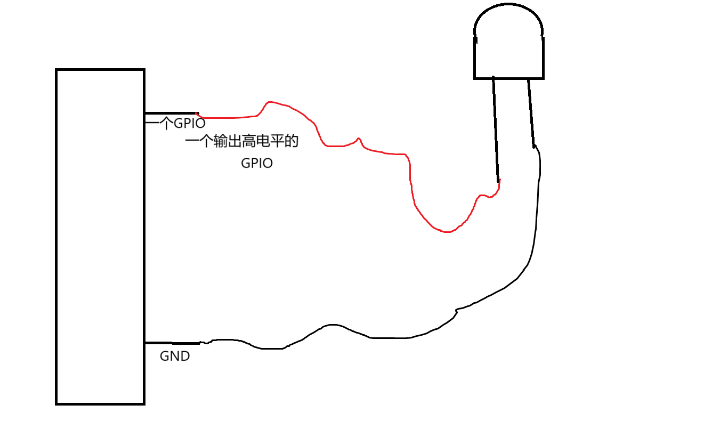
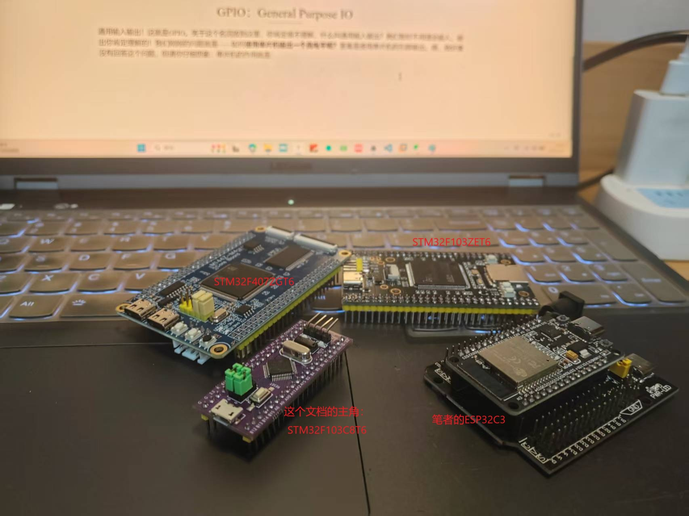
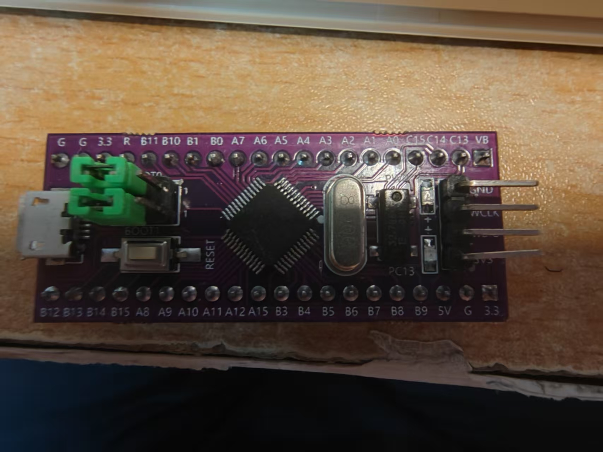
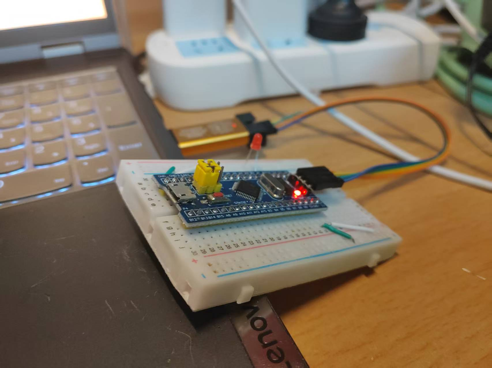
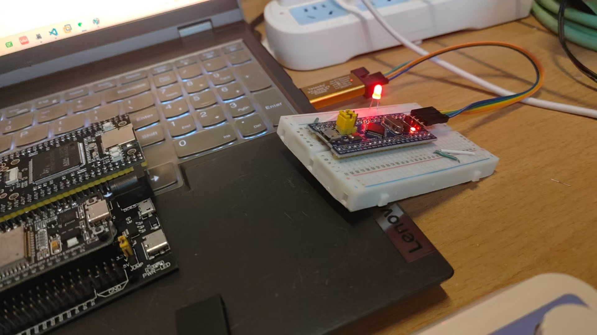

# 单片机的起始点：使用GPIO输出点亮我们的第一个小灯

​	我们都说，学习一个型号的单片机的第一个尝试，就是使用这个单片机点亮一个小灯。点亮小灯就意味着我们开始初步掌握我们手中的单片机了，我们学会使用单片机来控制最简单的外设了。当然，只会这个还是远远不够的，我们需要进一步理解单片机的更多知识才能走的更远。

## 先干！从单片机的实操点灯开始

​	对于GPIO，你可以认为是单片机无形的大手，他来拨弄最简单的我们外接的外设。一个最经典的例子就是点亮一个LED。我们先看看LED是啥。

​	笔者简单的说，LED就是一个小灯（你想想，LED小灯，LED小灯），我们这里暂时不介绍LED本身,只介绍我们的LED的外部接口特性.首先,LED是一个简单的拥有正负极的一个发光二极管.笔者这里screenshot下我自己买的LED小模块



​	你可以看到这些二极管存在两个引脚

> 笔者需要告诉你的是：大部分情况下，你更多需要关心的是外延的引脚。这里LED因为特别简单，学过一点点高中物理的朋友都知道，**LED分正负引脚，正极接长的一端，负极接短的一段，这样，LED才会有电流时导通，反接的时候，LED被认为是断路，没有电流流过，自然就会咋样都不亮！**，为什么要强调这个呢？这个跟我们后面的控制LED亮灭的GPIO最简单实验有关系。

​	所以，从编程的角度上看，**我们只需要保证我们给引脚正确的高低电平，这样就好了**，当我们使用电池供电的时候，我们一定会这样做：




​	很好，初中物理实验，但是呢！我们现在学习的是STM32，因此，现在我们就需要换东西了！就是GND，我们使用单片机的GND引脚就好了，那VCC从哪里来呢？答案是从单片机上来，你看，我们的编程模型就变成了：



​	现在，我们的任务逐渐明确了，那就是使用单片机的一个引脚，输出高电平，然后将他链接LED的正极，然后将另一根线连接LED的负极和GND引脚，这样我们的电路就完成了一个逻辑回环。简单吧！

​	问题现在就转移到了：我们的单片机如何输出高电平呢？懂行的朋友说：GPIO嘛！但这就递归的派生了新的问题，我想如果完全没有听说过GPIO这四个字母组合在一起的朋友也会问的，啥是GPIO呢？

## GPIO：General Purpose IO

​	通用输入输出！这就是GPIO。关于这个名词放到这里，你肯定很不理解，什么叫通用输入输出？我们暂时不用理会输入，输出你肯定理解的！我们刚刚的问题就是——如何**使用单片机输出一个高电平呢？**答案是使用单片机的引脚输出。嗯，我好像没有回答这个问题，但请你仔细想象：单片机的作用就是作为一个嵌入式项目的大脑，我们有大脑还不够，他要把它的想法（这里就是我们书写的程序）告诉外界（比如说我们现在正在瑟瑟发抖的LED），就需要一个引脚，把我们的想法（比如说我们想要输出一个高电平）输出出去，通过杜邦线（或者是其他导线）给我们的LED上。



（笔者的小私货：笔者随手拿到的各种各样的板子，严格上讲，哪些板子上最大的一坨芯片，就是单片机本体了，他们被用PCB上的铜线连接到了外部的引脚上）

​	此时此刻，这个引脚在我们编程的时候，我们就说：“嘿！你这个引脚，你这次当GPIO通用输入输出！我告诉你，你需要做的事情是产生一个高电平输出出去”，如何做？这就是我们下面要说的。

​	这里是库函数编程，所以我们的文档也就会使用库函数来完成我们的工作。你可能不知道啥叫库函数（哦天，你知道为什么单片机的门槛如此之高了吧！简单的说，就是人家写好了工具，你用就行，就像**你拧螺丝不用从头炼铁做扳手**，拿着**现成的扳手用就完事了**，你需要做的**就是正确的使用扳手（正确的调用库函数）**！）

​	很好，我们现在打开了我们的MDK啊，还是CubeIDE啊，还是跟我一起使用PlatformIO完成这个事情啊，无所谓，总而言之你在这里了，说明环境没有问题了。我们下面就来点灯。

### 第一步：开启GPIO的时钟

​	笔者一致认为，我们的所有的高端电子设备（单片机之上，包括你现在看我文档的手机/电脑/IPAD乱七八糟的都算！），时钟是这些设备的生命线，我们所有的这些设备都按照时钟的节拍，一个流水一个流水，一条指令一条指令的执行我们写给它的指令（不然它就会死在哪里，就像你没法指望一个心脏停止跳动的人跟你谈笑风生一个道理，除非他是僵尸）

​	让我们的GPIO从睡眼朦胧中（上电了，但是你要注意，这个时候他还没起来！你需要做的就是使能时钟，把他叫起来！！！）

> 请千万记住，使用**任何任何外设的时候，出现了罢工的问题（实际上就是不工作），请你第一反应思考：我是不是没有使能时钟，我是不是没有使能对对应的时钟？**然后如果不是这个问题，再去思考其他的事情。

​	所以，我们的工作就是叫醒GPIO。问题来了，叫醒哪一个呢？

​	对于初学者，笔者以开始就建议你先去阅读手册，对于GPIO而言，没有必要，对于我们的文档的主角STM32F103C8T6而言，引脚不多，你现在，拿起你的板子，观察上面的丝印。



​	看到针脚上面的丝印了嘛：上面依次是`G G 3.3 R B11 ....`以直到`C15 C14 C13 VB...`这些就是我们的单片机的引脚的编号。我们的STM32，对我们的引脚分类了。您看！对于哪些最有规律的引脚，比如说上面的`PA0, PA1, PA2... PA15`，`PB0, PB1, PB2, ... PB15`和`PC0, PC1, ... PC15`这三组，每一组16个的引脚，一共48个引脚，是我们一定可以拿来做GPIO的引脚。换而言之，接线的时候，就能拿这里的引脚作为我们的电平输出端口。

​	选择困难症了？啊哈，笔者给你选一个，PA0怎么样？那就PA0咯！

​	PA0这个引脚，首先，他就属于A分组的第0个引脚，我们在库编程中，说：PA0的A说明了PA0属于GPIOA分组（为什么这样分，不着急，你会在GPIO中断的子章节对这个概念更深入的理解），而且，PA0属于第0个引脚，也就是GPIO_PIN_0，当我们组合出现GPIOA和GPIO_PIN_0的时候，我们就是在说单片机上的PA0引脚。我们后面的时候，就可不会这样的罗嗦了。

> 现在你类比分析道：PC14, PC13, PB3这些引脚是啥意思，我们如何在库编程中找到他们！

​	回到我们的整体，**第一步，使能GPIO的时钟**，特别的，我们想要操作PA0，就需要**使能GPIOA分组的时钟**，那问题来了，咋使能时钟啊？

​	思考的流程是这样的：“我要使能**GPIOA**的时钟 ”，因此对于标准库而言，使能GPIOA的时钟，使用的一个函数调用就是
如下的：

```
RCC_APB2PeriphClockCmd(RCC_APB2Periph_GPIOA, ENABLE);
```

​	不要被吓晕了，我来说明一下，今后你阅读代码要怎么阅读。第一件事情，RCC_APB2PeriphClockCmd中的ClockCmd你认识：时钟的指令嘛！我们要对时钟下命令（恩！情！），对谁下命令呢？一个叫做RCC_APB2Periph的东西下的，或者说：对于挂载在使用单片机基准时钟作为生命线的，APB2总线上的外设使能这个总线上的外设时钟。好，这个外设可是一大堆的东西啊，你要找谁呢？我们于是提供了第一个参数：RCC_APB2Periph_GPIOA。原来我们要找的是GPIOA啊，你找他做什么呢？答案是，`ENABLE`（使能）它！所以，这行代码的作用就是使能GPIOA的时钟。完事了

> 如果是GPIOB的时钟呢？举一反三！（提示，GPIOA, GPIOB和GPIOC的时钟都在RCC_APB2Periph上，你很容易想到怎么做的，对吧！）

### 第二步，配置我们的GPIO的电气属性

​	这一步，回答了我们要让GPIO成为谁。通用通用，说明它是一个万能牛马，啥脏活烂货都能干，但是你的告诉他，今天你充当啥样的牛马角色。这个时候，我们要请出我们的一个重要的结构体：GPIO_InitTypeDef

```c
typedef struct
{
  uint16_t GPIO_Pin;             /*!< Specifies the GPIO pins to be configured.
                                      This parameter can be any value of @ref GPIO_pins_define */

  GPIOSpeed_TypeDef GPIO_Speed;  /*!< Specifies the speed for the selected pins.
                                      This parameter can be a value of @ref GPIOSpeed_TypeDef */

  GPIOMode_TypeDef GPIO_Mode;    /*!< Specifies the operating mode for the selected pins.
                                      This parameter can be a value of @ref GPIOMode_TypeDef */
}GPIO_InitTypeDef;
```

​	这个结构体无非再说自己的负责的三个事情，我记录了：GPIO的引脚是谁`(GPIO_Pin)`，GPIO的速度是谁`GPIO_Speed`，GPIO充当了咋样的角色人`GPIO_Mode`，啥，我咋知道的？看看旁边的注释呗！你瞧，扔进谷歌翻译这个事情多简单啊。

​	显然，我们现在不深究原理，我们就说我们准备点亮小灯的PA0。啊哈，显然回到我们上面的引脚分析，就是第0个引脚嘛，这个抽象是啥呢，我告诉你，答案是GPIO_PIN_0，或者说，之后你想问库函数标准库中，我们如何找到第N个引脚的时候，一定试试搜出来`GPIO_PIN_X`，其中X就是N的值，比如说，我们找PC13，那就是GPIO_PIN_13咯！

​	下一步，就是抓出来速度，啊哈，我们亲爱的标准库说我们有三个选择（你使用VSCode，那就是摁住Ctrl+右键点击GPIOSpeed_TypeDef跳转，狗屎的Keil5的话，自求多福，先编译你的工程然后点击“Go To the Definition”）

```
typedef enum
{ 
  GPIO_Speed_10MHz = 1,
  GPIO_Speed_2MHz, 
  GPIO_Speed_50MHz
}GPIOSpeed_TypeDef;
```

​	很好，速度上可以选择10MHz，2MHz，50MHz，好消息是点个灯，无所谓哪一个，嗯，随便选一个折磨我们的单片机，GPIO_Speed_50MHz就是你了。

​	如法炮制，我们来到了最后一个

```c
typedef enum
{ GPIO_Mode_AIN = 0x0,
  GPIO_Mode_IN_FLOATING = 0x04,
  GPIO_Mode_IPD = 0x28,
  GPIO_Mode_IPU = 0x48,
  GPIO_Mode_Out_OD = 0x14,
  GPIO_Mode_Out_PP = 0x10,
  GPIO_Mode_AF_OD = 0x1C,
  GPIO_Mode_AF_PP = 0x18
}GPIOMode_TypeDef;
```

​	嗯？这啥玩意，这就是GPIO可以充当的角色了，我们先关心第五个`GPIO_Mode_Out_OD`和第六个`GPIO_Mode_Out_PP`，你看到了，有一个Out，说明他是跟外界打交道的，换而言之，输出去东西的。啊哈，我告诉你，你需要让GPIO做一个强势的人，直接塞给LED电平是他的工作，**为什么？不要着急，我在下一篇博客会仔细的说明GPIO的8种工作模式，这个8种的工作模式将会伴随我们的单片机学习之旅的终点**

​	给啥呢？就是GPIO_Mode_Out_PP，这里的PP就是，PushPull就是一个非常主动的角色，叫做推挽输出，推是Push，挽就是Pull。关于这个的解释笔者放到后面说明。

​	所以，我们的编程细节就是

```c
void init_led()
{
	GPIO_InitTypeDef gpio_init;
	RCC_APB2PeriphClockCmd(RCC_APB2Periph_GPIOA, ENABLE);
	gpio_init.GPIO_Mode = GPIO_Mode_Out_PP;
	gpio_init.GPIO_Speed = GPIO_Speed_50MHz;
	gpio_init.GPIO_Pin = GPIO_Pin_0;
	GPIO_Init(GPIOA, &gpio_init);
}
```

​	最后的GPIO_Init，就是让我们的单片机正眼看我们的工作，**将我们对GPIO的设置角色成为现实**，参数上，需要给出的是GPIO的分组和你的GPIO_InitTypeDef结构体的指针。

​	非常好，到这里，你调用下init_led，PA0就会从睡梦种醒来，站好军姿准备就位了。

### 控制我们的预备好的GPIO输出高低电平

​	咱不能让他门外竖着，干活啊对吧，我们下面就是用GPIO_WriteBit函数完成控制GPIO高低电平的工作。来，我们说在数字世界里，高电平是1，低电平是0（奥，一些大佬跳出来说这是错的，对！这是错的，一些场景下是反过来的，但是在这里，让单片机输出高电平给1完事，低电平给0完事，这符合我们的逻辑语义的）。

​	请注意，单片机程序最后是要进入一个死循环的（这个说法还不对，但是感兴趣的朋友看看RTOS，你会高兴的发现死循环丢了单片机没跑飞，这个说法请到笔者展开的对STM32F407ZGT6的FreeRTOS框架编程中理解）

```c
	while (1)
	{
		GPIO_WriteBit(GPIOA, GPIO_Pin_0, 1);
		system_delay_ms(500);
		GPIO_WriteBit(GPIOA, GPIO_Pin_0, 0);
		system_delay_ms(500);
	}
```

​	你猜也猜到了，system_delay_ms是笔者的延时封装，我们延时500ms，将我们的PA0依次输出高电平低电平高电平低电平。。。嗯，灯会怎么样？一闪一闪的！这里我们就不说明了。

​	整个代码流程如同行云流水板的简单。

```
#include "system_clock.h"
#include "stm32f10x.h"

void init_led()
{
	GPIO_InitTypeDef gpio_init;
	RCC_APB2PeriphClockCmd(RCC_APB2Periph_GPIOA, ENABLE);
	gpio_init.GPIO_Mode = GPIO_Mode_Out_PP;
	gpio_init.GPIO_Speed = GPIO_Speed_50MHz;
	gpio_init.GPIO_Pin = GPIO_Pin_0;
	GPIO_Init(GPIOA, &gpio_init);
}

int main(void)
{
	init_led();
	
	while (1)
	{
		GPIO_WriteBit(GPIOA, GPIO_Pin_0, 1);
		system_delay_ms(500);
		GPIO_WriteBit(GPIOA, GPIO_Pin_0, 0);
		system_delay_ms(500);
	}
}
```

​	其中，system_delay_ms是自己写的：

```c
#include "stm32f10x.h"
#include "system_clock.h"

/**
 * @brief the delay function for the system clock, delay in us
 * 
 * @param xus 
 */
void system_delay_us(uint32_t xus)
{
	SysTick->LOAD = 72 * xus;				
	SysTick->VAL = 0x00;					
	SysTick->CTRL = 0x00000005;				
	while(!(SysTick->CTRL & 0x00010000));	
	SysTick->CTRL = 0x00000004;				
}

/**
 * @brief the delay function for the system clock, delay in ms
 * 
 * @param xms 
 */
void system_delay_ms(uint32_t xms)
{
	volatile uint32_t ready_delay = xms;
	while(ready_delay--)
	{
		system_delay_us(1000);
	}
}
```

​	烧录上电，恭喜你完成成就：单片机的历史性第一步：点亮一个LED灯！！！



