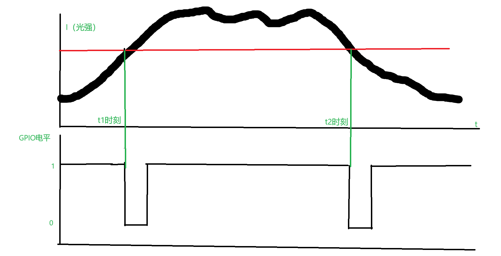
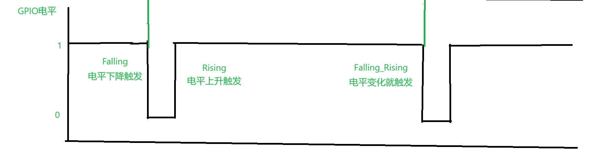
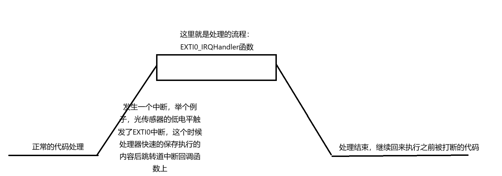
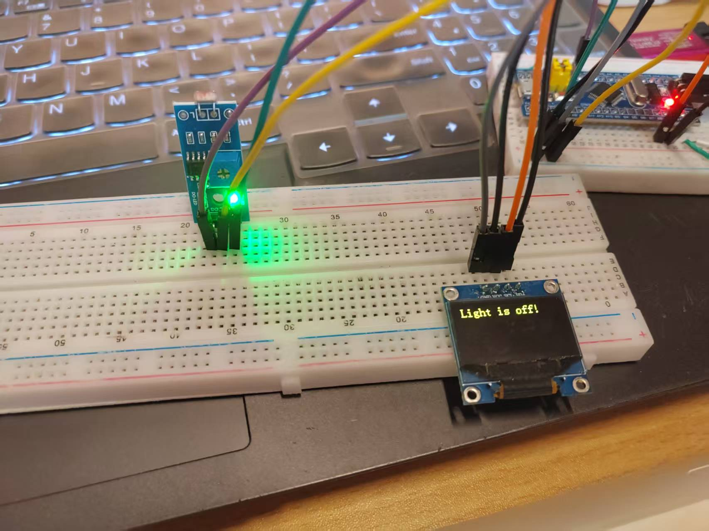
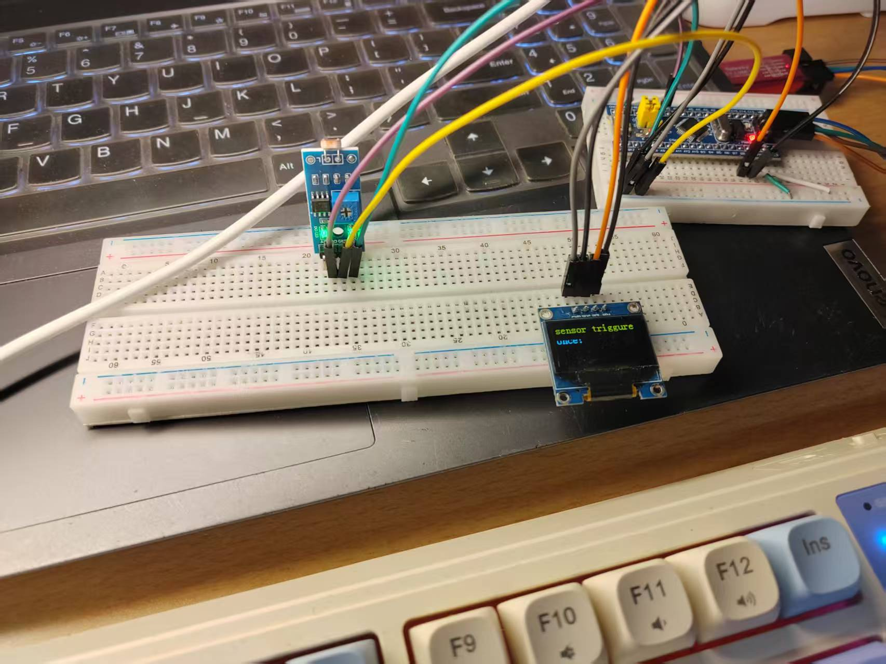

# 简单说说单片机的外部GPIO中断

## 前言

​	在之前，我们就详细的讨论过了最简单的GPIO设备的驱动和使用，但是如你所见，这些调用都是**同步**，即我们程序主动的去设置和读取GPIO的状态。这很正常——我们只有在想要主动出击的时候，比如说点亮LED电平，查询按钮的状态的时候，我们主动的申请和读取结果。这是很正常的事情。

​	但是仍然有一些场景，我们实际上并不是这样的，甚至完全与此相反。举个例子，一些事情我们更希望是外部来告知我们发生了。举个例子，一个经典的场景就是——我们希望在按键嗯下的时候，我们来做一部分事情，比如说后面我们切换LCD界面啊等等的事情。按照我们之前的方法，那就是：

```c
while(1)
{
	if(isKeyPressed()){
        do_things();
    }else{
        do_other_things();
    }
    ...
}
```

​	这个的问题看起来不大，但是实际上你仔细思考一下，问题很大。在我们上一个小节中，我们做一个改动，您可以尝试一下：

```
while(1)
{
	if(isKeyPressed()){
        reverse_gpio_status(&led0);
    }else{
        system_clock_delay_ms(1000);	// delay for 1 seconds
    }
    ...
}
```

​	你会发现一个致命的问题，整个系统罢工了，为什么，我们仔细看看这个代码——我们在一瞬间检查完Key没有按下之后，整个系统直接挂起来1秒钟，如果我们之后写更加庞大的项目的时候，问题还能更加尖锐（比如说使用ESP8266等待网络请求，那可就是一个等待就是好几秒），这下你的客户如果发了疯的按按钮就会发现根本不起作用的时候，你的好日子也就到头了。那咋办？

​	仔细想下，我们的逻辑是不是有点问题——分明是我们想要“按下按钮的时候，我们才会翻转LED的电平。”，整个程序的逻辑是——询问一下按钮按下了嘛？有则处理按钮按下的逻辑，没有处理其他程序。这不对的。

​	问题就在于，我们需要把逻辑颠倒过来！一个事件发生了，我们需要如何处理这个事情。而不是反复的询问这个事情有没有发生。因此，我们就需要一个机制，这个机制，**就是外部中断**，外部中断按照一种通知的方式，通知我们的单片机一个抽象的事件发生了。

> 一个光传感器察觉到了一个光亮度的变化的时候，光传感器发送了一个电平脉冲。与其一直轮循电平的变化，不如直接让我们的GPIO处于一个中断的前端，让接受到电平变化的引脚申请我们的单片机触发一个中断，极其短暂的打断我们的程序执行，跳转道一个新的处理流处理我们的电平变化的事件。比如说，光暗了，我们需要开灯，这个时候，我们处理光传感器发过来的“光暗下去了”的信号，处理的程序就是打开一个LED灯。你看，简单吧！

​	因此，按照这种方式，我们就可以摆脱我们的轮循式的询问，转向语义更好的“中断事件通知了”。

​	关于中断的本质和STM32的中断，我们放到旋转编码器和光传感器的之后作为一个硬核原理篇章，仔细的介绍其根本原理，这里，我们仍然只是保留到会用即可的水平。

​	下面，我们就来聊一聊，标准库是如何使用外部中断来完成我们的事情的。

## 如何使用STM32F1系列的标准库完成外部中断的抽象

​	标准库已经给我们提供好了脚手架了，只需要我们按照步骤进行配置即可。简单的说，就是做这些事情

- 初始化我们的GPIO为输入的一个模式
- 初始化GPIO外部中断的资源寄存器
- 使能我们的外部中断

​	这需要我们一步步来看。

### 初始化我们的GPIO为输入的一个模式

​	为什么是输入模式呢？你想想，我们接受外部的中断是不是需要从外界获取信息？是的，这就是我们的GPIO中断模式本质上需要以输入模式进行配置的原因，如果你还看笔者的HAL库教程，你就会知道，HAL库直接封装好了体系，将输入模式中的一部分特化出来了外部中断，合并了我们标准库的配置，标准库比较原始，因此我们需要做的事情就是将这些步骤正确的组合起来。

​	关于输入模式的配置，这里我们不再重复谈论了，实在乏味。我们马上进入下一个阶段，配置外部中断的GPIO引脚资源。

### 初识GPIO复用，开启GPIO的复用功能时钟

​	关于复用的底层原理，一并合并到我们的GPIO中断中讨论，这里，你只需要知道的是：GPIO现在具备了片上外设和外部设备的沟通能力，在这里，就是我们的中断控制器现在可以监控我们的外部设备的电平变化了，我们这一步就是做这个事情。

> 开启GPIO的AF时钟

```
RCC_APB2PeriphClockCmd(RCC_APB2Periph_AFIO, ENABLE);
```

​	开启这个时钟，我们的片上外设复用就变得可用，下一步，就是提交我们要监察的外部中断是如何的。

### GPIO_EXTILineConfig和EXTI_Init配置外部中断参数

使用的函数是GPIO_EXTILineConfig来注册EXTI中断控制子系统，连接GPIO和外部中断线，进而再EXTI_Init函数来初始化。

```
void EXTI_Init(EXTI_InitTypeDef* EXTI_InitStruct);
```

​	EXTI_InitTypeDef里，提供的就是我们写的参数了

```c
typedef struct
{
  uint32_t EXTI_Line;               /*!< Specifies the EXTI lines to be enabled or disabled.
                                         This parameter can be any combination of @ref EXTI_Lines */
   
  EXTIMode_TypeDef EXTI_Mode;       /*!< Specifies the mode for the EXTI lines.
                                         This parameter can be a value of @ref EXTIMode_TypeDef */

    // 笔者注释：之前的版本中
  EXTITrigger_TypeDef EXTI_Trigger; /*!< Specifies the trigger signal active edge for the EXTI lines.
                                         This parameter can be a value of @ref EXTITrigger_TypeDef */

  FunctionalState EXTI_LineCmd;     /*!< Specifies the new state of the selected EXTI lines.
                                         This parameter can be set either to ENABLE or DISABLE */ 
}EXTI_InitTypeDef;
```

#### 插入一个小知识——如何正确的配置结构体？

​	我发现，大部分嵌入式的人，不太会查看手册/查看注释来进行学习。你看，我们的标准库实际上已经把事情说的很明白了，我们这里实际上需要填写的参数

​	第一个蚕食，人家的说法是任意组合的EXTI_Line，我们一看，嗯很，没有具体说明，一个最快速的办法就是看注释，EXTI_LINE的一个组合，这也就说明了，直接全局搜索一个EXTI_LINE，这里的EXTI_Mode对应的就是对应的GPIO_Pin所在的EXTI线，举个例子，GPIO_Pin_0对应的就是EXTI_Line0，GPIO_Pin_1对应的就是EXTI_Line1，类推！

```
#define EXTI_Line0       ((uint32_t)0x00001)  /*!< External interrupt line 0 */
#define EXTI_Line1       ((uint32_t)0x00002)  /*!< External interrupt line 1 */
#define EXTI_Line2       ((uint32_t)0x00004)  /*!< External interrupt line 2 */
#define EXTI_Line3       ((uint32_t)0x00008)  /*!< External interrupt line 3 */
#define EXTI_Line4       ((uint32_t)0x00010)  /*!< External interrupt line 4 */
#define EXTI_Line5       ((uint32_t)0x00020)  /*!< External interrupt line 5 */
#define EXTI_Line6       ((uint32_t)0x00040)  /*!< External interrupt line 6 */
#define EXTI_Line7       ((uint32_t)0x00080)  /*!< External interrupt line 7 */
#define EXTI_Line8       ((uint32_t)0x00100)  /*!< External interrupt line 8 */
#define EXTI_Line9       ((uint32_t)0x00200)  /*!< External interrupt line 9 */
#define EXTI_Line10      ((uint32_t)0x00400)  /*!< External interrupt line 10 */
#define EXTI_Line11      ((uint32_t)0x00800)  /*!< External interrupt line 11 */
#define EXTI_Line12      ((uint32_t)0x01000)  /*!< External interrupt line 12 */
#define EXTI_Line13      ((uint32_t)0x02000)  /*!< External interrupt line 13 */
#define EXTI_Line14      ((uint32_t)0x04000)  /*!< External interrupt line 14 */
#define EXTI_Line15      ((uint32_t)0x08000)  /*!< External interrupt line 15 */
```

​	EXTI_Mode是一个enum枚举类型

```
typedef enum
{
  EXTI_Mode_Interrupt = 0x00,
  EXTI_Mode_Event = 0x04
}EXTIMode_TypeDef;
```

​	这里有两个参数，我们理解和学习的是中断，很显然是EXTI_Mode_Interrupt，但是这里笔者还是要简单的说明一下这两个参数有什么区别。

| 特性             | EXTI_Mode_Interrupt (中断模式) | EXTI_Mode_Event (事件模式) |
| :--------------- | :----------------------------- | :------------------------- |
| **是否触发中断** | ✔️ (调用我们处理的回调函数)     | ❌ (仅硬件事件)             |
| **是否唤醒 CPU** | ✔️                              | ❌                          |
| **CPU 参与**     | 需要 CPU 处理中断              | 无需 CPU 干预              |
| **典型应用**     | 紧急任务（如按键、故障检测）   | 硬件触发（如 DMA、ADC）    |

EXTI_Mode_Event不是我们这里可以管的，因此，等到我们谈论到了DMA，ADC等概念的时候，我们会回来学习事件模式的。

​	EXTITrigger_TypeDef说明我们如何触发这个中断。

```
typedef enum
{
  EXTI_Trigger_Rising = 0x08,
  EXTI_Trigger_Falling = 0x0C,  
  EXTI_Trigger_Rising_Falling = 0x10
}EXTITrigger_TypeDef;
```

​	嗯，上升？下降？上升下降？这些是什么东西啊？别急，我们来仔细思考一下。一个很自然的疑问，举个例子：我们如何认为外部的GPIO中断道来了呢？你可能会说这是我关心的嘛？**你需要关心！**，这需要你仔细阅读器件的手册，举一个例子，笔者的光传感器，查看手册后，可以做出这样的一个时序图。



​	我们看到，这个器件的特性是阈值触发类型的传感器，也就是扫描过一次阈值，就会触发一次信号。可以看到，我们触发一次，我们的光传感器就会快速向外发射一个低电平，因此，我们只需要检测低电平，就能捕捉到我们的光强变化事件了！

​	仔细看看下面的这个图，思考一下上面的三个枚举，你认为，这三个枚举，想要监控的是哪些电平变化呢？答案如下！



​	现在我们很清楚了，对于我们的器件，如果你的手册上说：光强变化给一个下降触发的时候，你就需要配置成Falling了。

​	剩下的Cmd实际上就是Enable，没啥好说的。这就是使能的意思。

​	很好，我们申请GPIO中断的第一个子步骤，是注册GPIO的中断Pin线，使用的函数是

```
/**
  * @brief  Selects the GPIO pin used as EXTI Line.
  * @param  GPIO_PortSource: selects the GPIO port to be used as source for EXTI lines.
  *   This parameter can be GPIO_PortSourceGPIOx where x can be (A..G).
  * @param  GPIO_PinSource: specifies the EXTI line to be configured.
  *   This parameter can be GPIO_PinSourcex where x can be (0..15).
  * @retval None
  */
  void GPIO_EXTILineConfig(uint8_t GPIO_PortSource, uint8_t GPIO_PinSource)
```

​	比如说，我们想要给GPIOB注册中断，办法就是提供：GPIO_PortSourceGPIOB和GPIO_PinSource0。这个时候，使用这个函数的后，我们的GPIO_Pin就能根我们的外部中断线连接起来，下一步只需要把中断使能起来，就可以使用外部中断来监控事件了。

### 初始化中断：NVIC注册

​	NVIC是啥呢？NVIC的全称是Nested vectored interrupt controller，即嵌套向量中断控制器。关于通用的中断，我们需要做的理解就是跟上面说的一致——是事件（中断也可以来自内部，但对于最核心的CPU而言，你认为他们都是外部好像毛病也不大，总而言之，就是一些事件需要触发我们的处理器暂停手下的活来处理通知的中断事件，这里的嵌套你可以认为中断是可以嵌套的）

​	如果感觉中断不好理解，笔者在手搓操作系统的博客中有打过这样的比喻：

> 现实生活中，我们可能往往会被任何啥东西打断，比如说，此时此刻我正在写一个阐述中断的博客，我的一个好朋友突然给我发QQ，向我抱怨该死的爬虫实在是太慢了，需要优化一下并发的结构。这个时候，我就跑去回应他，刚准备打几个字，我的母上大人着急的找我问点事情，我又抛下对这个哥们的回复，冲过去回复我母上大人的问题，之后再回复我兄弟的抱怨，最后回来，继续抓耳挠腮的写下这段话。
>
> [从0开始的操作系统手搓教程11：为底层添砖加瓦：中断_intr指令-CSDN博客](https://blog.csdn.net/charlie114514191/article/details/145812925)
>
> [Charliechen114514/CCOperateSystem: A Tutorial Trying teach you how to make an os in modern tools with gcc, nasm and bochs!](https://github.com/Charliechen114514/CCOperateSystem)

​	理解好中断之后，我们继续说明我们的配置。STM32对我们的中断管理非常的细致，将中断分组，其描述优先级的位实际上非常了两个比较大的部分。如下所示

- **抢占优先级(Preemption Priority)**：决定中断是否可以打断正在执行的其他中断
- **子优先级(Sub-Priority)**：当多个挂起中断具有相同抢占优先级时，决定它们的执行顺序

​	换而言之，回复我母上大人的消息的抢占优先级是1，回复我兄弟的抱怨抢占优先级是2的时候，**我显然会先处理母上大人的事情，这个时候，尽管我正在回复我的兄弟，我也会让他靠边站！**，这就是抢占优先级的效果。

​	那子优先级呢？答案是当我们没有发生中断的时候，或者说发生的是同级优先级的中断的时候（可以认为是特殊的“没有中断发生”），我们决定先处理谁。举个例子，我跟好朋友A和好朋友B中，我更喜欢跟A相处的时候，我优先回复A的消息，完事了之后回复B的消息。因此，在存在多个中断配置的时候，我们需要牢记好，谁会霸道的优先发生，这样，在处理中断的时候，就会理清楚基本的思路。

> 来，举个例子，我们的Systicks更新中断总是放到优先级的最后，这个时候，如果你在高优先级的中断中，调用了跟Systicks相关的系统中断，你知道会发生什么的。那就是你希望Systicks更新，好衡量给定的毫秒数，但是你又在高优先级中断中，没办法执行Systicks更新的回调函数，导致Systicks又不更新，这个事情在HAL中就会非常明显，HAL库就是一个强依赖软件更新的时钟基础系统，因此，这个时候调用基于这个时钟的延时，都会导致矛盾：希望Systicks中断正常工作触发软件定时器更新，但是你处于高优先级中断中无法打断此时此刻的中断去更新软件定时器。导致系统直接死机。

​	配置上，对于STM32F103C8T6而言，就是这样了。

| 分组   | 抢占优先级位数 | 子优先级位数 | 抢占优先级范围 | 子优先级范围 |
| :----- | :------------- | :----------- | :------------- | :----------- |
| Group0 | 0位            | 4位          | 0              | 0-15         |
| Group1 | 1位            | 3位          | 0-1            | 0-7          |
| Group2 | 2位            | 2位          | 0-3            | 0-3          |
| Group3 | 3位            | 1位          | 0-7            | 0-1          |
| Group4 | 4位            | 0位          | 0-15           | 0            |

​	这个中断，就对应了如下的结构体的NVIC_IRQChannelPreemptionPriority参数和NVIC_IRQChannelSubPriority参数，我们依次对应了抢占优先级和子优先级：

```
typedef struct
{
  uint8_t NVIC_IRQChannel;                    /*!< Specifies the IRQ channel to be enabled or disabled.
                                                   This parameter can be a value of @ref IRQn_Type 
                                                   (For the complete STM32 Devices IRQ Channels list, please
                                                    refer to stm32f10x.h file) */

  uint8_t NVIC_IRQChannelPreemptionPriority;  /*!< Specifies the pre-emption priority for the IRQ channel
                                                   specified in NVIC_IRQChannel. This parameter can be a value
                                                   between 0 and 15 as described in the table @ref NVIC_Priority_Table */

  uint8_t NVIC_IRQChannelSubPriority;         /*!< Specifies the subpriority level for the IRQ channel specified
                                                   in NVIC_IRQChannel. This parameter can be a value
                                                   between 0 and 15 as described in the table @ref NVIC_Priority_Table */

  FunctionalState NVIC_IRQChannelCmd;         /*!< Specifies whether the IRQ channel defined in NVIC_IRQChannel
                                                   will be enabled or disabled. 
                                                   This parameter can be set either to ENABLE or DISABLE */   
} NVIC_InitTypeDef;
```

​	剩下的NVIC_IRQChannelCmd我们直接填写enable即可。那NVIC_IRQChannel说明什么呢？答案是——标识使能哪一个中断。中断也是需要使能的，牢记一句话——**我们的一切电子设备几乎都是依靠时钟才能进行节拍有序的工作，没有基准时钟，所有的器件没有了节拍，自然也就黯淡失色**

​	随后，我们把这个结构体提交给NVIC_Init函数即可。

### 处理中断回调函数

​	剩下的发生的事情，那就是交给单片机了，他经过一系列复杂的机制，终于到达了ST工程师们预设的中断，对于PB0（举个例子），这个IRQ_Handler是谁呢？EXTI0_IRQHandler。是随便起的名字嘛？不是。请看汇编——

```c
g_pfnVectors:

  .word _estack
  .word Reset_Handler
  ......
  .word EXTI0_IRQHandler
  .word EXTI1_IRQHandler
  .word EXTI2_IRQHandler
  .word EXTI3_IRQHandler
  .word EXTI4_IRQHandler
  ......
  .word EXTI9_5_IRQHandler
  ......
  .word EXTI15_10_IRQHandler
  ......
```

​	在这一串代码里，我们很快找到了几个我们看起来很熟悉的东西，对的，就是这些，你会发现这些就是著名的IRQHandler，也就是中断处理回调函数，对于应用层次，你只需要理解的是发生了这个中断，就会触发回调（回调回调，回来调用）函数，来执行你的处理逻辑。

​	PB0对应的外部中断线是EXTI0线，也就是EXTI0_IRQn，触发的函数回调就是EXTI0_IRQHandler。因此，我们只需要在EXTI0_IRQHandler写上我们的处理逻辑即可。



​	需要注意的是，中断处理结束后，需要清理标置位，这个东西相当于我们的中断是否发生的标志，只有标志为——处理结束，没有发生了之后，我们才会理回新的中断！

## 本篇的实验代码

​	出于篇幅原因，这里不再粘贴代码，这里需要注意的是——我们引入了一个新的器件就是OLED器件，关于OLED器件的编程属于额外的内容，你需要做的就是将SCL接到PB8，SDA接到PB9，笔者写的CCGraphic框架会自动的在你的OLED屏上展示内容。具体的原理需要等待你掌握IIC协议和SPI协议之后，我们才能开始真正的修改内部的代码。

​	现象如下



