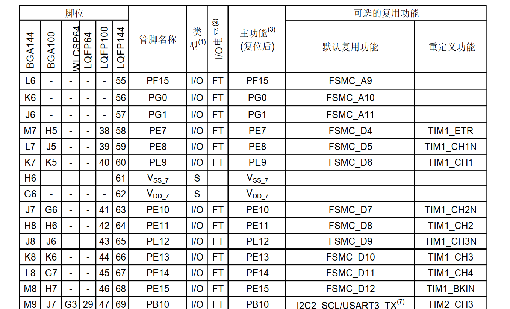
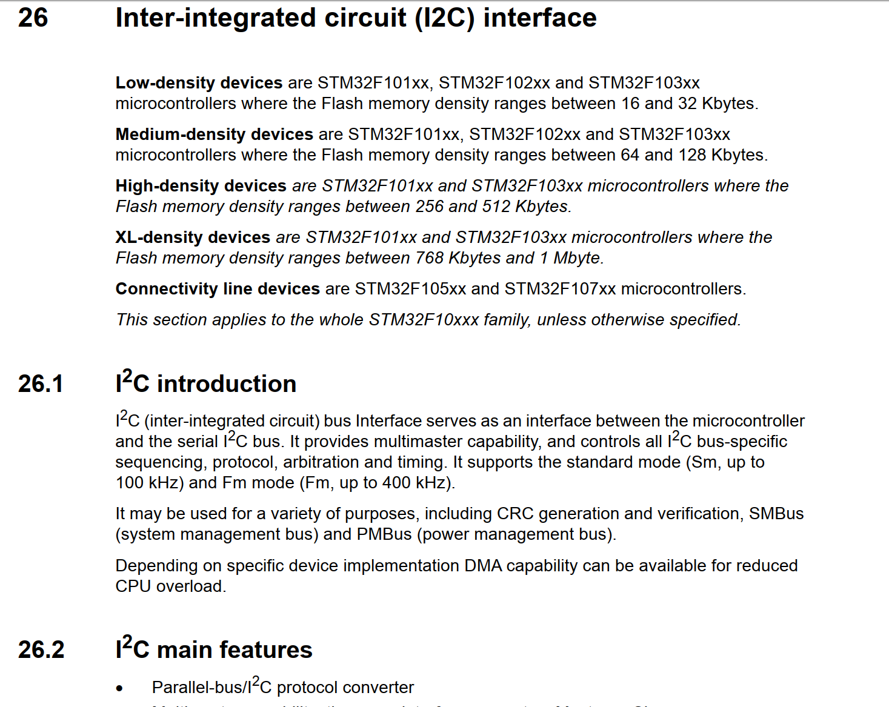

# 以STM32F103ZET6为例子，分析我们的单片机

## 第一件事情：为什么叫STM32F103ZET6

| 部分              | 说明                                                         |
| ----------------- | ------------------------------------------------------------ |
| **1. 产品系列**   | 固定为“STM32”，表示基于ARM Cortex-M内核的32位微控制器。      |
| **2. 产品类型**   | 用一个字母表示产品类型： **F**：通用型 **L**：低功耗型 **W**：无线型 |
| **3. 产品子系列** | 用三位数字表示产品子系列，指示特定的功能和性能： **101**：基本型 **102**：USB基本型（USB 2.0全速设备） **103**：增强型 **105/107**：互联型 |
| **4. 引脚数**     | 用一个字母表示封装的引脚数量： **T**：36引脚 **C**：48引脚 **R**：64引脚 **V**：100引脚 **Z**：144引脚 **I**：176引脚 |
| **5. 闪存容量**   | 用一个字母或数字表示内置的Flash容量： **6**：32KB **8**：64KB **B**：128KB **C**：256KB **D**：384KB **E**：512KB **G**：1MB |
| **6. 封装类型**   | 用一个字母表示封装类型： **H**：BGA封装 **T**：LQFP封装 **U**：VFQFPN封装 |
| **7. 温度范围**   | 用一个数字表示工作温度范围： **6**：-40°C 至 85°C **7**：-40°C 至 105°C |

​	这样看，我们的STM32F103ZET6的名称来源就很简单了：

​	首先显然，这是一款通用型的STM32单片机，此外，还是增强型的单片机。拥有144个引脚，其闪存大小是512KB。还是很能装的。封装类型是LQFP，其工作温度为经典的-40°C 至 85°C。

## 分析我们的资源手册

笔者在之前的博客中说到了我们的手册可以从哪里来，所以这里我们就不去再重复说下面的资源是从哪里考证的——就是从资源手册的第一页中摘取的。

| 分类                     | 项目         | 详细说明                                                     |
| ------------------------ | ------------ | ------------------------------------------------------------ |
| **内核**                 | CPU          | ARM 32位 Cortex™-M3                                          |
|                          | 主频         | 最高72MHz                                                    |
|                          | 性能         | 1.25DMips/MHz（Dhrystone 2.1）                               |
|                          | 运算         | 单周期乘法和硬件除法                                         |
| **存储器**               | 闪存         | 256KB 至 512KB                                               |
|                          | SRAM         | 高达 64KB                                                    |
|                          | 外部存储支持 | 静态存储器控制器（4个片选），支持 CF卡、SRAM、PSRAM、NOR、NAND |
|                          | LCD 接口     | 并行接口，兼容 8080 / 6800 模式                              |
| **时钟、复位、电源管理** | 电压         | 工作电压 2.0 ～ 3.6V（I/O引脚同）                            |
|                          | 复位         | 上电/断电复位（POR/PDR）、可编程电压监测器（PVD）            |
|                          | 振荡器       | 4～16MHz 晶体、内嵌 8MHz 校准 RC 振荡器、40kHz 校准 RC 振荡器、32kHz RTC 校准振荡器 |
| **低功耗模式**           | 模式         | 睡眠、停机、待机                                             |
|                          | 备用电源     | VBAT 为 RTC 和后备寄存器供电                                 |
| **模数转换器 (ADC)**     | 数量         | 3 个 12 位 ADC                                               |
|                          | 转换时间     | 1μs                                                          |
|                          | 输入通道     | 多达 21 个                                                   |
|                          | 电压范围     | 0 ～ 3.6V                                                    |
|                          | 功能         | 三倍采样保持、温度传感器                                     |
| **数模转换器 (DAC)**     | 数量         | 2 通道 12 位                                                 |
| **DMA**                  | 通道数       | 12 通道                                                      |
|                          | 支持外设     | 定时器、ADC、DAC、SDIO、I2S、SPI、I2C、USART                 |
| **调试接口**             | 接口         | 串行单线调试（SWD）、JTAG                                    |
|                          | 追踪模块     | Cortex-M3 内嵌 ETM（嵌入式跟踪模块）                         |
| **I/O端口**              | 数量         | 多达112个快速I/O口                                           |
|                          | 特性         | 51/80/112个多功能双向I/O，可映射至16个外部中断，几乎全部5V容忍 |
| **定时器**               | 总数         | 多达11个                                                     |
|                          | 普通定时器   | 多达4个16位定时器（最多4个通道，支持输入捕获/输出比较/PWM/编码器输入） |
|                          | 高级定时器   | 2个16位（支持死区控制和刹车，用于电机控制）                  |
|                          | 看门狗       | 独立式 + 窗口型                                              |
|                          | 系统定时器   | 24位 自减型计数器                                            |
|                          | 基本定时器   | 2个16位，用于驱动 DAC                                        |
| **通信接口**             | I2C          | 多达 2 个（支持 SMBus / PMBus）                              |
|                          | USART        | 多达 5 个（支持 ISO7816、LIN、IrDA、调制解调控制）           |
|                          | SPI / I2S    | 3个 SPI（18Mbps），其中2个可复用为 I2S                       |
|                          | CAN          | 1个 CAN 2.0B 主动接口                                        |
|                          | USB          | USB 2.0 全速                                                 |
|                          | SDIO         | 支持                                                         |
| **其他**                 | CRC          | CRC 计算单元                                                 |
|                          | 唯一标识     | 96位芯片唯一识别码                                           |

## 第二件事情，关心我们的GPIO引脚输出

​	我们的单片机最后是依靠GPIO引脚跟外界进行沟通，我们查询了上面的资源之，确定了这个板子是我们的一个可以选择的方案后，下一步，就是看看结合我们的需求，简单的调研一下我们的GPIO引脚的复用情况。

​	关于GPIO是什么，这个不是我们这篇博客的重点，笔者记得我前前后后说过两次。所以可以翻翻笔者之前的博客，看我的碎碎念。

​	简单的说，就是我们的GPIO引脚不可能单独的表达含义，我们可以采取复用策略（也就是说把XXXGPIO现在作为一个）

​	关于GPIO的复用，我们还是要去看资源手册。这一部分的内容一般是Pinouts and pin description那一部分的内容，注意，我们在学习其他的单片机的时候，可能板块不会叫这个名字。

​	笔者截取了一下我手头的手册的一个截图：

​	我们一般关心的是Pin name和右侧的一些说明。第一件事情是看我们需要的功能所在的引脚在哪里。比如说。我们的PE9，既可以是操作FSMC的引脚，又可以是TIM1定时器的第一个通道。

## 第三件事情：去找对应外设的说明部分

​	这个事情在我们的编程手册中才会涉及到，比如说，我们想要驱动IIC。

​	就要准备去对应的手册上慢慢翻。ST官方的手册比较全面，会仔细的介绍细节。这里给出的是英文手册的截图。

​	笔者接触到的流程大致就是如此。

