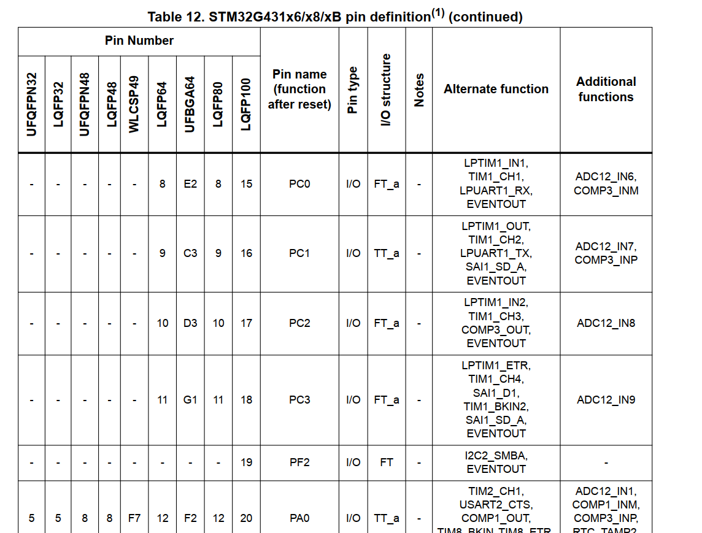

# 以STM32G431RBT6为例子的单片机资源分析

## 第一点：为什么叫STM32G431RBT6

​	对于命名规则不太熟悉的朋友看这里：

| 部分              | 说明                                                         |
| ----------------- | ------------------------------------------------------------ |
| **1. 产品系列**   | 固定为“STM32”，表示基于ARM Cortex-M内核的32位微控制器。      |
| **2. 产品类型**   | 用一个字母表示产品类型： **F**：通用型 **L**：低功耗型 **W**：无线型 |
| **3. 产品子系列** | 用三位数字表示产品子系列，指示特定的功能和性能： **101**：基本型 **102**：USB基本型（USB 2.0全速设备） **103**：增强型 **105/107**：互联型 |
| **4. 引脚数**     | 用一个字母表示封装的引脚数量： **T**：36引脚 **C**：48引脚 **R**：64引脚 **V**：100引脚 **Z**：144引脚 **I**：176引脚 |
| **5. 闪存容量**   | 用一个字母或数字表示内置的Flash容量： **6**：32KB **8**：64KB **B**：128KB **C**：256KB **D**：384KB **E**：512KB **G**：1MB |
| **6. 封装类型**   | 用一个字母表示封装类型： **H**：BGA封装 **T**：LQFP封装 **U**：VFQFPN封装 |
| **7. 温度范围**   | 用一个数字表示工作温度范围： **6**：-40°C 至 85°C **7**：-40°C 至 105°C |

​	现在，我们以STM32G431RBT6作为一个例子进行分析

STM32G431RBT6的命名遵循STM32系列的命名规则，每个部分代表特定的含义。以下是对该型号各部分的解析：

| 部分      | 含义                                                         |
| --------- | ------------------------------------------------------------ |
| **STM32** | 表示意法半导体（STMicroelectronics）基于ARM Cortex-M内核的32位微控制器系列。 |
| **G**     | 代表产品系列。G系列通常表示具有高性能模拟外设和数字功能的微控制器。 |
| **431**   | 指定产品的子系列和特性。具体来说，'4'表示Cortex-M4内核，'31'表示具体的功能配置，如存储容量和外设组合。 |
| **R**     | 表示封装的引脚数量。'R'通常代表64引脚封装。                  |
| **B**     | 指定片上Flash存储器的容量。'B'通常表示128 KB的Flash容量。    |
| **T**     | 表示封装类型。'T'通常代表LQFP（低引脚数四方扁平封装）。      |
| **6**     | 指定工作温度范围。'6'通常表示-40°C至85°C的工业级温度范围。   |

## 从资源手册拿到我们的对STM32G431RBT6的资源描述

| 特性类别               | 详细说明                                                     |
| ---------------------- | ------------------------------------------------------------ |
| **核心**               | Arm® 32 位 Cortex®-M4 CPU，带浮点单元（FPU）和数字信号处理（DSP）指令，最高运行频率 170 MHz，性能达 213 DMIPS。 |
| **数学硬件加速器**     | - **CORDIC**：用于三角函数计算加速。- **FMAC**：滤波数学加速器。 |
| **存储器**             | - **Flash**：128 KB，支持 ECC，具备专有代码读取保护（PCROP）和可安全存储区，另有 1 KB OTP（一次性可编程存储器）。- **SRAM**：22 KB，前 16 KB 实现硬件奇偶校验。- **CCM SRAM**：10 KB，用于指令和数据总线，具备硬件奇偶校验。 |
| **复位和电源管理**     | - 上电/掉电复位（POR/PDR/BOR）。- 可编程电压检测器（PVD）。- 低功耗模式：睡眠、停止、待机和关机。- VBAT 电源用于 RTC 和备份寄存器。 |
| **时钟管理**           | - 4 至 48 MHz 晶体振荡器。- 32 kHz 振荡器，带校准功能。- 内部 16 MHz RC 振荡器，带 PLL 选项（±1%）。- 内部 32 kHz RC 振荡器（±5%）。 |
| **I/O 接口**           | - 最多 86 个快速 I/O 引脚。- 所有引脚均可映射到外部中断向量。- 多个引脚具备 5V 耐受能力。 |
| **DMA 控制器**         | 12 通道 DMA 控制器。                                         |
| **ADC**                | 2 个 ADC，转换时间 0.25 µs，支持多达 23 个通道，分辨率最高可达 16 位，具备硬件过采样功能，转换范围 0 至 3.6 V。 |
| **DAC**                | 4 个 12 位 DAC 通道：- 2 个带缓冲的外部通道，速率 1 MSPS。- 2 个无缓冲的内部通道，速率 15 MSPS。 |
| **比较器**             | 4 个超高速轨到轨模拟比较器。                                 |
| **运算放大器**         | 3 个运算放大器，可用作可编程增益放大器（PGA），所有端子均可访问。 |
| **内部电压参考缓冲器** | 支持三种输出电压：2.048 V、2.5 V、2.9 V。                    |
| **定时器**             | 共 14 个定时器：- 1 个 32 位定时器和 2 个 16 位定时器，支持多达四个输入捕获/输出比较/PWM 或脉冲计数器，以及正交（增量）编码器输入。- 2 个 16 位 8 通道高级电机控制定时器，支持多达 8 个 PWM 通道，具备死区时间生成和紧急停止功能。- 1 个 16 位定时器，具备 2 个输入捕获/输出比较，一个输出比较互补/PWM，死区时间生成和紧急停止功能。- 2 个 16 位定时器，具备输入捕获/输出比较/输出比较互补/PWM，死区时间生成和紧急停止功能。- 2 个看门狗定时器（独立和窗口）。- 1 个 SysTick 定时器：24 位向下计数器。- 2 个 16 位基本定时器。- 1 个低功耗定时器。 |
| **RTC**                | 日历型实时时钟，具备闹钟功能，可在停止/待机模式下定期唤醒。  |
| **通信接口**           | - 1 个 FDCAN 控制器，支持灵活的数据速率。- 3 个 I2C 接口，支持 Fast Mode Plus（1 Mbit/s），具备 20 mA 电流下拉能力，支持 SMBus/PMBus，且可在停止模式下唤醒。- 4 个 USART/UART 接口，支持 ISO 7816 接口、LIN、IrDA、调制解调器控制。- 1 个低功耗 UART（LPUART）。- 3 个 SPI 接口，支持 4 至 16 位可编程帧，其中 2 个支持复用半双工 I2S 接口。- 1 个串行音频接口（SAI）。- USB 2.0 全速接口，支持链路电源管理（LPM）和电池充电检测（BCD）。- 红外接口（IRTIM）。- USB Type-C™ / USB 电源传输控制器（UCPD）。 |
| **其他特性**           | - 真随机数生成器（RNG）。- CRC 计算单元。- 96 位唯一 ID。- 开发支持：串行线调试（SWD）、JTAG、嵌入式跟踪宏单元™（ETM）。 |

## 第二件事情，关心我们的GPIO引脚输出

​	我们的单片机最后是依靠GPIO引脚跟外界进行沟通，我们查询了上面的资源之，确定了这个板子是我们的一个可以选择的方案后，下一步，就是看看结合我们的需求，简单的调研一下我们的GPIO引脚的复用情况。

​	关于GPIO是什么，这个不是我们这篇博客的重点，笔者记得我前前后后说过两次。所以可以翻翻笔者之前的博客，看我的碎碎念。

​	简单的说，就是我们的GPIO引脚不可能单独的表达含义，我们可以采取复用策略（也就是说把XXXGPIO现在作为一个）

​	关于GPIO的复用，我们还是要去看资源手册。这一部分的内容一般是Pinouts and pin description那一部分的内容，注意，我们在学习其他的单片机的时候，可能板块不会叫这个名字。

​	笔者截取了一下我手头的手册的一个截图，注意，我们一般都是看Alternate functions部分来分析这个GPIO可以额外的做啥

​	这里数据非常多，笔者不一一枚举说明。可以到笔者仓库的bonus部分拿取数据手册

## 第三件事情：去找对应外设的说明部分

​	这个事情在我们的编程手册中才会涉及到，比如说，我们想要驱动IIC。

​	就要准备去对应的手册上慢慢翻。ST官方的手册比较全面，会仔细的介绍细节。这里给出的是英文手册的截图。

​	笔者接触到的流程大致就是如此。