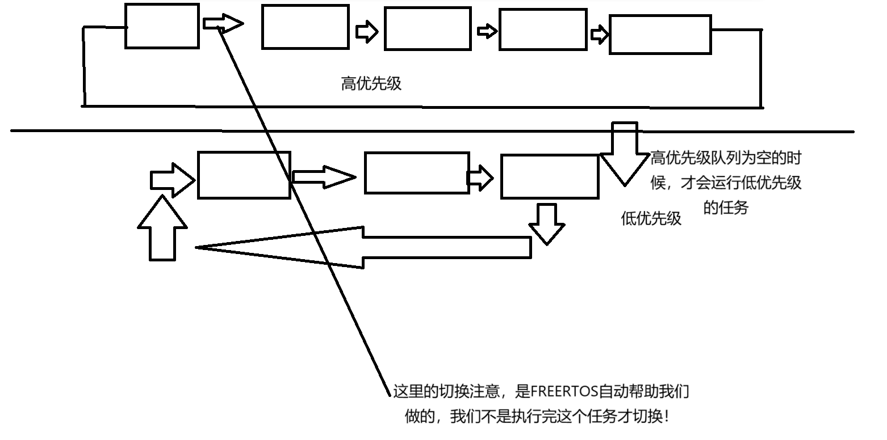
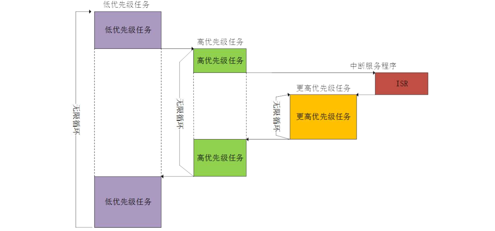

# FreeRTOS之：FREERTOS基础之任务

## 前言

​	这是FreeRTOS的第一个内容，也是FreeRTOS笔者认为算是核心的一个内容。我们使用FreeRTOS的目的就是**解耦合任务实现和任务调度，任务协商的职责**，从而化简咱们写代码的难度。当然，FreeRTOS的功能不止于此，但是笔者认为，**学习掌握任务的创建和删除**，是理解后面的事务的一个非常重要的出发点。

## 理解任务与任务调度的基石——多任务的操作系统

​	第一件事情，我们要把被修饰的主语——操作系统，给说明白。

> 打个广告，笔者有一个手搓操作系统的教程（当然，一个运行在X86上的操作系统还是会比跑在MCU的RTOS在领域范畴上稍微难一些）：
>
> [Charliechen114514/CCOperateSystem: A Tutorial Trying teach you how to make an os in modern tools with gcc, nasm and bochs!](https://github.com/Charliechen114514/CCOperateSystem)

​	**操作系统实际上就是一个软件！一个抽象计算机硬件的软件。它自身也是用汇编代码和C语言代码写出来的（一般实现，不讨论爱好者用其他五花八门的语言写出来的操作系统）**，举个例子，我们这里谈论的任务调度，就是我们的FreeRTOS提供给我们对单片机的核心的抽象。

​	下一个就是多任务这个修饰语。这个我相信大伙很好理解，这就是一个宏观的操作系统中允许存在多个任务。这里就是我们的话题——多任务的操作系统！我们知道我们大部分的单片机（当然是M系列，常见的就是F1或者是其他系列的STM32单片机）只有一个核，也就是说，实际上一个单片机在**物理层次上**只会跑一个程序流（你可以理解为单片机只会在一个事件内跑一个任务）。那我们的其他任务是如何被**调度起来**呢？

​	换而言之，单片机一下子只能跑一个函数，其他我们委派给单片机执行的任务呢？他们啥时候跑起来呢？这就是我们下面要讲的内容了。

## 裸机程序的编程范式：前后台系统


​	让我们整理一下自己写过的常见的单片机程序，无非就是这样的流程

```
#include "headers.h"		// 包含自己所需要的头文件

// global var
int my_var;
...
void my_func(void){
	// 一些放到处理main中的子程序，可能是复杂的初始化
}

int main()
{
	hardware_init();	// 所有硬件的初始化
	while(1)
	{
		process_issue1();
		process_issue2();
		process_issue3();
		...
		status = busy_check_status();	// 忙等待轮循状态
		process_with_status(status); 	// 处理状态
	}
}

void someIRQ_Handler(void){
	process_irq();
}
```

​	你可以看到，我们相当于把任务按照一个循环队列一般，排放到while(1)的循环当中，大家可能会发现一个问题——一个没有RTOS的程序中，任务的执行是循环的流水线。从执行完hardware_init之后，我们就依次执行process_issue1，2，3...中间可能混杂了状态检查，处理状态。外面当中我们可能会Hook一些中断，处理这些中断后进一步返回我们的大循环中执行我们的任务。

​	这里，中断处理就是一个前台程序，他跑到前面，当我们跟单片机产生交互，或者是外部/内部发生了什么事情，就要放下后台的活处理外部的中断，修改大循环中的一部分状态后回来继续默默的处理自己的事情！

​	这样的编程逻辑，如果说事务少，事情会简单很多，相较而言，程序的代码也会轻量很多。但是现在伴随电子产业的发展，我们的业务可以说是越来越复杂了。这种大循环程序，杂糅复杂的任务沟通和状态机编程，导致这样编程范式的程序越发的不可维护。我们需要将任务的逻辑实现和任务的在物理CPU的调度解耦合开来，让我们关心的是任务的实现就好了，剩下我们操心的——什么时候任务要执行，多紧急，什么时候任务撤下或者挂起，什么时候任务休息等待其他任务的执行，交给我们的RTOS就好了！这就是FreeRTOS出现在这里的原因。

## FreeRTOS的运行逻辑是如何的呢？

### 什么是任务？

​	**任务（Task）** 是操作系统调度的基本单位，也是实现多任务并发的核心机制。任务可以理解为一个独立的执行单元，每个任务都有自己的代码逻辑、堆栈空间和优先级。FreeRTOS 通过任务调度器（Scheduler）来管理多个任务的执行顺序，确保系统能够高效地运行。你可以认为，一个任务就像霸占裸机的一个小程序。他似乎拥有了一整个单片机的资源。当然，这个单片机的资源可能会有点寒酸，这个资源是您创建任务的时候自己指派的。

​	我们说，任务的资源有包括经典的独立的执行单元和任务堆栈。这里的执行单元就是独立的工作函数（牢记，C语言中我们使用函数抽象工作流本身，工作流就是完成一个事情的流程，或者说，执行当前的工作流就在完成我们希望单片机做的事情），这里的任务堆栈就是您理解的那个堆栈。我们在这里创建变量，调用函数，所有的事情都发生在这个堆栈上。

### 什么是优先级

​	就像我们处理事情要有轻重，任务的重要程度也要有轻重。一些我们的工作非常重要，要赶鸭子上架，快速的扔到CPU上分配时间片运行程序，一些则是慢慢悠悠，让那些重要的任务都没事可做的时候，我们在给低优先级的任务，让他们处理处理一些杂事。这也可以认为，当系统没有优先事务的时候，我们处理那些不咋重要的事情。

### 无新任务到来时的运行逻辑框图

​	所以，FreeRTOS呢，笔者认为一些教程画的图不太全面，这里给出一个全局的视角。



​	如你所见，我们的任务按照一个优先级进行排序，相同的优先级被组织成了一个队列，我们的操作系统让CPU给最高优先级的任务队列分配时间片进行调度，对于相同优先级的任务，分配等长的时间片，让他们都有机会运行。低优先级的队列只能看着高优先级队列霸占CPU运行，等到他们的任务都结束了，我们的RTOS才会选择低优先级的队列分配时间片进行轮转。

### 任务切换的视图

任务的优先级是创建的时候指定，当然也可以在中间改动我们的任务优先级。这就是一个侧面——任务切换的视图



​	比如说，我们的系统中存在多个不同优先级的队列，分出了低优先级，高优先级和更高优先级的任务。我们提到过，在 FreeRTOS 中，任务的优先级决定了它们的执行顺序。低优先级任务只有在没有高优先级任务运行时才会获得 CPU 时间。当高优先级任务就绪时，调度器会立即切换到该任务，抢占低优先级任务的 CPU 使用权。如果存在更高优先级的任务，它会进一步抢占所有低优先级和高优先级任务的 CPU 时间。

​	需要注意的是——ISR，也就是Interrupt Service的优先级通常高于所有任务。当硬件中断发生时，CPU 会立即暂停当前任务，转而执行 ISR。ISR 的执行是不可被任务抢占的，只有在 ISR 执行完毕后，调度器才会根据任务的优先级重新分配 CPU 时间。

### 任务的状态

​	我想你可能鳖很久了。“你说：我们的MCU的处理器一次只能跑一个任务，那其他的没有被选中执行的任务呢？他们在干什么呢？”。这就是我们下面要谈到的任务的状态。

​	任务状态是任务调度中几乎无法回避的话题。我们直接说：**对于那些没有被CPU选择执行的任务，他们就安静的躺在RAM中休息，准备就绪呢！**，因此，我们至少分出两个状态了——运行态和就绪态。当然，我们还需要补充两个：阻塞态和挂起态。

​	运行态可太好理解了：**那些正在占用 CPU 资源执行代码的任务的状态，就是运行态**（好像我阅读的文献也有叫执行态，无所谓，大家达成：“这个状态是CPU正在跑的那个任务的状态就好了”）在任何时刻，对于只有一个核的CPU，只有一个任务可以处于运行态，当任务处于运行态时，它正在执行其代码逻辑，直到它主动让出 CPU 或者被更高优先级的任务抢占。任务的优先级决定了它在运行态中的执行顺序，高优先级的任务会优先获得 CPU 时间。

​	那剩下那部分呢？大部分就是处于就绪态了。就绪态是指任务已经准备好运行，但由于当前有其他任务正在运行，暂时无法获得 CPU 资源。就绪态的任务已经满足了运行的所有条件，只是等待调度器分配 CPU 时间。当运行态的任务主动让出 CPU 或者被更高优先级的任务抢占时，调度器会从就绪态的任务中选择一个优先级最高的任务切换到运行态。如果多个任务具有相同的优先级，FreeRTOS 会通过时间片轮转的方式让这些任务共享 CPU 时间。

​	剩下的两个状态，阻塞态和挂起态，这个需要我们好好解释一番。

​	举个例子，对于需要外向交互的任务，比如说我这里有一个资源队列，我嘎嘎卸下来队列的内容处理，处理完了之后接着卸货，如果哪一次，货物没了，队列空了，OK，你该睡大觉了。这就是阻塞态，或者说：任务因为等待某些事件或资源而暂时无法运行的状态。任务进入阻塞态的原因可能包括等待信号量、队列、事件组、定时器或其他同步机制。当任务处于阻塞态时，它不会占用 CPU 资源，直到它等待的事件发生或资源可用。

​	另一种呢，就是挂起态，挂起态要更加主动一些，挂起指代的是主动的将自己或者是其他一个任务挂起来，不要执行！挂起的任务不会参与调度，即使它已经满足了运行条件。主动，就意味着我们需要使用一些函数，让他执行后，挂起一部分的任务。挂起态的任务不会占用 CPU 资源，也不会响应任何事件，直到它被显式恢复。

## 所以，我们如何使用任务这个抽象呢——如何创建和删除任务

​	啊，FreeRTOS的文档编写的可以说是非常出色了，让我们看看FreeRTOS是如何抽象任务的。

```
// Task to be created.
void vTaskCode( void * pvParameters )
{
  for( ;; )
  {
      // Task code goes here.
  }
}

// Function that creates a task.
void vOtherFunction( void )
{
	static uint8_t ucParameterToPass;
	TaskHandle_t xHandle = NULL;
  	// Create the task, storing the handle.  Note that the passed parameter ucParameterToPass
  	// must exist for the lifetime of the task, so in this case is declared static.  If it was just an
  	// an automatic stack variable it might no longer exist, or at least have been corrupted, by the time
  	// the new task attempts to access it.
  	xTaskCreate( vTaskCode, "NAME", STACK_SIZE, &ucParameterToPass, tskIDLE_PRIORITY, &xHandle );
  	configASSERT( xHandle );
  	// Use the handle to delete the task.
  	if( xHandle != NULL )
  	{
     	vTaskDelete( xHandle );
  	}
}
```

​	这里的xTaskCreate和vTaskDelete，我们放到后面专门聊，关注的是vTaskCode这个函数。一个想要长期驻留在我们的单片机的任务的基本组成是这样的：

```
void vTaskFunc(void* params)
{
	MyParams* params_type = (MyParams*)params;	// 强转成自己目的的参数，这里可以检测是不是自己期望的参数
	// 或者，你没有参数，那就
	// 	(void)params;表示自己不打算使用参数，任务是无参数的
	while(1)
	{
		// codes here
	}
	
	// if break
	vTaskDelete(NULL);	// 这句话就一个意思，任务即将垂死，要把自己清理掉
}
```

​	这就是我们之后要写代码的一个范本了。下一篇，我们就要真正的来实战一下我们的FreeRTOS。
