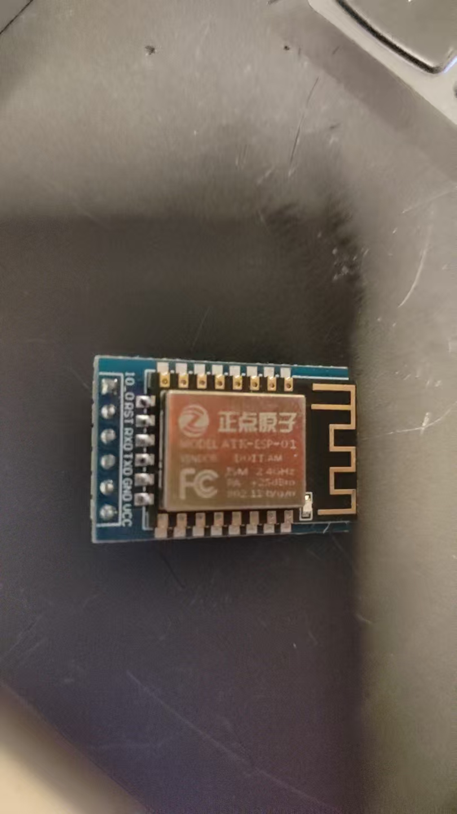
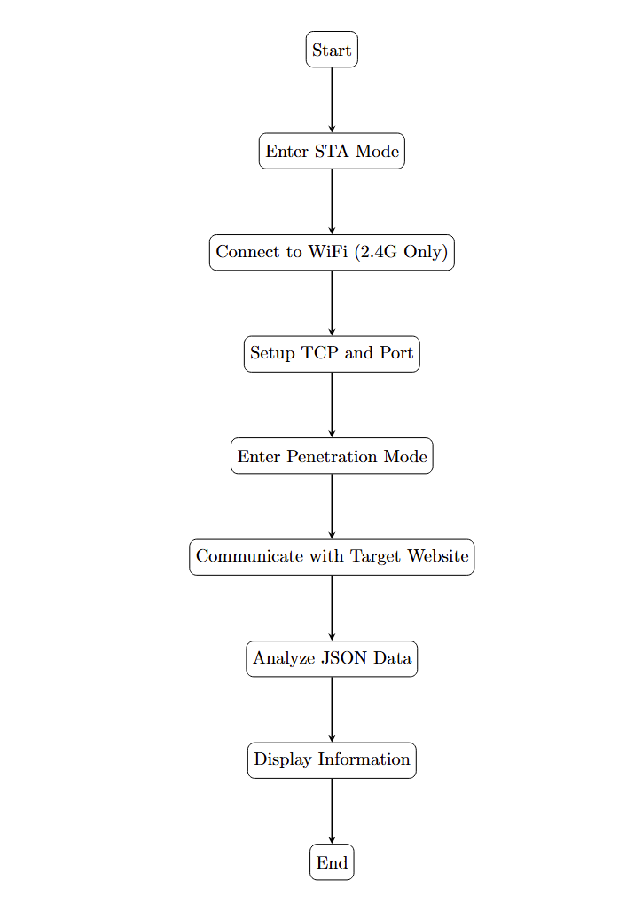

# 从0开始的构建的天气预报小时钟（基于STM32F407ZGT6，ESP8266 + SSD1309）

# Part 1：开始之前笔者的说明

​	本项目隶属于项目：[Charliechen114514/BetterATK: This is a repo that helps rewrite STM32 Common Repositories](https://github.com/Charliechen114514/BetterATK)。

​	这个文档打算尝试介绍从0开始构建一个简单的天气预报小时钟（基于STM32F407ZGT6，ESP8266 + SSD1309）。目前为止，这个文档描述的部分是——Non-RTOS的前后台程序框架的源码的文档，后续笔者也许会更新使用FreeRTOS重构的，交互性更好的版本，但是归根结底，大部分的原理是不会发生改动。

​	本项目使用的单片机型号是：STM32F407ZGT6，这个单片机隶属于ARMv7-M——Cortex-M4架构的STM32F4，使用的展示设备是SSD1309，其构建的框架是隶属项目BetterATK自己写的OLED图形驱动框架，注意，这个框架测试尚不完备，您可以直接参考接口进行自己的代码替换，我会详细的说明接口预期需要完成的功能。如果您对SSD1309或者是SSD1306（注意，两者的指令代码不一样，但是原理相同，所以构建的抽象也是类似的）以及对如何构建最简单的图形驱动尚不了解，可以移步参考笔者项目根文件夹下的Documentations/Old/set_up_oled_graphic_framework文件夹，或者参考笔者的Post的CSDN教程看看笔者构建的思路。

> [从0开始使用面对对象C语言搭建一个基于OLED的图形显示框架_显示交互c语言框架-CSDN博客](https://blog.csdn.net/charlie114514191/article/details/145397231)

## 你需要准备的外设清单

- 一块STM32系列的单片机，可以无所谓型号，笔者采用非CubeMX框架生成的HAL库作为自己的驱动基础，在此基础上是F1还是F4还是其他型号无关紧要
- 一块ESP8266，笔者购买的是正点原子的ESP8266，需要注意的是——我没办法保证所有厂家的ESP8266性质一样，笔者会说明每一个设计部分的任务是什么，对应的，如果你不清楚自己的ESP8266行为是否一致，数据手册永远是你最好的帮手
- 一块SSD1309的显示屏幕，SSD1306同样可以，如果你使用的是笔者写的驱动框架，只需要添加定义-DSSD1306后即可，笔者的OLED使用的是IIC通信协议，为了方便移植，则采用软件IIC，事实证明STM32F4的GPIO速度属实吓人，刷新的非常快

## 笔者将会做的事情

- 介绍，和完成ESP8266的编程说明和封装。
- 对于OLED框架，这里不再赘述，请参考[从0开始使用面对对象C语言搭建一个基于OLED的图形显示框架_显示交互c语言框架-CSDN博客](https://blog.csdn.net/charlie114514191/article/details/145397231)
- cJson的简单使用与说明
- 简单的界面状态机编程
- 简单的时钟绘制和RTC编程

​	准备好之后，我们就可以开始进行我们的长征了！

## Part1 简单的介绍一下ESP8266和他的编程指令

​	ESP8266是由上海乐鑫信息科技（Espressif Systems）设计开发的一款高度集成的Wi-Fi系统级芯片(SoC)，而市场上常见的ESP8266模块则是深圳安信可公司基于该芯片开发的完整解决方案（增加了必要的外围电路、串口Flash和板载天线等）。这款芯片首次将Wi-Fi连接功能以极低成本带入大众视野，彻底改变了物联网设备的开发方式。（上述事情是我从手册里CV的）

​	简单的说，如果我们只是关心器件的编程特性的话，我们要看的实际上就是



​	让我们看到我们的器件的引脚。笔者的板子上，有6个引脚，其中GND和VCC是没啥好说的，这两个引脚是供电使用的。我们需要注意的是，RXD和TXD这两个引脚，需要我们介入一个串口进行通信。你可以我们的USB转TTL模块，测试我们的ESP8266是否工作正常。办法就跟板子之间或者是板子和上位机之间的通信原理完全一致：USB转TTL的TX段接我们的ESP8266的RXD段，RX段接我们的ESP8266的TXD段。然后，笔者的ESP8266可以耐压5V，所以看清楚了，别把自己的ESP8266烧坏了。

​	下面我们就来看看ESP8266的交互问题，关于ESP8266的内部器件特性，留给我们的关心的问题是如何跟ESP8266交互。好在我们的器件都已经封装好了，需要做的事情也就是使用串口发送我们想要的信息即可。

### ESP8266编程指令前导——三种工作模式

​	我们必须要说明ESP8266的工作模式，不然的话，我们真的没有办法完成我们的工作

- **STA（Station）模式**：在此模式下，ESP8266作为客户端设备连接到现有的无线网络（如家庭路由器）。这种配置使得设备能够通过互联网被远程访问和控制，是大多数物联网应用的理想选择。STA模式的典型应用场景包括智能家居设备、远程传感器节点等需要接入互联网的设备。
- **AP（Access Point）模式**：在此配置下，ESP8266自身充当无线接入点，创建独立的无线网络。其他设备（如智能手机、笔记本电脑）可以直接连接到该模块，形成局域网通信。AP模式适用于需要快速建立设备间直接通信的场景，如配置工具、本地控制面板等。模块支持多种安全机制，包括WEP、WPA-PSK和WPA2-PSK加密，确保通信安全。
- **STA+AP混合模式**：这种配置允许ESP8266同时作为STA客户端和AP热点运行，实现了互联网访问与本地控制的无缝结合2。在这种模式下，设备既可以通过路由器接入互联网，又能直接与附近设备通信，提供了极高的操作灵活性。混合模式特别适合需要多种控制方式的智能设备，如既支持手机APP远程控制又支持本地按键操作的智能插座。

​	对于STA模式下，我们还有穿透模式和非穿透模式一说，默认的情况下，我们会是非穿透模式，设置好我们的TCP连接对象后，就可以进入穿透模式，让ESP8266直接转发我们发给他的数据，这样就实现了远程跟我们的服务器沟通的效果。

​	现在，理论知识差不多就这些，我们的思路差不多是这样的：

> **获取天气或者是时钟信息，需要我们进入STA模式，连接好我们手机的WiFi（你需要注意的是，ESP8266只可以连接2.4G频段的WIFI，我的电脑的热点他不认，但是各位看官都先尝试一下，不认的话，手机的热点他是一定认的）后，我们设置沟通的网站对象（TCP和端口号），然后进入穿透模式跟我们的目标网站进行通信。拿到的数据进行json分析后展示出来**




### ESP8266编程指令

#### 工作确认指令（用于非穿透模式下）

​	现在，你可以先暂时先将我们的ESP8266跟我们的USB转TTL连接起来，然后，打开串口（波特率115200），现在，你可以尝试发送指令检查我们的设备工作是否正常。

​	办法是，打开你的串口调试助手，端口号记得选择USB-TTL的端口后，波特率设置为115200，然后其他设置为默认。随后，发送AT指令。

```
AT

OK
```

​	出现这个，就表明我们的ESP8266的工作是一切正常的。

#### 设置工作模式：AT+CWMODE=X

​	`AT+CWMODE` 是 ESP8266 Wi-Fi 模块中用于设置 Wi-Fi 工作模式的核心 AT 指令。该指令决定了模块如何与其他 Wi-Fi 网络和设备进行交互，是 ESP8266 网络配置的基础。基本上我们做ESP8266的应用层的东西，起手都会设置工作模式

| 模式值 | 工作模式      | 描述                                                  |
| :----- | :------------ | :---------------------------------------------------- |
| 1      | Station (STA) | 作为客户端连接到现有 Wi-Fi 网络（如家庭路由器）       |
| 2      | SoftAP (AP)   | 作为接入点创建自己的 Wi-Fi 网络，允许其他设备连接     |
| 3      | STA+AP        | 同时工作在 Station 和 SoftAP 模式，兼具两种模式的特性 |

​	试一下这个：这个时候我们就会设置为工作模式了

```
AT+CWMODE=1

OK
```

#### 两个重要的复位

##### 硬复位AT+RESTORE

`AT+RESTORE` 是 ESP8266 Wi-Fi 模块中用于恢复出厂设置的 AT 指令。该指令会将模块的所有参数重置为出厂默认值，清除用户配置的所有网络参数和其他设置。

```
AT+RESTORE

ready
```

​	这个事情需要查手册来解决，我的是Ready，一些的可能是OK

##### 软复位AT+RST

​	`AT+RST` 是 ESP8266 Wi-Fi 模块中用于软件重启模块的 AT 指令。该指令会重新初始化模块，但不改变任何用户配置参数，相当于给模块发送了一个"软复位"信号。

```
AT+RST

OK
```

| 特性         | AT+RST (重启)    | AT+RESTORE (恢复出厂设置) |
| :----------- | :--------------- | :------------------------ |
| **参数保持** | 保留所有用户配置 | 清除所有用户配置          |
| **执行速度** | 较快(3-5秒)      | 较慢(可能需要更长时间)    |
| **波特率**   | 保持不变         | 通常恢复为115200          |
| **网络配置** | 自动尝试重新连接 | 需要完全重新配置          |
| **使用频率** | 可频繁使用       | 应谨慎使用                |

#### 加入Wifi AT+CWJAP

`AT+CWJAP` 是 ESP8266 Wi-Fi 模块中用于连接/配置无线接入点(AP)的核心 AT 指令。该指令允许模块以 Station (STA) 模式连接到指定的 Wi-Fi 网络。

```
AT+CWJAP="<ssid>","<password>"
```

​	注意，`<ssid>`和`<password>`替换成你手机热点的**WIFI名称和密码**

#### 开始一次TCP通信

`AT+CIPSTART` 是 ESP8266 Wi-Fi 模块中用于建立 TCP/UDP/SSL 连接的核心 AT 指令。该指令允许模块作为客户端连接到指定的服务器，支持多种协议类型，是网络通信的基础。

​	我们这里只需要掌握TCP通信的请求即可

```
AT+CIPSTART="TCP", "<Target>", "<Port>"
```

Target换成目标的网站，Port换成通信的端口号，我们这里一般是80（HTTP），或者是443（HTTPS）

#### 进入和退出穿透模式

##### 进入

```
AT+CIPMODE=1
```

​	我们进入穿透模式很简单，就是AT+CIPMODE=1，进入穿透模式之后，我们需要做的预备动作就是准备好发送数据，

```
AT+CIPSEND
```

​	发送结束后，我们的串口就会输出就会有`>`，这个时候，任何的request都会直接被转发到ESP8266上送到我们的服务器

```
+++
```

​	**注意，不要带回车换行，否则会失败！**，退出我们的穿透模式

​	上面几个就是我们会用到的指令！

# 理论成立，实践开始

## 构建简单的ESP8266驱动

### 设计协议帧和串口资源抽象函数

​	理论成立，实战开始，我们的第一步，就是让我们的ESP8266变得可以方便使用起来，让代码之间存在良好的分层，不仅会让我们的开发变得方便，而且助于我们排查错误，不然谁也不喜欢代码之间各个层次混在一起，谁也不知道问题出在哪里。

​	ESP8266当然还有很多其他的功能，但是他们的功能，我们的单片机要是想要使用，则必须利用串口进行交互，意味着如下的事情：

- ESP8266必须占用单片机的一个UART资源

```c
// link with ESP8266's RX
#define ESP8266_UART_TX_GPIO_PORT           GPIOD
#define ESP8266_UART_TX_GPIO_PIN            GPIO_PIN_5
#define ESP8266_UART_TX_GPIO_AF             GPIO_AF7_USART2
#define ESP8266_UART_TX_GPIO_CLK_ENABLE()   do{ __HAL_RCC_GPIOD_CLK_ENABLE(); }while(0)     /* PB口时钟使能 */

// link with ESP8266's TX
#define ESP8266_UART_RX_GPIO_PORT           GPIOD
#define ESP8266_UART_RX_GPIO_PIN            GPIO_PIN_6
#define ESP8266_UART_RX_GPIO_AF             GPIO_AF7_USART2
#define ESP8266_UART_RX_GPIO_CLK_ENABLE()   do{ __HAL_RCC_GPIOD_CLK_ENABLE(); }while(0)     /* PB口时钟使能 */

/* UART Sources Settings */
#define ESP8266_UART_NAME       (USART2)
#define ESP8266_UART_IRQn       USART2_IRQn
#define ESP8266_UART_IRQHandler USART2_IRQHandler
#define ESP8266_UART_CLK_Enable() do{ __HAL_RCC_USART2_CLK_ENABLE(); }while(0)
```

​	笔者打算是使用UART2，对于STM32F407ZGT6而言，则是PD5和PD6引脚。

​	为了方便，我们设计一下我们的UART抽象

```c
typedef struct __esp8266_uart_frame_protocol    ESP8288_UARTFrameProtocol;
typedef struct __esp8266_uart_handle            ESP8266_UARTHandle;
typedef struct {
    uint8_t*(*get_internal_frame)(ESP8266_UARTHandle* handle);
    uint16_t(*get_internal_frame_len)(ESP8266_UARTHandle* handle);
    void(*reset)(ESP8266_UARTHandle* handle);
}ESP8266_UARTHandleOperations;

typedef struct __esp8266_uart_handle{
    ESP8288_UARTFrameProtocol*      pvt_frame;
    UART_HandleTypeDef              uart_handle;
    ESP8266_UARTHandleOperations*   operations;
}ESP8266_UARTHandle;

void send_esp8266_uart_info(ESP8266_UARTHandle* handle, char* format, ...);
void init_esp8266_uart_handle(
    ESP8266_UARTHandle* handle, uint32_t    uart_baudrate);

```

​	我们依次进行说明

- ESP8266_UARTHandleOperations衡量了我们的串口的约束动作——他只能对外提供如下的信息：
  - 当前的缓存接收buffer本身和他的长度
  - 重置我们的buffer
- ESP8266_UARTHandle是我们占用的串口本身的抽象，他需要被开启中断（不然我们没办法想象一个同步的手法对我们的程序的影响占用会是多么的令人沮丧！），它内部包含了如下的信息
  - ESP8288_UARTFrameProtocol约束了协议栈的格式
  - UART_HandleTypeDef是我们更底层的HAL库Level的串口资源
  - ESP8266_UARTHandleOperations上面是我们已经谈过的事情，不会再重复
- send_esp8266_uart_info是一个变参数函数，这种函数的特性，笔者非常乐意说的是——您可以参考笔者的《操作系统手搓教程》的《实现一个自己的printf》，来看看我们是如何实现类似于printf的函数的
- init_esp8266_uart_handle则是说明了我们通信的波特率，我们一般给出默认值115200，你可以自己查看手册，看看我们的ESP8266使用的通信频率到底是如何的。

### 初始化我们的UART串口资源

​	默认下，我们可以使用如下的方式进行串口资源初始化。

```c
void init_esp8266_uart_handle(
    ESP8266_UARTHandle* handle, uint32_t    uart_baudrate)
{
    memset(handle, 0, sizeof(ESP8266_UARTHandle));
    allocate_global_frame(handle);
    current = handle;
    handle->operations =    &operations;
    handle->uart_handle.Instance            = ESP8266_UART_NAME;
    handle->uart_handle.Init.BaudRate       = uart_baudrate;
    handle->uart_handle.Init.WordLength     = UART_WORDLENGTH_8B;          
    handle->uart_handle.Init.StopBits       = UART_STOPBITS_1;             
    handle->uart_handle.Init.Parity         = UART_PARITY_NONE;             
    handle->uart_handle.Init.Mode           = UART_MODE_TX_RX;             
    handle->uart_handle.Init.HwFlowCtl      = UART_HWCONTROL_NONE;          
    handle->uart_handle.Init.OverSampling   = UART_OVERSAMPLING_16;

    HAL_UART_Init(&handle->uart_handle);
}
```

​	我们这样处理协议栈的（为了说明里面代码的东西，必须先说说如何抽象的）

```c
/* Frame Settings */
#define INTERNAL_ESP8266UART_RX_BUFFER  (1000)
#define INTERNAL_ESP8266UART_TX_BUFFER  (128)

typedef struct __esp8266_uart_frame_protocol {
    uint8_t rx_buffer[INTERNAL_ESP8266UART_RX_BUFFER];
    uint8_t tx_buffer[INTERNAL_ESP8266UART_TX_BUFFER];
    struct 
    {
        uint32_t    frame_len;
        uint8_t     is_finished;
    }frame_status;
}ESP8288_UARTFrameProtocol;

static ESP8288_UARTFrameProtocol    global_frame;
static ESP8266_UARTHandle*          current;	// 标定了现在我们处理的ESP8266是哪一个，如果你的场景是只有一个，那就没必要放置这个全局变量
```

​	其中，allocate_global_frame约定了我们的ESP8266的分配资源空间的行为是如何的，这里我们采取最简单的静态资源分配，直接把一个数组来作为我们的分配资源地址

```c
static void allocate_global_frame(ESP8266_UARTHandle* handle){
    handle->pvt_frame   = &global_frame;
}
```

​	如果您使用的是HAL库（笔者其实不太建议，因为我们需要自己处理一下中断，HAL的代码全写死了，处理没法灵活），可以按照上面的配置自己看看，基本上是默认的设置。

​	以及我们还需要有一定的回调处理

```c
static void __open_tx_clk(){
    ESP8266_UART_TX_GPIO_CLK_ENABLE();
}

static void __open_rx_clk(){
    ESP8266_UART_RX_GPIO_CLK_ENABLE();
}
/* post init */
void esp8266_uart_post_init(UART_HandleTypeDef *huart)
{
    CCGPIOInitTypeDef tx = {
        .open_clock = __open_tx_clk,
        .post_init = NULL,
        .port = ESP8266_UART_TX_GPIO_PORT,
        .type = {
          .Pin = ESP8266_UART_TX_GPIO_PIN,
          .Mode = GPIO_MODE_AF_PP,
          .Alternate = ESP8266_UART_TX_GPIO_AF,
          .Speed = GPIO_SPEED_FREQ_HIGH,
          .Pull = GPIO_NOPULL
        }
      };

      CCGPIOInitTypeDef rx = tx;
      rx.port = ESP8266_UART_RX_GPIO_PORT;
      rx.type.Pin = ESP8266_UART_RX_GPIO_PIN;
      rx.open_clock = __open_rx_clk;
      CCGPIOType  _rx, _tx;
      configure_ccgpio(&_tx, &tx);
      configure_ccgpio(&_rx, &rx);

      ESP8266_UART_CLK_Enable();   
      HAL_NVIC_SetPriority(ESP8266_UART_IRQn, 0, 0); 
      HAL_NVIC_EnableIRQ(ESP8266_UART_IRQn);         

      __HAL_UART_ENABLE_IT(huart, UART_IT_RXNE); 
      __HAL_UART_ENABLE_IT(huart, UART_IT_IDLE); 
}
```

​	他被放到了HAL_UART_MspInit里，注意，这里一般还会有调试串口（笔者开启的是UART1作为自己的调试串口）

```c
void HAL_UART_MspInit(UART_HandleTypeDef *huart)
{
    if (huart->Instance != ESP8266_UART_NAME)
    {
        on_init_private_uart();
    }
    else
    {
        esp8266_uart_post_init(huart);
    }
}
```

​	我们还需要处理一下UART2的中断：

```c
/* Interrupt handler */
void esp8266_uart_handle(void)
{
    uint8_t tmp;
    
    if (__HAL_UART_GET_FLAG(&current->uart_handle, UART_FLAG_ORE) != RESET)        /* UART overrun error interrupt */
    {
        __HAL_UART_CLEAR_OREFLAG(&current->uart_handle);                           /* Clear overrun error flag */
    }
    
    if (__HAL_UART_GET_FLAG(&current->uart_handle, UART_FLAG_RXNE) != RESET)       /* UART receive interrupt */
    {
        HAL_UART_Receive(&current->uart_handle, &tmp, 1, HAL_MAX_DELAY);           /* UART receive data */
        
        if (current->pvt_frame->frame_status.frame_len >= (INTERNAL_ESP8266UART_RX_BUFFER - 1))
        {
            current->pvt_frame->frame_status.frame_len = 0;                        /* Reset frame length if buffer is full */
        }
        current->pvt_frame->rx_buffer[
            current->pvt_frame->frame_status.frame_len] = tmp;                     /* Store received byte in buffer */
        current->pvt_frame->frame_status.frame_len++;                              /* Increment frame length counter */
    }

    if (__HAL_UART_GET_FLAG(&current->uart_handle, UART_FLAG_IDLE) != RESET)       /* UART idle line detected */
    {
        current->pvt_frame->frame_status.is_finished = 1;                          /* Mark frame as complete */                      
        __HAL_UART_CLEAR_IDLEFLAG(&current->uart_handle);                          /* Clear idle line flag */
    }
}
```

​	上面的代码就是在做这些事情：

1. **检测并清除过载错误**：首先检查串口是否发生接收过载错误（ORE），如果发生则清除该错误标志，防止持续触发中断。
2. **处理接收数据**：当串口接收到新数据（RXNE 标志置位）时，读取一个字节存入临时变量，并检查接收缓冲区是否已满。如果未满，则将数据存入接收缓冲区的当前位置，并递增帧长度计数器；如果已满，则重置帧长度计数器（实现循环缓冲）。
3. **检测空闲中断**：当串口检测到空闲状态（IDLE 标志置位）时，标记当前帧接收完成（is_finished=1），并清除空闲标志。此机制通常用于判断一帧数据接收完毕（如串口通信中的帧间隔）。

​	这个函数会在我们的UART2的中断触发的时候调用

```c
void ESP8266_UART_IRQHandler(void)
{
    esp8266_uart_handle();
}
```

### 完成串口的功能函数

​	下面我们完成一下串口操作本身的功能

```c
uint8_t* __pvt_get_frame_self(ESP8266_UARTHandle* handle){
    // 传输完了，我们才会吐出来buffer，否则返回NULL表达我们没有接受
    if(handle->pvt_frame->frame_status.is_finished){
        handle->pvt_frame->rx_buffer[handle->pvt_frame->frame_status.frame_len] = '\0';
        return handle->pvt_frame->rx_buffer;
    }
    return NULL;
}

uint16_t __pvt_get_frame_len(ESP8266_UARTHandle* handle)
{
    // 同上，为了协调一致
    return handle->pvt_frame->frame_status.is_finished ? 
        handle->pvt_frame->frame_status.frame_len : 0;
}

static void reset_the_handle(ESP8266_UARTHandle* handle)
{
    // 重置我们的串口接受状态
    handle->pvt_frame->frame_status.frame_len = 0;
    handle->pvt_frame->frame_status.is_finished = 0;
}
```

​	这些操作给予给我们的结构体

```
static ESP8266_UARTHandleOperations operations = {
    .get_internal_frame = __pvt_get_frame_self,
    .get_internal_frame_len = __pvt_get_frame_len,
    .reset = reset_the_handle
};
```

​	现在操作的初始化就完成了回环，之后我们调用接口处理就好了，至于内部的实现细节，完全跟外界无关。

​	最重要的函数，就属下面这个了

```c
void send_esp8266_uart_info(ESP8266_UARTHandle* handle, char* format, ...)
{
    va_list ap;

    va_start(ap, format);
    vsprintf((char *)handle->pvt_frame->tx_buffer, format, ap);
    va_end(ap);

    uint32_t len = strlen((const char*)handle->pvt_frame->tx_buffer);
    HAL_UART_Transmit(&handle->uart_handle, handle->pvt_frame->tx_buffer, len, HAL_MAX_DELAY);
}
```

​	我们阻塞的发送数据（当然你想做成异步的也行，注意如果一些操作需要结果的时候，你这个时候一定要设计显著的等待，如果使用的是RTOS，需要立刻进行信号量的休眠，直到资源接受线程唤醒！）

### 设计ESP8266结构体本题的抽象

```c
#ifndef ESP8266_H
#define ESP8266_H
#include "esp8266_config.h"
#include "esp8266_uart.h"
#include "gpio.h"
// 错误码的设计
typedef enum {
    ESP8266_OK      = 0,	// OK，啥问题没有
    ESP8266_ERROR   = 1,	// 嗯，杂七杂八错误
    ESP8266_TIMEOUT = 2,	// 超时错误
    ESP8266_EINVAL  = 3		// 非法参数
}ESP8266_ErrorCode;

typedef enum {
    ESP8266_APMode = 2,		// AP模式
    ESP8266_StationMode = 1, // Sta模式
    ESP8266_MixMode = 3		// 我全都要
}ESP8266_WorkMode;

typedef enum {
    ESP8266_SoftReset,
    ESP8266_HardReset
}ESP8266_ResetMethod;

typedef struct __esp8266_handle ESP8266_Handle;

typedef struct {
    char*           cmd;			// 命令command
    char*           ack;			// 我们期待的回应ack
    uint32_t        timeout_try;	// 尝试的最大限度
}ESP8266_CMDPackage;

typedef struct {
    char*           ssid;
    char*           pwd;
}WiFi_Package;

typedef struct {
    char*           ip;
    char*           port;
}TCPServerInfo;

typedef struct {
/* Function pointer for sending AT commands (base method implementation) */
uint8_t (*send_command)(ESP8266_Handle* handle, ESP8266_CMDPackage* pack);

/* Resets the ESP8266 module using specified reset method */
uint8_t (*reset)(ESP8266_Handle* handle, ESP8266_ResetMethod method);

/* Tests if ESP8266 module is responsive/enabled */
uint8_t (*test_enable)(ESP8266_Handle* handle);

/* Sets the working mode of ESP8266 (Station/AP/Station+AP) */
uint8_t (*set_mode)(ESP8266_Handle* handle, ESP8266_WorkMode mode);

/* Enables or disables AT command echo */
uint8_t (*set_as_echo)(ESP8266_Handle* handle, uint8_t status_wish);

/* Joins a WiFi network using provided credentials */
uint8_t (*join_wifi)(ESP8266_Handle* handle, WiFi_Package* package);

/* Retrieves IP address obtained from WiFi connection */
uint8_t (*fetch_ip_from_wifi)(ESP8266_Handle* handle, char* container, uint8_t buffer_len);

/* Establishes TCP connection with specified server */
uint8_t (*connect_tcp_server)(ESP8266_Handle* handle, TCPServerInfo* server_info);

/* Enters transparent transmission mode */
uint8_t (*enter_unvarnished)(ESP8266_Handle* handle);

/* Exits transparent transmission mode */
uint8_t (*leave_unvarnished)(ESP8266_Handle* handle);

/* Fetches data from remote server using custom command */
void (*fetch_from_remote)(ESP8266_Handle* handle, const char* cmd, char* buffer, uint16_t buflen);

/* Refreshes/updates data fetched from remote */
void (*refresh_fetch)(ESP8266_Handle* handle);
}ESP8266_Operations;

typedef struct __esp8266_handle{
    ESP8266_UARTHandle      handle;
    ESP8266_Operations*     operations;
    CCGPIOInitTypeDef       rst_gpio;
}ESP8266_Handle;

uint8_t init_esp8266_handle(
    ESP8266_Handle*         handle, 
    uint32_t                baudrate,
    CCGPIOInitTypeDef*      rst_package);

#endif
```

​	ESP8266_Handle本身包含了我们的ESP8266_UARTHandle结构体抽象，以及操作抽象，还有一个是我们的RST引脚（注意，我们的系统必须接上单片机，辅助我们进行复位，不然下次开机的时候，我们的初始化会出现问题，或者你也可以不进行初始化，但是就会很麻烦）

​	初始化现在因为串口的封装，代码变得没办法再简单了

```c
static void __init_rst_gpio(ESP8266_Handle *handle, CCGPIOInitTypeDef *gpio)
{
    CCGPIOType tmp;
    configure_ccgpio(&tmp, gpio);
}

static void __hardware_reset(ESP8266_Handle *handle, CCGPIOInitTypeDef *gpio)
{
    CCGPIOType type;
    type.pinType = gpio->type.Pin;
    type.port = gpio->port;
    set_ccgpio_state(&type, CCGPIO_LOW);
    system_delay_ms(100);
    set_ccgpio_state(&type, CCGPIO_HIGH);
    system_delay_ms(500);
}

uint8_t init_esp8266_handle(
    ESP8266_Handle *handle,
    uint32_t baudrate,
    CCGPIOInitTypeDef *rst_package)
{
    memset(handle, 0, sizeof(ESP8266_Handle));
    __init_rst_gpio(handle, rst_package);
    __hardware_reset(handle, rst_package);
    init_esp8266_uart_handle(&handle->handle, baudrate);
    handle->operations = &op;
    handle->rst_gpio = *rst_package;
    return handle->operations->test_enable(handle);
}
```

​	初始化完成之后，我们就可以安安心心的开始完成上面的函数指针结构体抽象了

#### 完成通用命令发：send_basic_command

```c
static uint8_t send_basic_command(ESP8266_Handle *handle, ESP8266_CMDPackage *pack)
{
    // 每一次发送，我们都要复位一下存储的结果
    handle->handle.operations->reset(&handle->handle);
    // 发出去
    send_esp8266_uart_info(&handle->handle, "%s\r\n", pack->cmd);

    if (!pack->ack || pack->timeout_try == 0)
    {
        return ESP8266_OK;
    }

    uint32_t timeout_try = pack->timeout_try;
    uint8_t *receivings = NULL;
    while (timeout_try > 0)
    {
        // 现在我们进行等待
        receivings = handle->handle.operations->get_internal_frame(&handle->handle);
        if (receivings)
        {
            // 如果我们出现了期待的回应，那么，说明我们的操作成了
            if (strstr((const char *)receivings, pack->ack) != NULL)
            {
                return ESP8266_OK;
            }
            else
            {
                // 反之，说明不是我们想要的输出，先清空，后面我们可能还有新的输入
                handle->handle.operations->reset(&handle->handle);
            }
        }
        timeout_try--;
        system_delay_ms(1);
    }

    return ESP8266_TIMEOUT;
}
```

#### 完成通用穿透收发：fetch_from_remote

```c
static void fetch_from_remote(
    ESP8266_Handle *handle, const char *cmd, char *buffer, uint16_t buflen)
{
    handle->handle.operations->reset(&handle->handle);
    send_esp8266_uart_info(&handle->handle, "%s\r\n", cmd);
    
    uint32_t timeout_try = 10000;
    uint8_t *receivings = NULL;
    while (timeout_try > 0)
    {
        receivings = handle->handle.operations->get_internal_frame(&handle->handle);
        if (receivings)
        {
            uint16_t rx_buffer_len = handle->handle.operations->get_internal_frame_len(&handle->handle);
            uint16_t fin_len = ((rx_buffer_len > buflen) ? buflen : rx_buffer_len);
            strncpy(buffer, (const char*)receivings, fin_len);
            return;
        }
        timeout_try--;
        system_delay_ms(1);
    }
}
```

​	这个函数实际上就是在上面收到的基础上，做的事情是直接拷贝所得的结果

#### 复位模式选择

```c
static uint8_t reset_hard(ESP8266_Handle *handle)
{
    ESP8266_CMDPackage package = {
        .ack = "ready",
        .cmd = "AT+RESTORE",
        .timeout_try = 3000};
    return send_basic_command(handle, &package);
}

static uint8_t reset_soft(ESP8266_Handle *handle)
{
    ESP8266_ErrorCode code;
    ESP8266_CMDPackage pack = {
        .ack = "OK",
        .cmd = "AT+RST",
        .timeout_try = 500};
    code = send_basic_command(handle, &pack);
    if (code == ESP8266_OK)
    {
        system_delay_ms(1000);
    }
    return code;
}

static uint8_t reset_method(ESP8266_Handle *handle, ESP8266_ResetMethod method)
{
    ESP8266_ErrorCode code = ESP8266_ERROR;
    switch (method)
    {
    case ESP8266_HardReset:
        code = reset_hard(handle);break;
    case ESP8266_SoftReset:
        code = reset_soft(handle);break;
    }
    return code;
}
```

#### 运行时测试是否正常（注意，需要在穿透模式前使用）

```c
static uint8_t test_enable(ESP8266_Handle *handle)
{
    ESP8266_CMDPackage package = {
        .ack = "OK",
        .cmd = "AT",
        .timeout_try = 500};
    ESP8266_ErrorCode code;
    for (uint8_t i = 0; i < 10; i++)
    {
        code = send_basic_command(handle, &package);
        if (code == ESP8266_OK)
        {
            return code;
        }
    }
    return code;
}
```

#### 设置回显模式

```c
static uint8_t set_echo_status(ESP8266_Handle *handle, uint8_t status)
{
    char *cmd = (status) ? "ATE0" : "ATE1";
    ESP8266_CMDPackage pack = {
        .ack = "OK",
        .cmd = cmd,
        .timeout_try = 500};
    return send_basic_command(handle, &pack);
}
```

#### 加入WIFI和WIFI下的IP获取

```
static uint8_t join_wifi(ESP8266_Handle *handle, WiFi_Package *pack)
{
    char final_cmd[128];
    snprintf(final_cmd, 128, "AT+CWJAP=\"%s\",\"%s\"", pack->ssid, pack->pwd);
    ESP8266_CMDPackage __pack = {
        .ack = "WIFI GOT IP",
        .cmd = final_cmd,
        .timeout_try = 10000};
    ESP8266_ErrorCode code = send_basic_command(handle, &__pack);
    // must a delay, else we won't get next operations
    system_delay_ms(100);
    return code;
}

static uint8_t fetch_ip(ESP8266_Handle *handle, char *container, uint8_t buffer_len)
{
    ESP8266_ErrorCode ret;
    char *p_start = NULL;
    char *p_end = NULL;

    ESP8266_CMDPackage pack = {
        .ack = "OK",
        .cmd = "AT+CIFSR",
        .timeout_try = 500};

    ret = send_basic_command(handle, &pack);
    if (ret != ESP8266_OK)
    {
        return ESP8266_ERROR;
    }
    system_delay_ms(100);
    p_start = strstr((const char *)handle->handle.operations->get_internal_frame(&handle->handle), "\"");
    p_end = strstr(p_start + 1, "\"");
    *p_end = '\0';
    snprintf(container, buffer_len, "%s", p_start + 1);
    return ESP8266_OK;
}
```

#### 穿透模式设置

```
static uint8_t enter_unvarnished(ESP8266_Handle *handle)
{
    ESP8266_CMDPackage pack = {
        .ack = "OK",
        .cmd = "AT+CIPMODE=1",
        .timeout_try = 500};
    ESP8266_ErrorCode code = send_basic_command(handle, &pack);
    if (code != ESP8266_OK)
    {
        return code;
    }
    pack.cmd = "AT+CIPSEND";
    pack.ack = ">";
    return send_basic_command(handle, &pack);
}

static uint8_t leave_unvarnished(ESP8266_Handle *handle)
{
    send_esp8266_uart_info(&handle->handle, "+++");
    system_delay_ms(100);
    return ESP8266_OK;
}
```

#### 设置工作模式

```
static uint8_t set_mode(ESP8266_Handle* handle, ESP8266_WorkMode mode)
{
    int _mode = (int)mode;
    char buffer[128];
    snprintf(buffer, 128, "AT+CWMODE=%d", _mode);
    ESP8266_CMDPackage pack = {
        .ack = "OK",
        .cmd = buffer,
        .timeout_try = 500};    
    return send_basic_command(handle, &pack);
}
```

#### 连接 TCP服务器

```
static uint8_t connect_tcp(ESP8266_Handle *handle, TCPServerInfo *info)
{
    char cmd[128];
    snprintf(cmd, 128, "AT+CIPSTART=\"TCP\",\"%s\",%s", info->ip, info->port);
    ESP8266_CMDPackage pack = {
        .ack = "CONNECT",
        .cmd = cmd,
        .timeout_try = 500};
    return send_basic_command(handle, &pack);
}

```

#### 复位接收

```
static void refresh_fetch(ESP8266_Handle* handle)
{
    handle->handle.operations->reset(&handle->handle);
}
```

