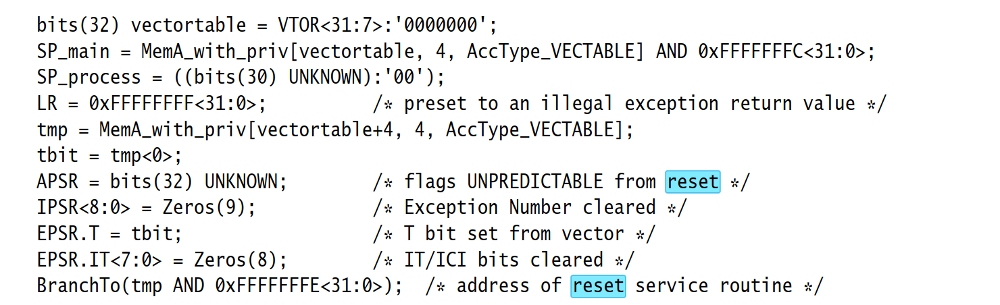
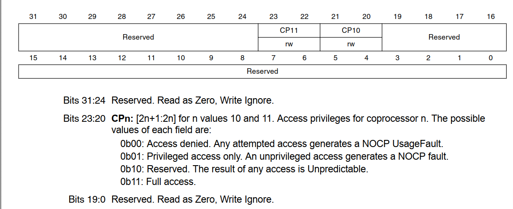
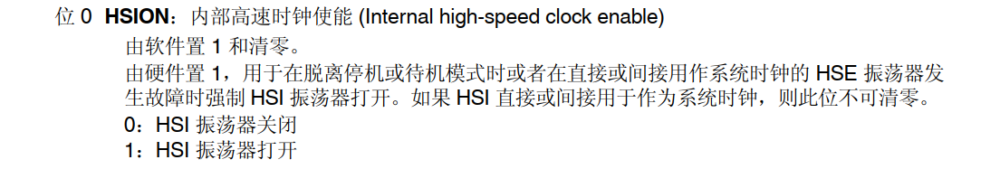

# 从启动说起到单片机点灯发生了什么上——库层次

​	下面这个部分是笔者总结使用纯HAL库编程的时候，一个单片机从启动到点灯发生了什么的博客集。可能存在一定的错误，如有发现，欢迎斧正！

​	当你使用各种渠道，不管是自己搬运了正点原子或者是野火的STM32开发的工程模板，还是套用了江科大寄存器库的模板，还是自己使用CubeMX生成的工程配置文件。总而言之，我们的确是生成了一个可以直接注重业务的代码了。但是这中间，隐藏了大量的细节没有纰漏，而我们出现问题的时候，往往最终就是栽到了这些不起眼的地方，笔者决定尝试将自己探索得到的结论，放到这里来详细的阐述。

​	笔者这个系列的博客，是针对STM32F407ZGT6型号的单片机，如果你手头上，是其他的单片机，可以自己尝试仿照分析，说不定，就会发现一些自己意想不到的新东西。

​	这个博客集是笔者尚在建设的一个项目：Better ATK单片机项目重写计划的博客的一个子集。笔者会尝试的详细说明我们的单片机从启动到点亮一个小灯发生的事情。

## 从我们的Reset说起

​	我们终于将我们的程序写好了，很快，我们就要将我们的代码放到我们的单片机上，也许是从MDK5的Keil上嗯下LOAD按钮，也许是从VSCode的Download To Flash按钮上使用各种协议传递到板子上，不管是最后自动Reset，还是我们满怀期待的嗯下Reset按钮，我们的单片机的确就从一个上电开始，准备执行它的第一行代码了。

​	你可能使用的是开发板，很容易知道：你的开发板的上面，一定有两个BOOT的引脚。当然，笔者的板子上没有接出来，你可以看看你的STM32F103系列的最小系统板，一般都会将BOOT0和BOOT1引脚接出来进行配置。

| BOOT0 | BOOT1 | 启动模式       | 说明                            |
| ----- | ----- | -------------- | ------------------------------- |
| 0     | X     | 用户闪存存储器 | 用户闪存存储器，也就是FLASH启动 |
| 1     | 0     | 系统存储器     | 系统存储器启动，用于串口下载    |
| 1     | 1     | SRAM启动       | SRAM启动，用于在SRAM中调试代码  |

​	常见的，我们习惯上是将BOOT0引脚拉低。也就是说将代码存储到我们的Flash上（Flash是一种EEPROM器件，对于这种器件访问的时间成本低廉）。

​	不要害怕，让我们看到STM32F4系列手册的8.2小节。当我们的BOOT拉低的时候，我们知道，默认的行为是将我们的Flash外设映射到地址0x00000000处。当然，问题就来了。之后呢？发生了什么呢？

## 从ARMv7-M架构的手册说起

​	这个事情，想要追溯跟源，需要我们到ARMv7-M的手册去查找，笔者不喜欢直接粘贴别人咀嚼过的二手菜，我要亲眼看到ARM手册的约定。



​	好在我们找到了，请参阅ARMv7手册的B1.5.5章节的Reset Behavior，就在上面，我们看到了——SP_Main被安排到了我们的VTOR寄存器指代的中断向量表的起始地址的下一个地址处。现在我们安稳了。

## 从启动文件说起

​	当然，我们都是新时代的单片机人，除非使用的是老毕等版本的库，否则我们的启动文件一般被换成了：

```
g_pfnVectors:
  .word _estack
  .word Reset_Handler
  .word NMI_Handler
  .word HardFault_Handler
  .word MemManage_Handler
  .word BusFault_Handler
  .word UsageFault_Handler
  .word 0
  .word 0
  .word 0
  .word 0
  .word SVC_Handler
  .word DebugMon_Handler
  ...
```

​	在这些地方。当然，笔者之前有专门的分析过我们的STM32启动文件，这里，我就简单的说两句。而不是完全的分析我们的启动文件在做什么。

> https://blog.csdn.net/charlie114514191/article/details/143222267

​	首先，我们知道，PC指针被设置为中断向量表偏移量的第二个的Reset_Handler，对于老式的ST2011年的ARM启动文件，这个汇编部分的代码实在简单到发指

```asm
; Reset handler
Reset_Handler    PROC
                 EXPORT  Reset_Handler             [WEAK]
     IMPORT  __main
     IMPORT  SystemInit
                 LDR     R0, =SystemInit
                 BLX     R0
                 LDR     R0, =__main
                 BX      R0
                 END
```

​	我们依次跳转进入SystemInit和__main，当然\_\_main隶属于KEIL的C库里的内容了。总而言之，我们就是进入了这两个函数。对于我们关心的事情，需要整明白我们的SystemInit函数和`__main`函数，我们就可以进一步前进了。

## SystemInit函数

​	这个函数就是我们的任何库，不管是操作寄存器进行单片机编程，还是库寄存器编程，还是HAL库编程，都要经历的代码。

​	Keil C的实现是这样的

```
void SystemInit(void)
{
  /* FPU settings ------------------------------------------------------------*/
  #if (__FPU_PRESENT == 1) && (__FPU_USED == 1)
    SCB->CPACR |= ((3UL << 10*2)|(3UL << 11*2));  /* set CP10 and CP11 Full Access */
  #endif
  /* Reset the RCC clock configuration to the default reset state ------------*/
  /* Set HSION bit */
  RCC->CR |= (uint32_t)0x00000001;

  /* Reset CFGR register */
  RCC->CFGR = 0x00000000;

  /* Reset HSEON, CSSON and PLLON bits */
  RCC->CR &= (uint32_t)0xFEF6FFFF;

  /* Reset PLLCFGR register */
  RCC->PLLCFGR = 0x24003010;

  /* Reset HSEBYP bit */
  RCC->CR &= (uint32_t)0xFFFBFFFF;

  /* Disable all interrupts */
  RCC->CIR = 0x00000000;

#if defined (DATA_IN_ExtSRAM) || defined (DATA_IN_ExtSDRAM)
  SystemInit_ExtMemCtl(); 
#endif /* DATA_IN_ExtSRAM || DATA_IN_ExtSDRAM */

  /* Configure the Vector Table location add offset address ------------------*/
#ifdef VECT_TAB_SRAM
  SCB->VTOR = SRAM_BASE | VECT_TAB_OFFSET; /* Vector Table Relocation in Internal SRAM */
#else
  SCB->VTOR = FLASH_BASE | VECT_TAB_OFFSET; /* Vector Table Relocation in Internal FLASH */
#endif
}
```

​	对于PIO，则是GCC使用`__lib_c_init_array`完成了一部分初始化

```
void SystemInit(void)
{
  /* FPU settings ------------------------------------------------------------*/
  #if (__FPU_PRESENT == 1) && (__FPU_USED == 1)
    SCB->CPACR |= ((3UL << 10*2)|(3UL << 11*2));  /* set CP10 and CP11 Full Access */
  #endif

#if defined (DATA_IN_ExtSRAM) || defined (DATA_IN_ExtSDRAM)
  SystemInit_ExtMemCtl(); 
#endif /* DATA_IN_ExtSRAM || DATA_IN_ExtSDRAM */

  /* Configure the Vector Table location -------------------------------------*/
#if defined(USER_VECT_TAB_ADDRESS)
  SCB->VTOR = VECT_TAB_BASE_ADDRESS | VECT_TAB_OFFSET; /* Vector Table Relocation in Internal SRAM */
#endif /* USER_VECT_TAB_ADDRESS */
}
```

​	显然，这里就化简了太多了。为了理解，我们还是从Keil C的入手。

### 检查FPU是否存在，如果存在，设置相应的权限



```
  /* FPU settings ------------------------------------------------------------*/
  #if (__FPU_PRESENT == 1) && (__FPU_USED == 1)
    SCB->CPACR |= ((3UL << 10*2)|(3UL << 11*2));  /* set CP10 and CP11 Full Access */
  #endif
```

​	翻开ARM架构对CortexM系列内核编程手册的部分，找到4.6.1节，我们看到我们的CPACR寄存器的说明，显然，我们要对FPU进行读写权限的掌管，这样我们的单片机才会开始允许对FPU的编程。3UL也就是11，左移20位和22位，恰好就是20~23位，全部放置了1，也就是开启了所有的读取权限。

​	下面我们就来讨论对RCC时钟初始化的历程了，这个寄存器在6.3节，RCC寄存器的部分。

```
  /* Reset the RCC clock configuration to the default reset state ------------*/
  /* Set HSION bit */
  RCC->CR |= (uint32_t)0x00000001;

  /* Reset CFGR register */
  RCC->CFGR = 0x00000000;

  /* Reset HSEON, CSSON and PLLON bits */
  RCC->CR &= (uint32_t)0xFEF6FFFF;

  /* Reset PLLCFGR register */
  RCC->PLLCFGR = 0x24003010;

  /* Reset HSEBYP bit */
  RCC->CR &= (uint32_t)0xFFFBFFFF;

  /* Disable all interrupts */
  RCC->CIR = 0x00000000;
```

​	依次来看，我们首先是对RCC模块的如下寄存器依次进行了操作：



​	首先，CR寄存器的最低位讨论了HSI的使能问题，显然，我们这里首先使能了HSI（置1），下一步，则是对我们的CFGR寄存器，也就是描述了我们STM32时钟树配置的寄存器全部清0，实际上就是重置成为了复位值。也就是说，在这里任何一个分频器都不工作了，任何AHB和APB总线上的时钟全部设置为不分频，交给我们的用户程序员在这后设置。

​	下一步，就是设置我们的CR寄存器为一个这样的值：对如下中，为1的部分保留原先的设置，余下的为0的清空

```
1111 1110 1111 0110 1111 1111 1111 1111
```

​	也就是从左往右数，第8，13，16个比特被置0，这就是说对PLLON，CSSON和HSEON的部分放上了0，查看我们的手册

- PLLON：主 PLL (PLL) 使能 (Main PLL (PLL) enable)

> - 由软件置 1 和清零，用于使能 PLL。
> - 当进入停机或待机模式时由硬件清零。如果 PLL 时钟用作系统时钟，则此位不可清零。
> - 0：PLL 关闭 
> - 1：PLL 开启

​	主PLL此时此刻被失能了，也就是关闭了主PLL时钟

- CSSON：时钟安全系统

​	由软件置 1 和清零，用于使能时钟安全系统。当 CSSON 置位时，时钟监测器将在 HSE 振      荡器就绪时由硬件使能，并在检出振荡器故障时由硬件禁止。

> - 0：时钟安全系统关闭（时钟监测器关闭） 
> - 1：时钟安全系统打开（如果 HSE 振荡器稳定，则时钟监测器打开；如果不稳定，则关闭）

​	也就是关闭我们的时钟安全系统。

- HSEON:也就是要不要使能我们的HSE时钟

  > 由硬件清零，用于在进入停机或待机模式时停止 HSE 振荡器。如果 HSE 振荡器直接或间接 用于作为系统时钟，则此位不可复位。
  > 0：HSE 振荡器关闭 
  > 1：HSE 振荡器打开

​	显然，HSE也被要求关闭了

​	下一步就是看我们有没有外挂的RAM部分作为我们系统的一部分。笔者这里就不做分析了，感兴趣的朋友自己看源码。

```
#if defined (DATA_IN_ExtSRAM) || defined (DATA_IN_ExtSDRAM)
  SystemInit_ExtMemCtl(); 
#endif /* DATA_IN_ExtSRAM || DATA_IN_ExtSDRAM */
```

​	下一步，就是设置我们的中断向量表位置，一般的，我们的库都是设置为了逻辑0地址处。也就是我们的起始位置

```
/* Configure the Vector Table location add offset address ------------------*/
#ifdef VECT_TAB_SRAM
  SCB->VTOR = SRAM_BASE | VECT_TAB_OFFSET; /* Vector Table Relocation in Internal SRAM */
#else
  SCB->VTOR = FLASH_BASE | VECT_TAB_OFFSET; /* Vector Table Relocation in Internal FLASH */
#endif
}
```

​	到这里，我们的SystemInit位置就说完了。下一步，我们看看__main函数。如果你使用的是Arm-none-eabi-gcc作为主力，这部分代码就是透明的。我们依次来看看，可以选择自己感兴趣的平台所发生的事情。

### 你是一个MDK C库使用者

​	笔者发现这部分是没有源代码的，是作为二进制分发的东西，笔者不会逆向，这部分只好搬运了：

> [STM32_从SystemInit、__main到main() 已修正 - 蓝天上的云℡ - 博客园](https://www.cnblogs.com/yucloud/p/stm32_SystemInit_to_main.html)

​	简单的说，跟我们下面要谈论到的——使用GCC的内容是一样的

### 你是一个Arm-none-eabi-gcc使用者

​	现在我们可以分析了。第一步，就是依次初始化我们的用户代码。

​	首先我们知道，GCC对于我们的数据段存在分类——对于可变的数据段上，我们要把它搬运到SRAM上，否则就没法修改了！或者成本很大。所以我们之后做的事情，就是依次把混在在Flash上的可变数据段部分，依次的搬运到我们的SRAM上去。正如注释所说的：

```
/* Copy the data segment initializers from flash to SRAM */
```

```
  ldr r0, =_sdata
  ldr r1, =_edata
  ldr r2, =_sidata
```

​	r0~r2寄存器依次被装下了：数据段在SRAM中的起始地址，数据段在SRAM的终止地址，Flash的起始地址。R3寄存器被用来做了索引，给上了0，下一步就是直接跳到LoopCopyDataInit中

```
  movs r3, #0
  b LoopCopyDataInit
```

​	我们将R4作为当前准备拷贝的地址部分。也就是R4 = R0 + R3，比较我们R4和R1的值，回顾一下刚刚的内容，实际上就是比较我们当前有没有到达数据段的段未，没有到达，那就jmp到我们的CopyDataInit当中去

```
LoopCopyDataInit:
  adds r4, r0, r3
  cmp r4, r1
  bcc CopyDataInit
```

​	这个代码也很容易理解：

```
CopyDataInit:
  ldr r4, [r2, r3]
  str r4, [r0, r3]
  adds r3, r3, #4
```

​	首先，我们把r2这个Flash地址的首部添加对R3这个位移量，然后存放到r0指向的，以R3作为偏移量的地方，实际上，效果就像：

```c
int*	pSrcData 	= FLASH_ADDR;
int*	pDestData 	= DATA_DEST_BEGIN;
int		index = 0
while(pDestData != DATA_DEST_END){
    pDestData[index] = pSrcData[index];
    index++;
}
```

​	哈哈，这下看懂了吧，R3就是index，两个偏移量——源和目的地址是pSrcData[index]和pDestData[index]，只是用了两个寄存器作为中介做内存读写。

​	在之后，就是考虑处理用户BSS段

```
/* Zero fill the bss segment. */
  ldr r2, =_sbss
  ldr r4, =_ebss
  movs r3, #0
  b LoopFillZerobss

FillZerobss:
  str  r3, [r2]
  adds r2, r2, #4

LoopFillZerobss:
  cmp r2, r4
  bcc FillZerobss
```

​	啊哈，完全一样的逻辑，笔者就不浪费时间重复分析了

```
/* Call static constructors */
    bl __libc_init_array
```

​	__libc_init_array是一组C初始化函数，实际上是GCC对上层引用库的初始化，这里属于GCC编译器的知识了，笔者不太熟悉。

```
/* Call the application's entry point.*/
  bl  main
  bx  lr
.size  Reset_Handler, .-Reset_Handler
```

​	终于！我们到达了这里，BL就是一个跳转，跳转到Main函数之后，如果我们的Main函数没有做while(1)处理，那么就会到达BX LR这个汇编语句，任何熟悉ARM汇编的人都知道，我们的返回地址不跟X86类似压到栈中，而是存储到LR寄存器作为跳转。所以很快，我们就跳回了发起对Main函数调用的ResetHandler，也就是复位了！

