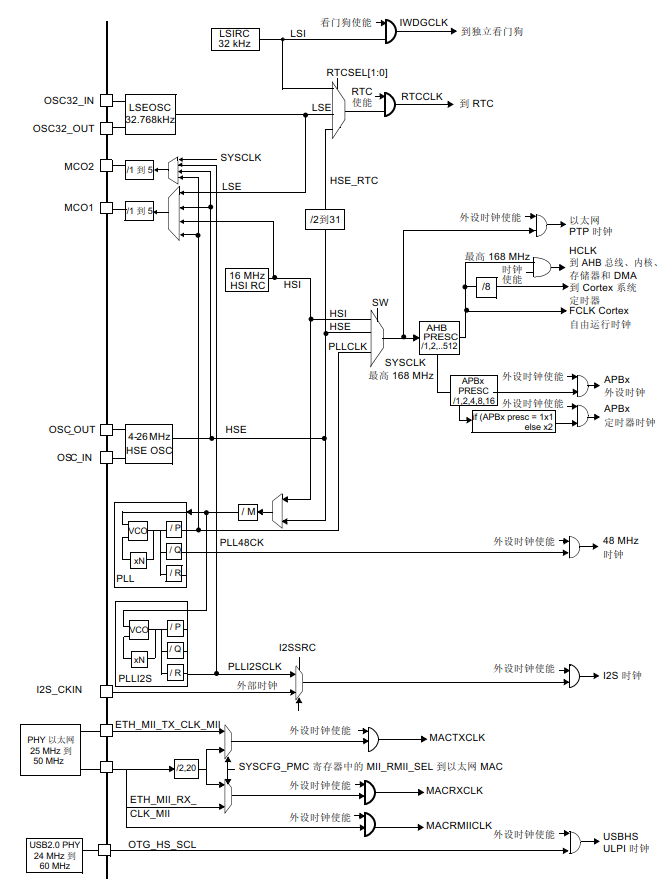
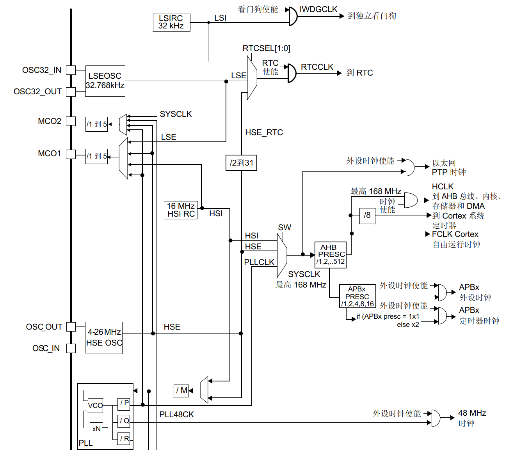
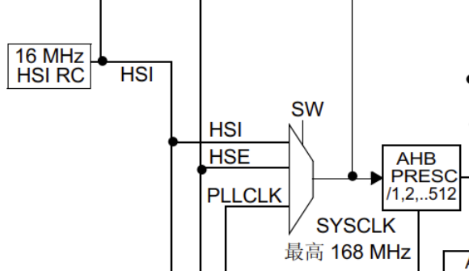
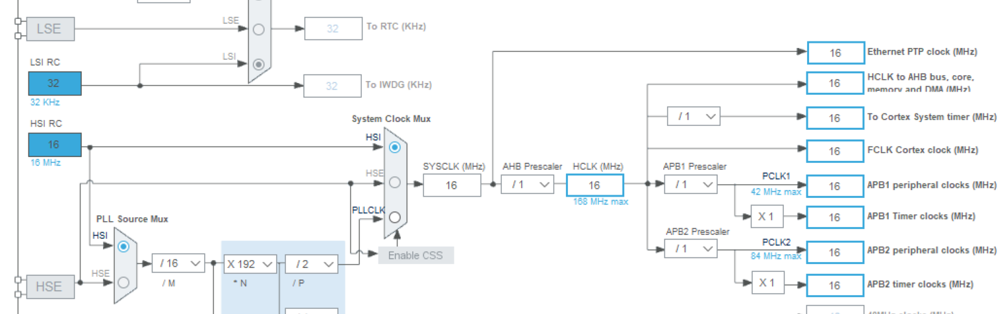
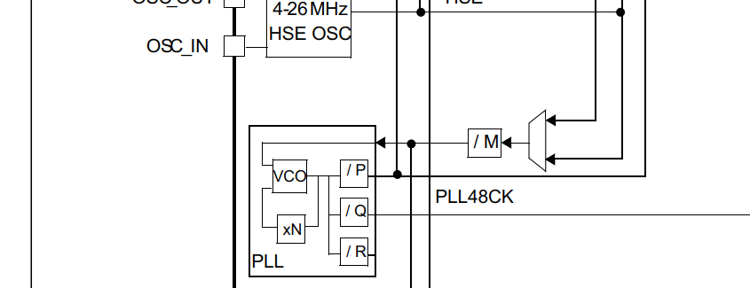
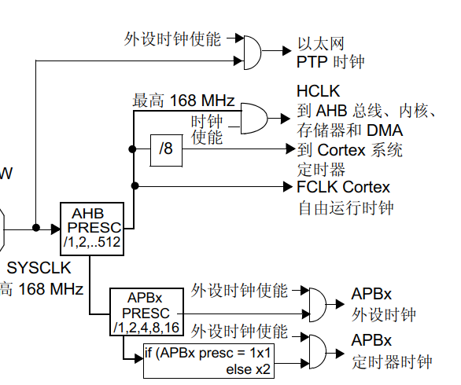

# 从单片机的启动说起一个单片机到点灯发生了什么2——HAL库的初始化

## 前言

​	上一张中，我们谈到了从使用ARMv7-M作为架构的Cortex微处理器架构的STM32F407ZGT6是如何从复位开始运行的，下面，笔者就要从代码一个个说我们的流程。

​	如果你没有看上一篇，请参考上一篇，笔者明确说明了我们的分析的场景和使用的框架（HAL库）。所以，我们下面的第一个主角就是

## HAL_Init，HAL库的一切起始点

​	HAL_Init相当于我们的System_Init了，实际上，我们的HAL_Init归根揭底，在做这些事情。

- 系统的配置中，有没有明确要求对指令缓存的启动？有，就启动起来
- 系统的配置中，有没有明确要求对数据缓存的启动？有，就启动起来
- 系统的配置中，有没有明确要求对缓存区做预取的行为的启动？有，就启动起来

​	任何一个接触过计算机体系架构的朋友都知道，在有限的硬件下，使用缓存预取机制将会有效的提升效率，充分发挥架构潜在的并行优势，这种流水线思想（一个人只做一个事情，而不是一个人从头到尾的做所有的工作）甚至影响到了CPU的指令处理机制。关于此，参考任何一本介绍现代CPU设计理念思想的书，笔者不做讲解了。只需要知道：对数据和指令的缓存和预取，是实现对性能飞跃的一个有效的办法，我们不需要跟呆子一样直到要了才去拿数据放数据，而是进行一定的预判和分析提前取好，像流水线一样分发传递。我们使能这个，从根本上是加速我们单片机的性能。

​	下一个部分，中断分组的设置了

```
HAL_NVIC_SetPriorityGrouping(NVIC_PRIORITYGROUP_2);
```

​	笔者将我们的函数注释中，摘出这个表格来。

| 优先级分组           | 抢占优先级 | 响应优先级 | bit[7:4] 分配情况 | 备注                           |
| -------------------- | ---------- | ---------- | ----------------- | ------------------------------ |
| NVIC_PriorityGroup_2 | 取值：0~3  | 取值：0~3  | 2:2               | 2bit抢占优先级、2bit响应优先级 |

​	*NVIC_PriorityGroup_2*是其中的一个优先级分组配置，它定义了抢占优先级和响应优先级各占2位，从而允许4个抢占优先级和4个响应优先级。

​	下一个，就是考验我们的分析了

```
  /* Use systick as time base source and configure 1ms tick (default clock after Reset is HSI) */
  HAL_InitTick(TICK_INT_PRIORITY);
```

​	首先，如果我们按照默认的设置，HAL库的注解说，默认是HSI时钟，怎么说，为什么是这样的？

​	回到我们的SystemInit函数，

```
RCC->CR |= (uint32_t)0x00000001;
```

​	我们就是在这里使能的。我们就只有HSI在这个时候是启动的。所以，这就是为什么CubeMX默认的使用的配置时钟是HSI了。因为它直接让我们的开启最小化，而把更多的资源完全留给了别的Applications。

> C语言编程小提示：
>
> 1. 当我们的数字存在含义的时候，请给一个名称说明它的意图。放心，一个编译器的优化就会优化成立即数。不会存在任何的干扰。
> 2. __weak关键字是一个指代链接时的关键字，他会让我们的**当被修饰的函数存在一个非weak定义的同名函数存在时，失能弱实现的C源代码**
> 3. HAL_OK和HAL_ERROR是一个指代HAL兼容层对工作的反馈，一个合格的程序员，最好对自己敏感部分的工作做调用返回值检查。

```
__weak HAL_StatusTypeDef HAL_InitTick(uint32_t TickPriority)
{
  /* Configure the SysTick to have interrupt in 1ms time basis*/
  if (HAL_SYSTICK_Config(SystemCoreClock / (1000U / uwTickFreq)) > 0U)
  {
    return HAL_ERROR;
  }

  /* Configure the SysTick IRQ priority */
  if (TickPriority < (1UL << __NVIC_PRIO_BITS))
  {
    HAL_NVIC_SetPriority(SysTick_IRQn, TickPriority, 0U);
    uwTickPrio = TickPriority;
  }
  else
  {
    return HAL_ERROR;
  }

  /* Return function status */
  return HAL_OK;
}
```

​	说完了，让我们依次看看。

```
HAL_SYSTICK_Config(SystemCoreClock / (1000U / uwTickFreq)
```

​	啊哈，这个偷懒咯，实际上。systicks_config直接转发到的我们寄存器库的SysTick_Config上。设计逻辑是这样的——实际上，是每当产生到给定的systicks的时候，触发一个中断。比如说，我们设置了HSI作为我们的SYSCLK采样资源，我们默认HSI是16000000U的值，也就是16MHz（HAL库可以去STM32F4xx_HAL_Conf.h文件一栏，我们后面也会修改这里的值完成正点原子对于PIO文件平台的STM32文件的迁移时，对于HSE时钟开启工作的支持）

​	首先，Systicks寄存器作为系统时钟的硬件层薄记，当触发到了设置的阈值就会发生一个中断。这也就说，我们在这里，设置1s计数16MHz的Systicks，计到HSI时钟的默认计数频率的千分之一的时候，触发一次到顶的中断。所以，事情就变成了，我们每一个毫秒，触发一次Systicks中断。这就是

```
/* Configure the SysTick to have interrupt in 1ms time basis*/
```

​	说出这个话的原因所在。

```
__STATIC_INLINE uint32_t SysTick_Config(uint32_t ticks)
{
  // 检查传入的 ticks 是否超过了 SysTick 定时器的最大重装载值
  if ((ticks - 1UL) > SysTick_LOAD_RELOAD_Msk)
  {
    return (1UL);  // 如果重装载值超出范围，返回错误（1）
  }

  // 设置 SysTick 重装载寄存器（LOAD），ticks-1 为重装载值
  SysTick->LOAD  = (uint32_t)(ticks - 1UL);

  // 设置 SysTick 中断优先级，SysTick_IRQn 是 SysTick 中断号
  // (1UL << __NVIC_PRIO_BITS) - 1UL 用于设置最低优先级
  NVIC_SetPriority (SysTick_IRQn, (1UL << __NVIC_PRIO_BITS) - 1UL);

  // 清零 SysTick 当前计数值寄存器，准备开始计数
  SysTick->VAL   = 0UL;

  // 配置 SysTick 控制寄存器（CTRL）：
  // - 选择时钟源：SysTick_CTRL_CLKSOURCE_Msk
  // - 启用中断：SysTick_CTRL_TICKINT_Msk
  // - 启用 SysTick 定时器：SysTick_CTRL_ENABLE_Msk
  SysTick->CTRL  = SysTick_CTRL_CLKSOURCE_Msk |
                   SysTick_CTRL_TICKINT_Msk   |
                   SysTick_CTRL_ENABLE_Msk;

  return (0UL);  // 函数成功返回 0
}
```

​	这没啥好说的。属于库寄存器的编程范畴，这里我认为大家很熟悉了。

```
  /* Configure the SysTick IRQ priority */
  if (TickPriority < (1UL << __NVIC_PRIO_BITS))
  {
    HAL_NVIC_SetPriority(SysTick_IRQn, TickPriority, 0U);
    uwTickPrio = TickPriority;
  }
  else
  {
    return HAL_ERROR;
  }
```

​	下一步，就是重定向我们的Systicks中断的中断优先级。

- `HAL_NVIC_SetPriority()` 用于设置 **SysTick** 中断的优先级。`SysTick_IRQn` 是 SysTick 定时器的中断号，`TickPriority` 是传递给 `HAL_InitTick` 的优先级参数，第二个参数 `0U` 是子优先级（此处设置为 0）。
- 还将全局变量 `uwTickPrio` 设置为当前的 Tick 优先级，通常用于后续的处理中断时引用。

​	别着急，我们看看SysTick_IRQn是什么

```
SysTick_IRQn                = -1,     /*!< 15 Cortex-M4 System Tick Interrupt
```

​	嗯？一个意想不到的值，但是，我们的库寄存器告诉我们，我们的中断号实际上是15.你现在认为我们应该去哪里看Callback呢？

​	答案是——启动文件！

```
g_pfnVectors:
  .word  _estack
  .word  Reset_Handler
  .word  NMI_Handler
  .word  HardFault_Handler
  .word  MemManage_Handler
  .word  BusFault_Handler
  .word  UsageFault_Handler
  .word  0
  .word  0
  .word  0
  .word  0
  .word  SVC_Handler
  .word  DebugMon_Handler
  .word  0
  .word  PendSV_Handler
  .word  SysTick_Handler
```

​	看到这个了吧！你一数，高兴的发现，我们的SysTick_Handler恰好就是第15个中断处理的钩子函数（实际上叫中断处理子例程更好，但是Windows编程玩多了，看啥都是Hook了）。

```
void __NVIC_SetPriority(IRQn_Type IRQn, uint32_t priority)
{
  if ((int32_t)(IRQn) >= 0)
  {
    NVIC->IP[((uint32_t)IRQn)]               = (uint8_t)((priority << (8U - __NVIC_PRIO_BITS)) & (uint32_t)0xFFUL);
  }
  else
  {
    SCB->SHP[(((uint32_t)IRQn) & 0xFUL)-4UL] = (uint8_t)((priority << (8U - __NVIC_PRIO_BITS)) & (uint32_t)0xFFUL);
  }
}
```

​	这个操作办法就是将我们的Hook注册到不同的处理机制上，对于NVIC嵌套向量中断控制器而言，处理的都是User Application Level的中断，所以，对于那些用户层次的玩意，比如说看门狗，DMA，RCC，资源Timer，USART，GPIO中断等玩意，全部丢到0以上，跟0以下，注册到系统控制块SCB层级的中断不再一个档次上，我们永远确保这些优先级远高于我们的Application Level的中断，这是设计为之！

​	所以，我们必须注册一个Systicks_Handler作为HAL库的代码，这个处理了我们的回调！

## （用户自定义的部分）选择我们自己指定的定时器来作为系统的时钟生命线

​	现在是用户自定义的部分，我们往往需要重新设定我们的时钟树，选择好我们的配置。所以，为了开启我们后续各种硬件的沟通交流（他们都依赖于我们的系统设置的生命时钟），我们往往会自己按照嵌入式系统的组成，自行根据所拥有的资源裁决我们选择的时钟。

### 关门，放图

​	别跑了，图来咯！



​	必须承认，**我第一次看这个B图的时候被吓的再也不敢多看一眼**，但是先别急，听我慢慢说这个图如何分析。让我们线不对需要一定传输速度的I2S设备，USB设备和以太网设备做啥要求，他们隶属于我们的片上时钟配置的外围，我们对之可以做模块的理解，所以一下子，我们的图被砍成了这个样子



​	非常好！我们现在，仔细看看这个图。我们需要先理清楚一个顺序

> 是的！我们的时钟来源，分为外部和内部。外部，也就是不归ST芯片管的部分。属于外部晶振产生的一个规整的方波作为我们的时钟频率。内部，就是芯片自身集成了信号发生器，产生一个内部可控的周期信号。对于速度上，分为高速和低速，也就是当我们的场景不同（高性能先行还是低功耗先行）的时候的选择。关于更加详细的HSE，HSI，LSE和LSI的内容，我看了眼手册，说的很详细了，不复制粘贴了

​	所以，我们现在回过头看：看门狗的时钟独立于我们的主系统，RTC使用一个我们选择的来源来决定我们的RTC时钟的资源是啥。这个都是后面我们专门谈到的时候才会分析的话题。

​	我们最关心的是SYSCLK，系统时钟的来源。



​	系统时钟，在SGTM32F407ZGT6上，来源只有三个！纯粹的HSI直接的供应的时钟，纯粹的HSE直接的供应的时钟，还有使用PLL锁相环（笔者简单的认为是产生一个分频倍频组合更多稳定频率的一个编程器件）的玩意提供的频率。显然，我们默认的时候，就是使用完全可控的HSI作为资源。我们还可以设置HSE，还可以设置PLL锁相环产生的CLK。不管怎么说，总是使用SW位（这个是Systicks寄存器在操作）来控制我们选择谁。

### HSI作为系统时钟的设置办法

​	HSI最高也就16MHZ，你看这就是为什么我们默认会在这里写16MHZ。上面时钟树，也说明白了这个事情。（看HSI下面的16MHZ就行了）



​	有的时候，16MHZ不够！我们使用STM32F407这个大家候，就是更多关心它的性能，所以，拉上来频率，爆发它性能的极限是很多人追求的。我们如何将频率拉到SYSTICKS的极限168MHZ呢？答案是PLL。

​	PLL使用若干分频器和一个倍频器，产生一个更高频率的时钟。虽说，如何组合是我们根据其他外设来决定的，但是笔者这里采用的设置是：

```
static CCCLK_SysConfigType hsiclk_168MHZ = {
    .m = 8,
    .n = 168,
    .p = RCC_PLLP_DIV2,
    .q = 4};
```



​	很好！回到这里，我们假设我们选择了HSI作为我们的时钟源，这里有几个框，你需要重点关心。

- /M为M分频器，对来源进行M倍的分频，举个例子，我们拉HSI为16MHz，在这里，就被分成了2MHz了。
- xN为N倍频器，对来源最终实现N倍的倍频。那就是2 * 168 MHZ了
- 下一步，我们的P，就是最终出PLL的时候，做的分频。所以这一算下来，出来的时钟就是168MHz，现在，我们顺着线送到了SysCLK子系统，我们的时钟就是这样，被拉到了168MHz的
- 至于Q，则是USB/SDIO/随机数产生器等的主PLL分频系数(PLL之后的分频)，不是我们关心的内容

​	动手！

#### 首先，配置我们的HSI时钟

```c
   	RCC_OscInitTypeDef RCC_OscInitStruct = {0};
    RCC_ClkInitTypeDef RCC_ClkInitStruct = {0};

    /** Configure the main internal regulator output voltage
     */
    __HAL_RCC_PWR_CLK_ENABLE();                                    // Enable power clock
    __HAL_PWR_VOLTAGESCALING_CONFIG(PWR_REGULATOR_VOLTAGE_SCALE1); // Set voltage scaling to level 1

    /** Initializes the RCC Oscillators according to the specified parameters
     * in the RCC_OscInitTypeDef structure.
     */
    RCC_OscInitStruct.OscillatorType = RCC_OSCILLATORTYPE_HSI;          // Set oscillator type to HSI
    RCC_OscInitStruct.HSIState = RCC_HSI_ON;                            // Enable HSI oscillator
    RCC_OscInitStruct.HSICalibrationValue = RCC_HSICALIBRATION_DEFAULT; // Use default calibration for HSI
    RCC_OscInitStruct.PLL.PLLState = RCC_PLL_ON;                        // Enable PLL
    RCC_OscInitStruct.PLL.PLLSource = RCC_PLLSOURCE_HSI;                // Use HSI as PLL source
    RCC_OscInitStruct.PLL.PLLM = config->m;                             // Set PLL M divider
    RCC_OscInitStruct.PLL.PLLN = config->n;                             // Set PLL N multiplier
    RCC_OscInitStruct.PLL.PLLP = config->p;                             // Set PLL P divider
    RCC_OscInitStruct.PLL.PLLQ = config->q;                             // Set PLL Q divider

    // Check for errors in the RCC oscillator initialization
    if (HAL_RCC_OscConfig(&RCC_OscInitStruct) != HAL_OK)
    {
        __clk_init_die(); // If initialization fails, enter an infinite loop
    }
```

​	第一步，就是搞定我们的HSE时钟设置。我们的晶振时钟类型是HSI。而且准备使用PLL进行一个分频倍频机制，所以，我们按照给定的参数完成这个工作。

```c
    // Configure PLL as the system clock
    RCC_ClkInitStruct.ClockType = (RCC_CLOCKTYPE_SYSCLK | RCC_CLOCKTYPE_HCLK | RCC_CLOCKTYPE_PCLK1 | RCC_CLOCKTYPE_PCLK2); // Set clock types for SYS, AHB, APB1, and APB2
    RCC_ClkInitStruct.SYSCLKSource = RCC_SYSCLKSOURCE_PLLCLK;                                                              // Set PLL as the system clock source
    RCC_ClkInitStruct.AHBCLKDivider = RCC_SYSCLK_DIV1;                                                                     // Set AHB clock divider to 1
    RCC_ClkInitStruct.APB1CLKDivider = RCC_HCLK_DIV4;                                                                      // Set APB1 clock divider to 4
    RCC_ClkInitStruct.APB2CLKDivider = RCC_HCLK_DIV2;                                                                      // Set APB2 clock divider to 2

    // Apply the clock configuration and check for errors
    if (HAL_RCC_ClockConfig(&RCC_ClkInitStruct, FLASH_LATENCY_5) != HAL_OK)
    {
        __clk_init_die(); // If configuration fails, enter an infinite loop
    }
```

​		第二步，完成Systicks子系统内部各个时钟线的初始化分频策略。



​	啊哈，看到

```c
RCC_ClkInitStruct.ClockType = (RCC_CLOCKTYPE_SYSCLK | RCC_CLOCKTYPE_HCLK | RCC_CLOCKTYPE_PCLK1 | RCC_CLOCKTYPE_PCLK2); // Set clock types for SYS, AHB, APB1, and APB2
```

​	了嘛，这个就是我们对这些时钟设置的使能。我们准备把这样的时钟按照一个分频，作为HCLK等其他子系统的设置上去。分频的系数笔者写在上面了。

### 对于使用HSE作为我们的系统的时钟来源

```

    __HAL_RCC_PWR_CLK_ENABLE(); // Enable the PWR clock

    // The following setting is used to set the regulator output voltage level to balance performance and power consumption
    // when the device is not running at maximum frequency.
    __HAL_PWR_VOLTAGESCALING_CONFIG(PWR_REGULATOR_VOLTAGE_SCALE1); // Set regulator output voltage level to scale 1

    RCC_OscInitStructure.OscillatorType = RCC_OSCILLATORTYPE_HSE; // Set clock source to HSE
    RCC_OscInitStructure.HSEState = RCC_HSE_ON;                   // Enable HSE
    RCC_OscInitStructure.PLL.PLLState = RCC_PLL_ON;               // Enable PLL
    RCC_OscInitStructure.PLL.PLLSource = RCC_PLLSOURCE_HSE;       // Set PLL clock source to HSE
    RCC_OscInitStructure.PLL.PLLM = config->m;                    // PLL input divider coefficient (PLL before division), range: 2~63
    RCC_OscInitStructure.PLL.PLLN = config->n;                    // PLL multiplier coefficient (PLL multiplication), range: 64~432
    RCC_OscInitStructure.PLL.PLLP = config->p;                    // System clock PLL divider coefficient (PLL after division), range: 2, 4, 6, 8 (only these 4 values)
    RCC_OscInitStructure.PLL.PLLQ = config->q;                    // PLL divider coefficient for USB/SDIO/random number generator, range: 2~15
    ret = HAL_RCC_OscConfig(&RCC_OscInitStructure);               // Initialize PLL

```

​	其他部分的代码都没变，变化的是我们指定了资源是HSE。注意的是，笔者的开发板上，使用的是8MHz的外部晶振。所以，事情变得复杂了起来。

​	stm32f4xx_hal_conf.h文件指定了我们HAL一些关键外部资源的指定，很容易想到，我们完全不知道我们的外部晶振的特性，需要我们自己手动指定。必须指出的是——HAL库默认的HSE认为是25MHz，不改正，就会出现一些硬件与软件失配的问题，造成系统时钟混乱，给排查带来极大的不便。

```
#if !defined  (HSE_VALUE) 
  #define HSE_VALUE              8000000U /*!< Value of the External oscillator in Hz */
#endif /* HSE_VALUE */
```

​	在这里！改成你的HSE外部晶振的频率！现在，我们对HSE的分频和倍频设置

```
static CCCLK_SysConfigType hseclk_168MHZ = {
    .m = 8,
    .n = 336,
    .p = RCC_PLLP_DIV2,
    .q = 7};
```

​	是袭用了正点原子的配置。到此为止，系统的时钟设置好了，整个系统就会按照我们告知的频率，准备进入下一个初始化阶段！