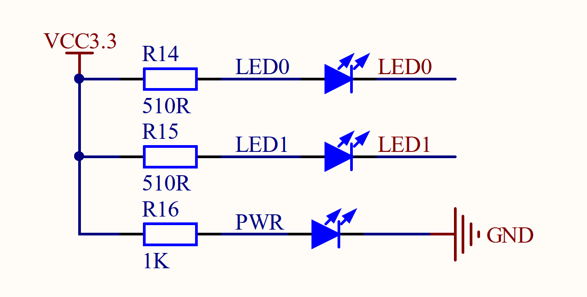
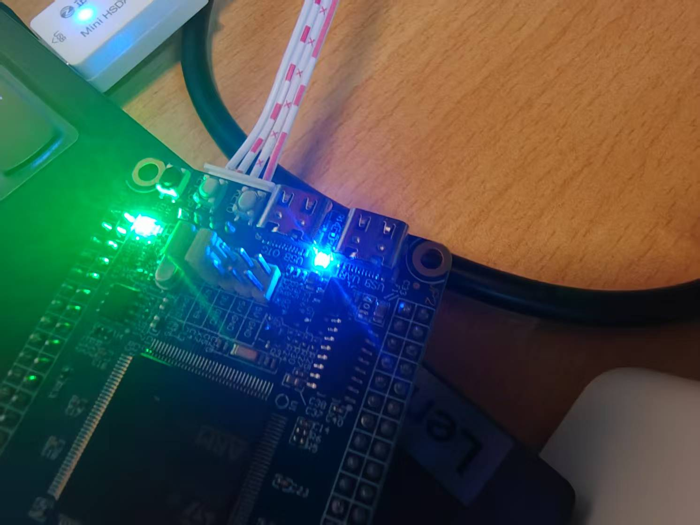

# 从单片机的启动说起一个单片机到点灯发生了什么——使用GPIO点一个灯

## 前言

​	我们终于到达了熟悉的地方，对GPIO的初始化。经过漫长的铺垫，我们终于历经千辛万苦，来到了这里

## HAL库对GPIO的抽象

​	HAL库对GPIO的抽象可以说是到了一个巅峰。使能一个GPIO，被化简到了一个非常显然的步骤。

- 使能对应GPIO所在的Port的时钟
- 设置GPIO对应的模式——点灯的时候，我们是推挽强力的控制外设
- 使用HAL_GPIO_Init函数注册到寄存器当中
- 做一些Post Init工作。比如说，我们明确的要求拉高拉低GPIO。这个，需要根据外设电路来实现

​	以我板子上外接的PA9作为一个例子把！

```c
static void __open_gpioclk(){
    __HAL_RCC_GPIOF_CLK_ENABLE();
}

CCGPIOInitTypeDef led0_init = {
    .type = {
        .Pin    = GPIO_PIN_9,
        .Mode   = GPIO_MODE_OUTPUT_PP,
        .Speed  = GPIO_SPEED_HIGH,
        .Pull   = GPIO_PULLUP
    },
    .open_clock = __open_gpioclk,
    .post_init  = __post_init,
    .port = GPIOF
};

void configure_ccgpio(
    CCGPIOType* type,  CCGPIOInitTypeDef* initer)
{
    type->port = initer->port;
    type->pinType = initer->type.Pin;

    // oh shit, the open clock is missing inited
    initer->open_clock ? initer->open_clock() : __die();

    HAL_GPIO_Init(type->port, &initer->type);

    if(initer->post_init) initer->post_init(type);
}
```

​	

## 核心分析：HAL_GPIO_Init

​	我们只是简单的点个灯，这个函数就可被化简为如下的逻辑

```c
void HAL_GPIO_Init(GPIO_TypeDef  *GPIOx, GPIO_InitTypeDef *GPIO_Init)
{
  uint32_t position;
  uint32_t ioposition = 0x00U;
  uint32_t iocurrent = 0x00U;
  uint32_t temp = 0x00U;

  /* 检查参数 */
  assert_param(IS_GPIO_ALL_INSTANCE(GPIOx));
  assert_param(IS_GPIO_PIN(GPIO_Init->Pin));
  assert_param(IS_GPIO_MODE(GPIO_Init->Mode));

  /* 配置GPIO引脚 */
  for(position = 0U; position < GPIO_NUMBER; position++)
  {
    /* 获取IO引脚位置 */
    ioposition = 0x01U << position;
    /* 获取当前IO引脚的状态 */
    iocurrent = (uint32_t)(GPIO_Init->Pin) & ioposition;

	...

      /* 配置引脚为高电平来点亮LED */
      GPIOx->ODR |= iocurrent; // 设置为高电平
    }
  }
}
```

​	这就是为什么我们可以使用Pin9 | Pin10完成我们的组操作，因为内部，我们是逐个比特的完成我们对GPIO的设置，对于每一个满足——的确是我们要设置的GPIO

```
    if(iocurrent == ioposition)
    {
      /* --------------------- GPIO模式配置 ------------------------*/
      /* 仅当输出模式时才需要配置 */
      if(((GPIO_Init->Mode & GPIO_MODE) == MODE_OUTPUT))
      {
        /* 配置IO速度 */
        assert_param(IS_GPIO_SPEED(GPIO_Init->Speed));
        temp = GPIOx->OSPEEDR;
        temp &= ~(GPIO_OSPEEDER_OSPEEDR0 << (position * 2U));
        temp |= (GPIO_Init->Speed << (position * 2U));
        GPIOx->OSPEEDR = temp;

        /* 配置IO输出类型 */
        temp = GPIOx->OTYPER;
        temp &= ~(GPIO_OTYPER_OT_0 << position);
        temp |= (((GPIO_Init->Mode & OUTPUT_TYPE) >> OUTPUT_TYPE_Pos) << position);
        GPIOx->OTYPER = temp;

        /* 配置IO输出模式 */
        temp = GPIOx->MODER;
        temp &= ~(GPIO_MODER_MODER0 << (position * 2U));
        temp |= ((GPIO_Init->Mode & GPIO_MODE) << (position * 2U));
        GPIOx->MODER = temp;
      }
```

​	也就是说，设置我们的输出类型是下面的：

- **上拉**是指在GPIO引脚与电源（通常是3.3V或5V）之间连接一个电阻，这样当引脚处于**输入状态**时，如果没有外部信号驱动该引脚，它会自动被拉到高电平。也就是被高电平拽上去了！

- **下拉**是指在GPIO引脚与地（0V）之间连接一个电阻，这样当引脚处于**输入状态**时，如果没有外部信号驱动该引脚，它会自动被拉到低电平。也就是被低电平拽下去了！

- **无上下拉**配置意味着不连接任何上拉或下拉电阻。当GPIO引脚处于输入模式时，它的电平状态将取决于外部电路。如果没有外部驱动信号，这个引脚将处于浮空状态（Hi-Z），可能会导致电平不稳定，容易受到噪声干扰。

中的一种。至于GPIO的速度，则是分为低速中速高速。我们的输出模式大致分两种：

- **推挽输出（Push-pull）**：这种输出类型意味着GPIO引脚可以驱动电流流向负载，并且在输出高电平和低电平时都会主动提供电流。即引脚会主动拉高电平和拉低电平。它是最常用的输出类型。
- **开漏输出（Open-drain）**：这种输出类型意味着GPIO引脚只有在输出低电平时才会提供电流（拉低电平），而在输出高电平时，它不会输出电流，而是处于高阻态（Hi-Z）。通常需要外部上拉电阻来将引脚拉到高电平。你会在使用软件IIC的时候，再看到它。

​	所以，笔者按照给出的这个原理图：配置为上拉的情况，确保初始化后不会立马被点亮。



​	很好，现在，我们终于来到了点灯！

```
set_ccgpio_state(&led0, CCGPIO_LOW);

void set_ccgpio_state(CCGPIOType* type, CCGPIOState state)
{
    HAL_GPIO_WritePin(
        type->port, type->pinType, 
        (state ? (GPIO_PIN_SET) : (GPIO_PIN_RESET)));
}
```

​	此时此刻，我们的GPIO就会被拉到低，形成一个高低的电压差，存在的电流就把我们的LED导通了！

