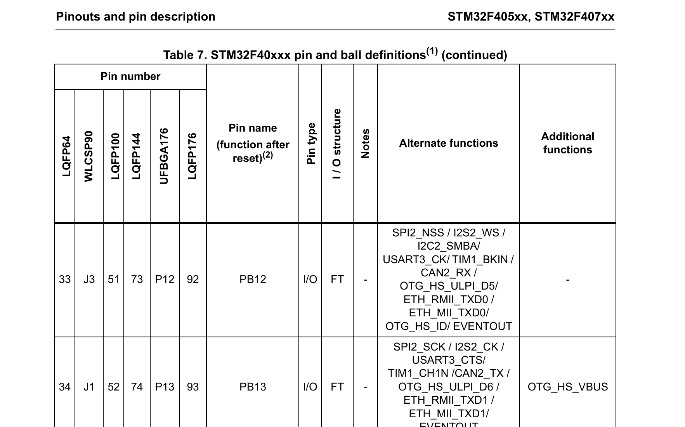

# 以STM32F407ZGT6为例子，分析我们的单片机

## 第一件事情：为什么叫STM32F407ZGT6

| 部分              | 说明                                                         |
| ----------------- | ------------------------------------------------------------ |
| **1. 产品系列**   | 固定为“STM32”，表示基于ARM Cortex-M内核的32位微控制器。      |
| **2. 产品类型**   | 用一个字母表示产品类型： **F**：通用型 **L**：低功耗型 **W**：无线型 |
| **3. 产品子系列** | 用三位数字表示产品子系列，指示特定的功能和性能： **101**：基本型 **102**：USB基本型（USB 2.0全速设备） **103**：增强型 **105/107**：互联型 对于4打头的表示采用 Cortex-M4 内核，最高主频可达 168 MHz。 |
| **4. 引脚数**     | 用一个字母表示封装的引脚数量： **T**：36引脚 **C**：48引脚 **R**：64引脚 **V**：100引脚 **Z**：144引脚 **I**：176引脚 |
| **5. 闪存容量**   | 用一个字母或数字表示内置的Flash容量： **6**：32KB **8**：64KB **B**：128KB **C**：256KB **D**：384KB **E**：512KB **G**：1MB |
| **6. 封装类型**   | 用一个字母表示封装类型： **H**：BGA封装 **T**：LQFP封装 **U**：VFQFPN封装 |
| **7. 温度范围**   | 用一个数字表示工作温度范围： **6**：-40°C 至 85°C **7**：-40°C 至 105°C |

​	当然，上面的表格

| 字符      | 含义                                                         |
| --------- | ------------------------------------------------------------ |
| **STM32** | 表示意法半导体的32位微控制器系列，其中“ST”代表意法半导体公司，“M”代表微控制器，“32”表示32位架构。 |
| **F**     | 指代通用型微控制器系列。                                     |
| **407**   | 具体的产品系列编号，表示该微控制器属于高性能系列，采用 Cortex-M4 内核，最高主频可达 168 MHz。 |
| **Z**     | 表示封装引脚数量，其中“Z”代表 144 引脚。                     |
| **G**     | 表示内嵌闪存容量，其中“G”代表 1 MB 闪存。                    |
| **T**     | 表示封装类型，其中“T”代表 LQFP（低引脚数四方扁平封装）。     |
| **6**     | 表示工作温度范围，其中“6”代表 -40°C 至 85°C。                |

## 分析首页的数据手册

笔者在之前的博客中说到了我们的手册可以从哪里来，所以这里我们就不去再重复说下面的资源是从哪里考证的——就是从资源手册的第一页中摘取的。

| 特性分类                 | 具体参数                                                     |
| ------------------------ | ------------------------------------------------------------ |
| **内核**                 | - ARM® 32位 Cortex®-M4 CPU，带浮点运算单元（FPU）- 最高主频：168 MHz- 指令集：DSP 指令 |
| **存储器**               | - 闪存：高达 1 MB- SRAM：总计 192 KB（包括 64 KB 核心耦合存储器）- OTP（一次性可编程）内存：512 字节 |
| **时钟、复位和电源管理** | - 工作电压：1.8V 至 3.6V- 上电复位（POR）、掉电复位（PDR）、可编程电压监测器（PVD）和欠压复位（BOR）- 外部晶振：4 至 26 MHz- 内部 16 MHz RC 振荡器（工厂校准，精度 1%）- 32 kHz RTC 振荡器，带校准功能- 内部 32 kHz RC 振荡器，带校准功能 |
| **低功耗模式**           | - 睡眠模式- 停止模式- 待机模式- VBAT 供电，用于 RTC、20×32 位备份寄存器和可选的 4 KB 备份 SRAM |
| **模数转换器（ADC）**    | - 数量：3 个 12 位 ADC- 转换速度：2.4 MSPS- 通道数：多达 24 个- 三重交替模式下可达 7.2 MSPS |
| **数模转换器（DAC）**    | - 数量：2 个 12 位 DAC                                       |
| **DMA 控制器**           | - 通道数：16 个流，带 FIFO 和突发支持- 支持的外设：定时器、ADC、DAC、SDIO、I²S、SPI、I²C 和 USART |
| **定时器**               | - 总计：多达 17 个- 16 位定时器：12 个- 32 位定时器：2 个- 看门狗定时器：2 个（独立和窗口型）- 系统定时器：1 个（SysTick） |
| **通信接口**             | - I²C 接口：3 个（支持 SMBus/PMBus）- USART 接口：4 个- UART 接口：2 个（支持 ISO 7816 接口、LIN、IrDA、调制解调器控制，最高速率 10.5 Mbit/s）- SPI 接口：3 个（最高速率 42 Mbit/s），其中 2 个可复用为全双工 I²S 接口，满足音频级精度需求- CAN 接口：2 个（2.0B 活动）- SDIO 接口：1 个 |
| **高级连接**             | - USB 2.0 全速设备/主机/OTG 控制器，带片上 PHY- USB 2.0 高速/全速设备/主机/OTG 控制器，带专用 DMA、片上全速 PHY 和 ULPI- 10/100 以太网 MAC，带专用 DMA，支持 IEEE 1588v2 硬件时间戳，提供 MII/RMII 接口 |
| **其他特性**             | - 8 至 14 位并行摄像头接口，速率高达 54 Mbyte/s- 真随机数生成器- CRC 计算单元- 96 位唯一 ID- RTC：提供亚秒精度和硬件日历功能 |

## 第二件事情，关心我们的GPIO引脚输出

​	我们的单片机最后是依靠GPIO引脚跟外界进行沟通，我们查询了上面的资源之，确定了这个板子是我们的一个可以选择的方案后，下一步，就是看看结合我们的需求，简单的调研一下我们的GPIO引脚的复用情况。

​	关于GPIO是什么，这个不是我们这篇博客的重点，笔者记得我前前后后说过两次。所以可以翻翻笔者之前的博客，看我的碎碎念。

​	简单的说，就是我们的GPIO引脚不可能单独的表达含义，我们可以采取复用策略（也就是说把XXXGPIO现在作为一个）

​	关于GPIO的复用，我们还是要去看资源手册。这一部分的内容一般是Pinouts and pin description那一部分的内容，注意，我们在学习其他的单片机的时候，可能板块不会叫这个名字。

​	笔者截取了一下我手头的手册的一个截图：

​	我们一般关心的是Pin name和右侧的一些说明。第一件事情是看我们需要的功能所在的引脚在哪里。比如说。我们的PB12，可以复用的功能可以说是——丰富麻了！玩STM32F4了，说明对单片机也是足够说戏，这里不举例分析了

## 第三件事情：去找对应外设的说明部分

​	这个事情在我们的编程手册中才会涉及到，比如说，我们想要驱动IIC。

​	就要准备去对应的手册上慢慢翻。ST官方的手册比较全面，会仔细的介绍细节。这里给出的是英文手册的截图。

​	笔者接触到的流程大致就是如此。

